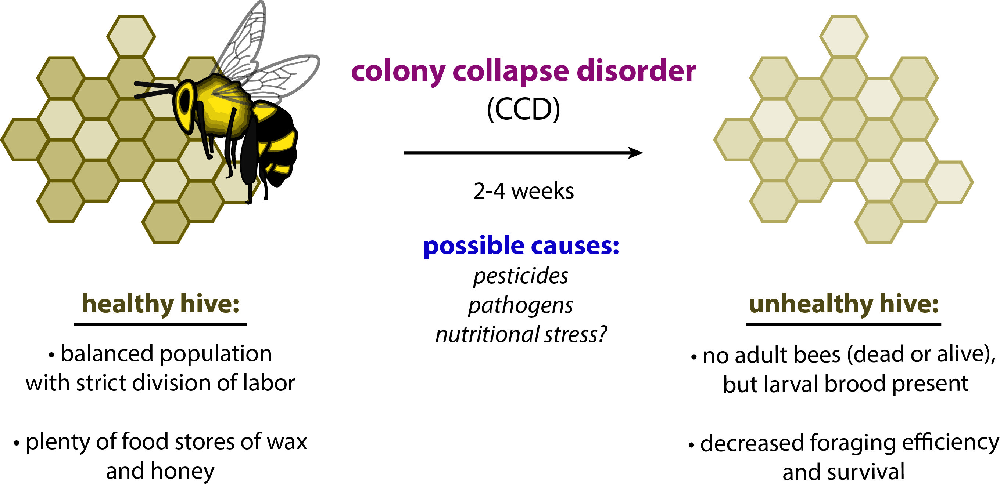
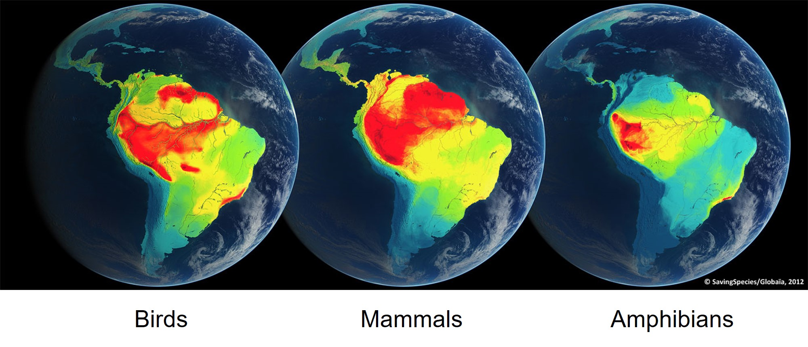
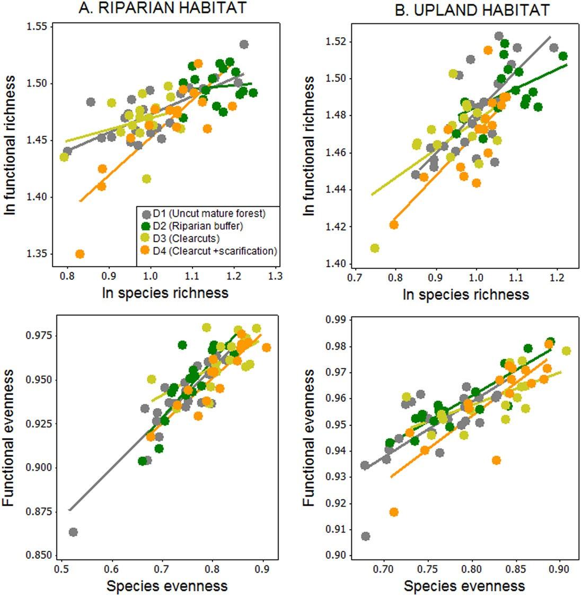
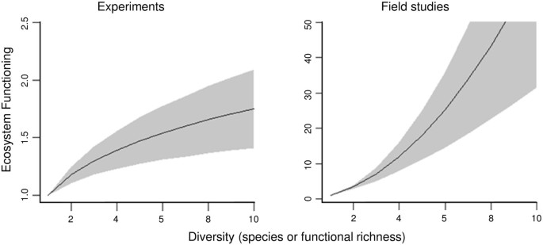
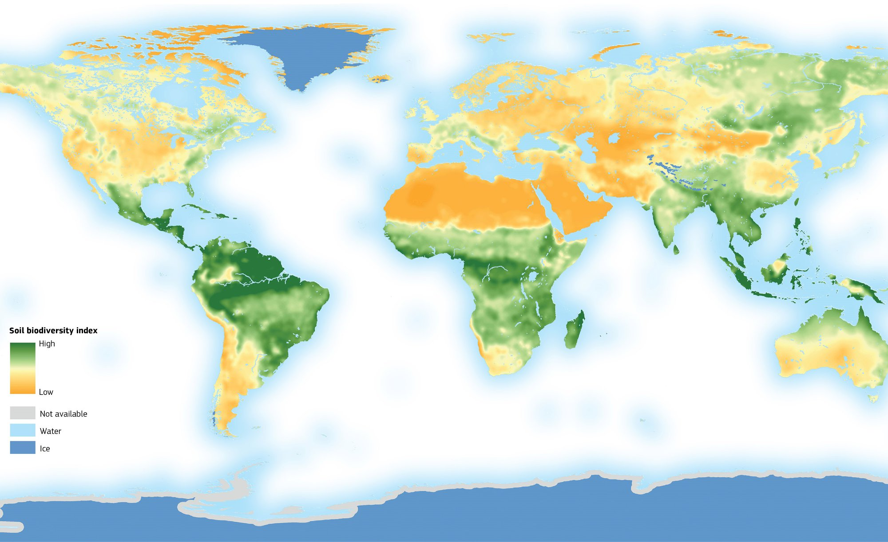
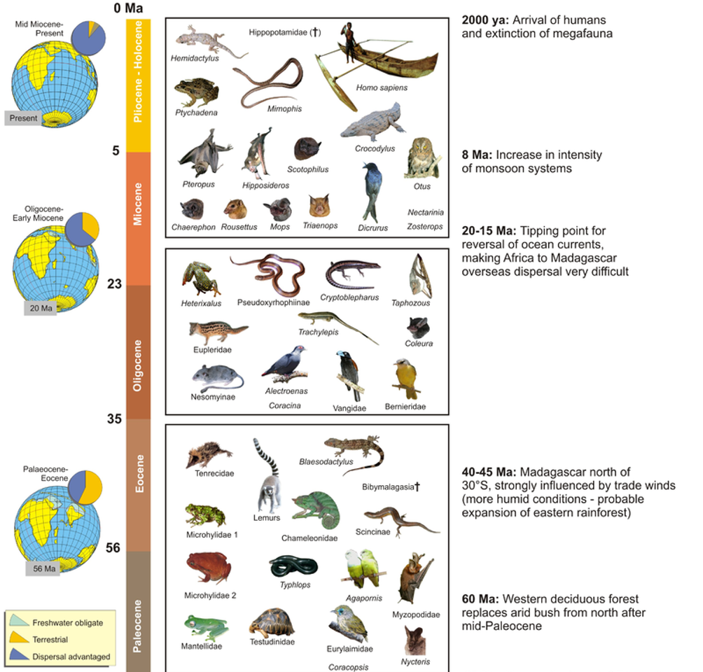
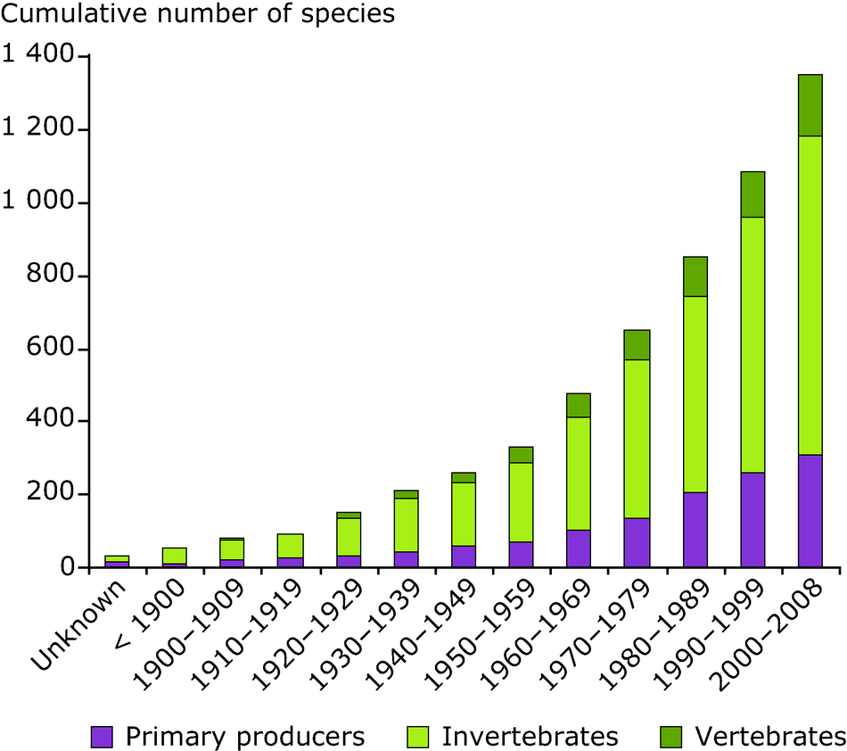
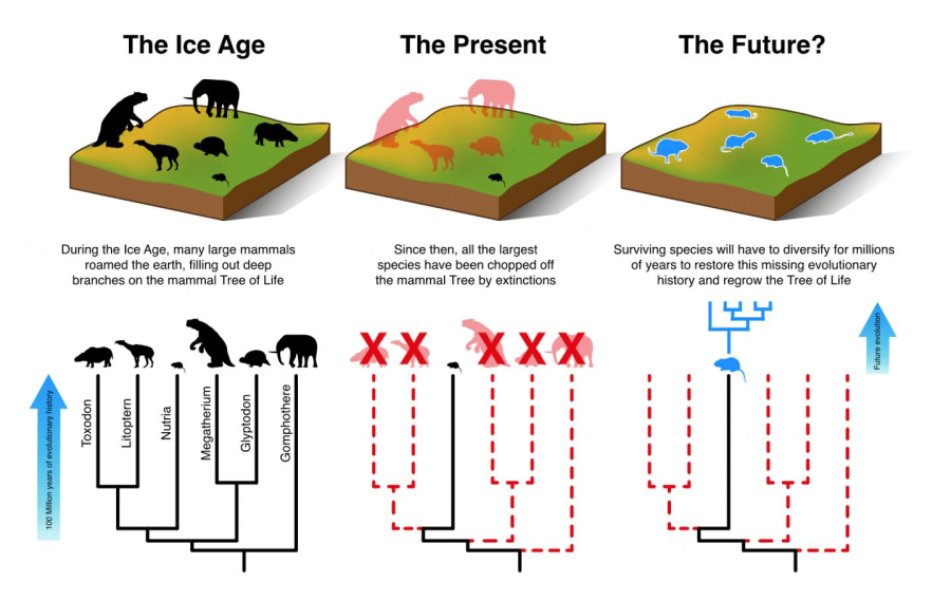
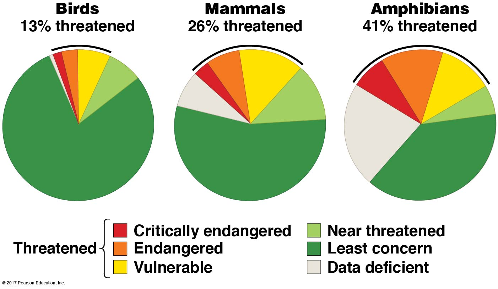
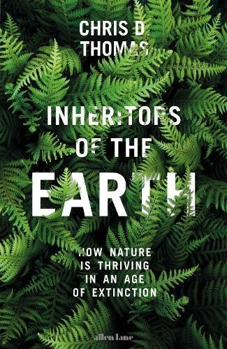

##

## 

## Biodiversity as insurance

 

**Diversity buffers against functional changes**

**No one species fills all the roles (functions)  of an ecosystem**

<!-- ## Genetic diversity bottlenecked for bees -->
<!-- 
 -->

<!--  -->

<!--  -->

## Today's topic: Species Diversity

 

* **Intricate webs of interacting organisms**
    + 2,000,000 species are known 
    + ~18,000 new species discovered per year
    + estimated 87% of Eukaryotas unknown

 

* **Reflects billions of ways organisms have adapted, over and over, to a changing planet**
    + biodiversity 'hot spots" exist
    
 

* **Humans relentlessly alter ecosystems**
    + aquatic and terrestrial
    + ~150 species go extinct each day
    
 

 

## Measuring biodiversity (e.g. Simpson's or Shannons index)

**Assumption: All species are equally important**

<!--  -->

<!--  -->

## Richness and Evenness both contribute to functional diversity

<!-- ## Species diversity is also a balance -->
<!-- 
 -->

<!--  -->

<!--  -->

## Species types (native, endemic, non-native, exotic, invasive)

## The march of the cane toad

<!-- ## Exotic vs Invasive -->
<!-- 
 -->

<!--  -->

<!--  -->

##  

## Where: Species diversity declines from tropics

## Where: Species diversity declines at altitude

## Mapping biodiversity: Soil community diversity matters

## Mapping biodiversity: Oceans

## Ecoregions: Where biodiversity hotspots exists

<!-- ## Hotspots: Endemic freshwater fish in the USA -->
<!-- 
 -->

<!--  -->

## Hotspots: Andean uplift and bird diversity

## Hotspots: Endemic species of Madagascar

**What factors contribute to 90% endemism?**

<!-- ## Biodiversity hotspots: species -->
<!-- 
 -->

<!-- 

<!-- ## Mapping biodiversity: Plants -->
<!-- 
 -->

<!-- 

<!-- ## Mapping biodiversity: Animals -->

<!--  -->

## Threats to biodiversity

## Threats: Invasive species are increasing

  
 
 
 

* **Change physical and biotic environment**

 
 

* **Aquatic ecosystems heavily affected**

 
 

* **Impacts outweigh natural extinction rates**
 

##

##

## Ecoregions versus humans

## Biodiversity is decreasing rapidly (Living Planet Index 2022)

<!-- ## Homogenization: ecosystems losing their uniqueness -->
<!-- 
 -->
<!--   -->
<!--   -->

<!-- 
 -->

<!-- * **Replacement of native species** -->
<!--     + invasives are highly competitive -->

<!--   -->

<!-- * **Taxonomic homogenization** -->
<!--     + increased similarity of species -->
<!--     + plants, insect, fish, birds & mammals -->

<!--   -->

<!-- * **Biotic homogenization tied to humans** -->
<!--     + landscape simplification -->
<!--     + habitat loss -->

<!-- 
 -->

<!--  -->

<!-- ## Homogenization: Megafauna -->
<!-- 
 -->

<!--  -->

<!--  -->

<!-- ## -->

<!--  -->

<!-- ## Homogenization: USA? -->
<!-- 
 -->
<!--  -->

<!-- ## Biodiversity in a changing world -->
<!-- 
 -->

<!--  -->

<!-- ## Are we experiencing a new mass extinction? -->
<!-- 
 -->

<!--  -->

<!-- ## Extinction versus humans -->
<!-- 
 -->

<!--  -->

<!-- ## -->

<!--  -->

<!-- ## -->

<!--  -->

<!-- ## The most vulnerable species -->

<!--  -->

<!-- ## How bad is it? Rates of speciation vs extinction... -->
<!-- 
 -->

<!-- 
 -->

<!-- * **Humans drive rapid evolution** -->
<!--     + relocation, domestication and hunting -->
<!--     + novel ecosystem creation -->

<!--   -->

<!-- * **During Holocene (past 11,000 yrs)** -->
<!--     + extinction and speciation balanced -->
<!--     + Bull and Maron 2016 -->

<!--   -->

<!-- * **Human influence on speciation rates not quantified** -->
<!--     + listed mechanisms above are known -->

<!--   -->

<!-- * **Is a 'no net l0ss' conservation strategy acceptable to you?** -->
<!-- 
 -->

<!--  -->