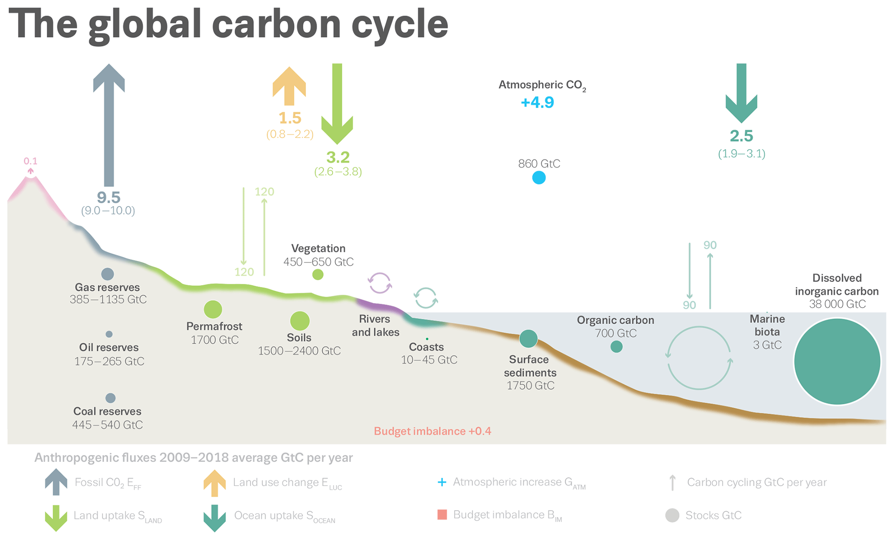

## Matter is conserved

 

## Energy flows, but matter is recycled

## 

## Importance of biogeochemical cycling

## Transfer, transformation and storage

## Biogeochemical cycles: Global

## Nutrient cycles: Ecosystem

 
 

* **Entry of nutrients into system**
    + fixation (bacteria)
    + weathering (rocks)
    + deposition (acid rain)

 

* **Internal transfer (recycling)**
    + food webs
    + decomposition
 
  
 
* **Loss of nutrients from system**

## Carbon cycle: Ecosystems

<!--  -->

## Carbon cycle: Global

## 

##

## Nitrogen cycle: Ecosystems

## Nitrogen cycle: Ecosystems

## Decomposition

## Decomposition rate: Biomes

 

 

## Nutrient transfer: Soils

## Nitrogen cycle: Global

## Primary productivity

## 

## Global net primary production

## Global net primary production

<!-- ## Net primary production and global change -->
<!-- 
 -->

<!--  -->

<!-- ## Net primary production and humans (HANPP) -->
<!-- 
 -->

<!--  -->

<!-- ## Eutrophication -->
<!-- 
 -->

<!--  -->

