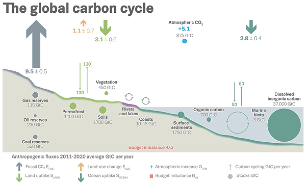
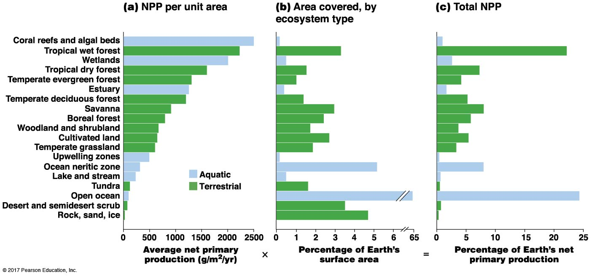
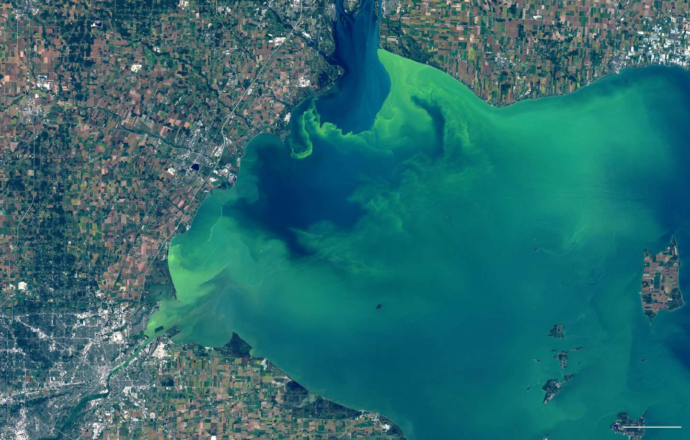

<!-- ## Biogeochemical Cycling -->
<!-- 
 -->

<!--  -->

## Matter is conserved

**Chemical elements (and water) are stored in different forms across the biosphere**

## Energy flows, but matter is recycled

## 
 
 
 
 
 
 
 
 
 
 
 
 
 
 
 
 
 
 
 
 
 

**Each cycle includes aspects of Biology + Chemistry + Geology as elements move or are stored in the componenets of the biosphere**

## Importance of biogeochemical cycling: Nutrient limitation

## Cycling = Transfer, transformation and storage

## Biogeochemical cycles: Global

## Nutrient cycles: Ecosystem

* **Entry of nutrients into system (IN)**
    + fixation (bacteria)
    + weathering (rocks)
    + deposition (acid rain)

 

* **Internal transfer (recycling)**
    + food webs
    + decomposition
    + inorganic - organic
 
  
 
* **Loss of nutrients from system (OUT)**
    + gas loss, leaching, disturbance
    
  
 
* **Steady State and Succession....**

## Carbon cycle: Ecosystems

<!--  -->

## Carbon cycle: Global (Sinks and Sources of C)

## 

##

## Nitrogen cycle: Ecosystems

## Nitrogen cycle: Ecosystems

## Decomposition - Ecosystem internal recycling

<!--  -->

## Decomposition rate: Biomes (climate+microbes+material)

 

 

## Nutrient transfer: Soil commmunity

## Nitrogen cycle: Global

## Primary productivity: Generation of biomass

<!-- ##  -->

<!--  -->

<!-- ## Global net primary production -->
<!-- 
 -->

<!--  -->

<!--  -->

<!-- ## Global net primary production -->
<!-- 
 -->

<!-- <!--  --> -->

<!--  -->

<!-- ## Net primary production and global change -->
<!-- 
 -->

<!--  -->

<!-- ## Net primary production and humans (HANPP) -->
<!-- 
 -->

<!--  -->

<!-- ## Eutrophication -->
<!-- 
 -->

<!--  -->

