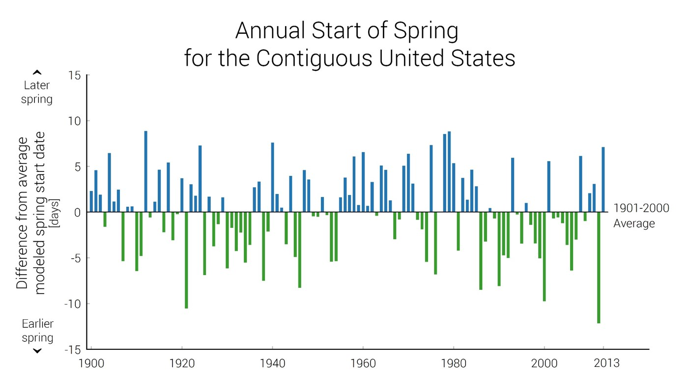
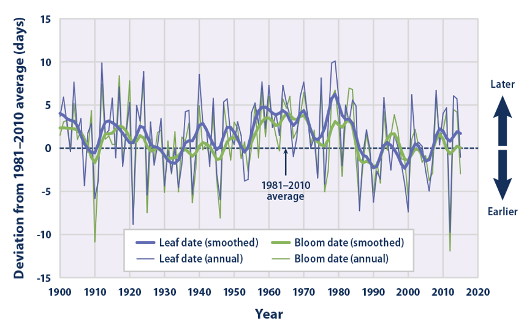
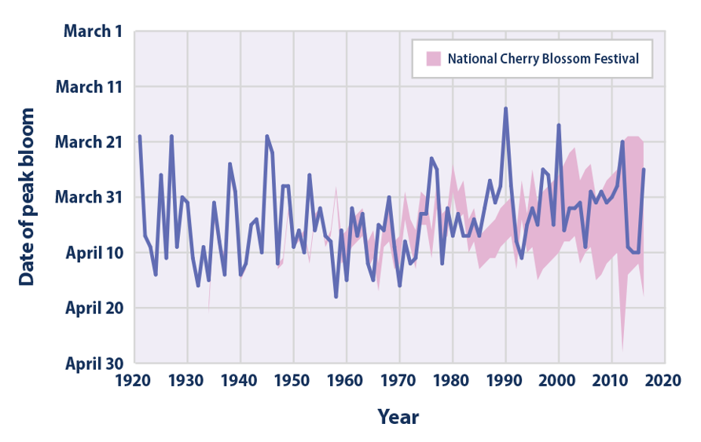

## So FAR we have....

## Phenology

 

* **Phenology is the study of the timing of cyclical events in an organism's life cycle**
    + flowering of plants, 
    + emergence of worker bees from the hive
    + migration of birds

 

* **Timing of critical life stages can be triggered by external environmental clues**
    + seasonal temperature change,
    + photoperiod (day length)
    + precipitation
    
## Global Change and Phenology

 

* **Shfits in weather patterns and/climate can alter an organism's phenology** 
 

* **Species that interact closely may no longer synced**

 

* **Flowering times and insect emergence are a great example**
    + certain insect and plant species may be specialized to each 

 

* **What happens when their interactions become mismatched?

## History matters!!!

 

* **To address current trends in environmental change we must first know historical patterns**
    + when and where species occur
    + timing of phenological events
    + key environmental triggers
    
* **We need data on our organsims and their environment**
  
## Environmental Triggers are changing (climate)

## Triggers alter phenology

## Scheduling the DC Cherry Blossum Festival

## Understanding changes in butterfly phenology

 

* **Long term data from natural history specimens**
    + earliest collection date each year of specimens
    + proxy for phenology 
    + online natural history database, iDigBio

 

* **First date an adult was collected signifies when the butterfly was in flight**
    + short lifespan of butterflies allows study of their phenology
    
## Goal today: Phenology from the plants perspective

* **Which is more important for plant reproduction and success?**

 

1) Flowering time as a function of temperature chanves
    + source of butterfly nectar food
  
   
  
**or**

 

2) Timing of butterfly adult flights

## DATA SETS

 

* **Go to Sakai > Resources > Data Fridays > and open the excel file labeled “Phenology_student_data"**

 

* **Read the “Metadata” tab to understand what datasets you have available to explore our question**

