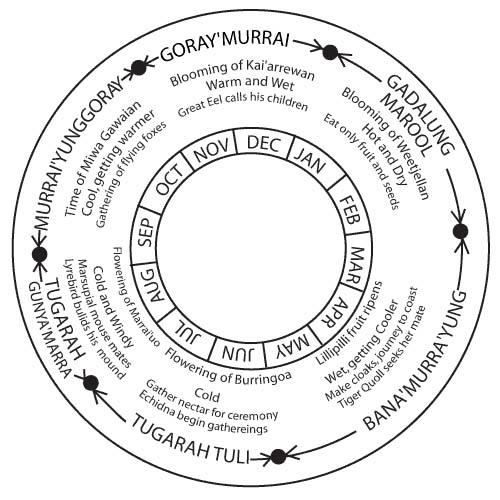
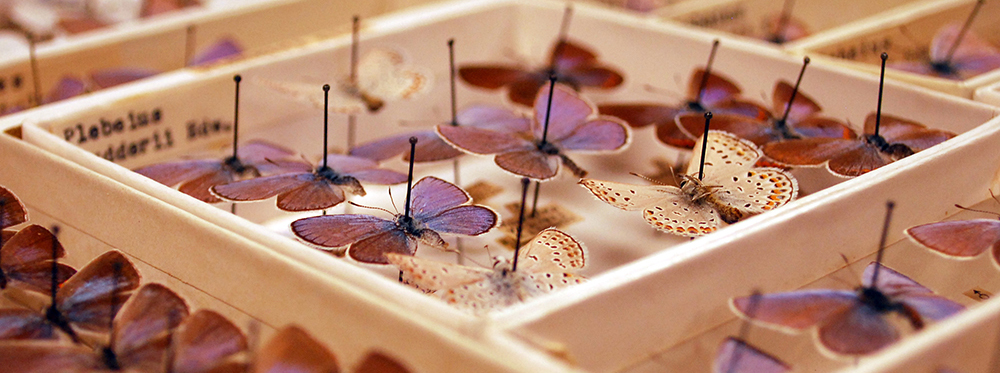

## Phenology

 

* **Phenology is the study of the timing of cyclical events in an organism's life cycle**
    + flowering of plants, 
    + emergence of worker bees from the hive
    + migration of birds

 

* **Timing of critical life stages can be triggered by external environmental clues**
    + seasonal temperature change,
    + photoperiod (day length)
    + precipitation

    
## Global Change and Phenology

 
 
 

* **Shifts in weather patterns and/climate can alter an organism's phenology** 
    + Species that interact may no longer be synced

 

* **Flowering times and insect emergence are a great example**
    + insect and plant species life cycles connected

 

* **What happens when their interactions become mismatched?**

## Environmental triggers are changing (climate)

## Environmental triggers alter phenology

## Scheduling the DC Cherry Blossum Festival

    
## Goal today: Phenology from the plants perspective

 
 

* **Which is more important for plant reproduction and success?**

 

**Flowering time as a function of temperature changes**
  
   
  
**or**

 

**Timing of butterfly adult flights in Bristish Columbia**

## DATA SETS

 

* **Go to Sakai > Resources > Data Fridays > and open the excel file labeled “Phenology_student_data"**

 

* **Read the “Metadata” tab to understand what datasets you have available to explore our question**

## Understanding changes in butterfly phenology

 

* **Long term data from natural history specimens**
    + earliest collection date each year of specimens
    + proxy for phenology 
    + online natural history database, iDigBio

 
 

* **First date an adult was collected signifies when the butterfly was in flight**
    + short lifespan of butterflies allows study of their phenology

