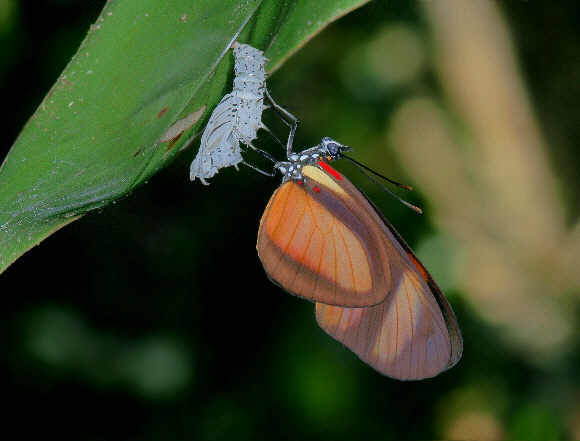

## Phenology

 

* **Phenology is the study of the timing of cyclical events in an organism's life cycle**
    + flowering of plants, 
    + emergence of worker bees from the hive
    + migration of birds

 

* **Timing of critical life stages can be triggered by external environmental clues**
    + seasonal temperature change,
    + photo period (day length)
    + precipitation
 
 

* **An important component of the culture of many indigenous communities** 
    

    
## Climate Change and Phenology

 
 
 

* **Shifts in climate can alter an organism's phenology** 

 

* **Insect and plant life cycles are connected**
    + e.g. flowering and insect emergence 

 

* **What happens when species interactions become mismatched?**

##

<!-- ## Scheduling the DC Cherry Blossum Festival -->
<!-- 
 -->

<!--  -->

##

## Phenology from the plants perspective

 
 
 
 

**Question: Which is more important for plant reproduction and success?**

 

**Flowering time as a function of temperature changes**
  
 
**or**

 
**Timing of butterfly adult flights**

## Data: Modified from  Kharouba and Vellend, 2015

 

* **Go to Brightspace > Open the excel file labeled “Phenology_student_data"**
    + Data Exercises module

 

* **Read the “Metadata” tab to understand what datasets you have available to explore**

 

* **Dataset:  Temperature sensitivity of the timing of adult flight in butterflies in British Columbia, Canada.**
    + many butterfly species
    + day of first flight
    + annual and seasonal climate data

## Understanding changes in butterfly phenology

 
 
 

* **Long term data from natural history specimens**
    + earliest collection date each year of specimens
    + proxy for phenology 
    + online natural history database, iDigBio

 
 

* **First date an adult was collected signifies when the butterfly was in flight**
    + short lifespan of butterflies allows study of their phenology

