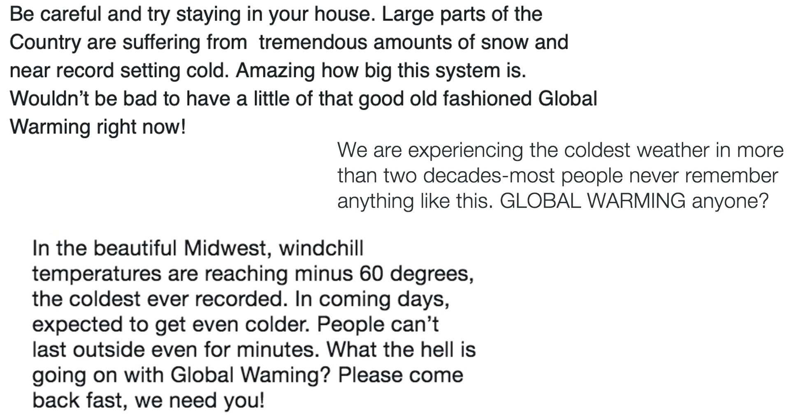
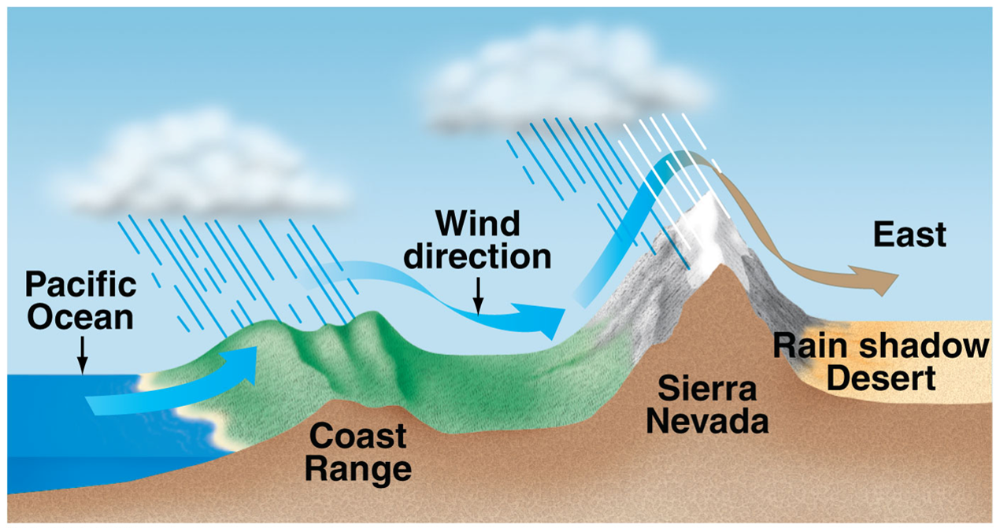
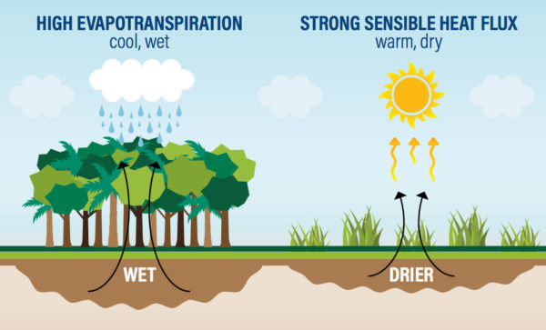
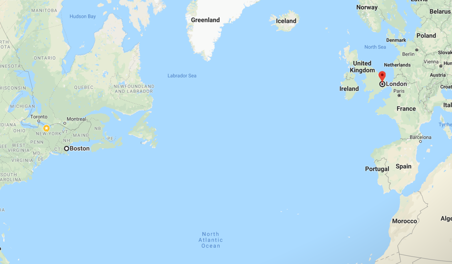
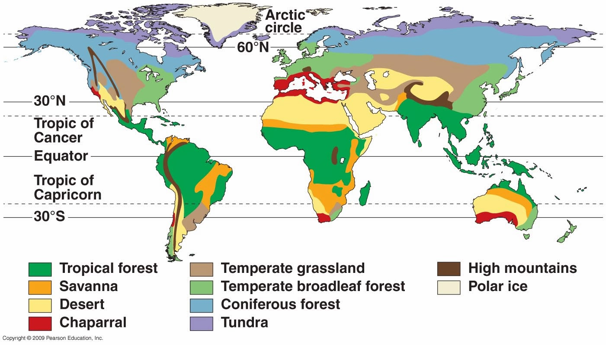
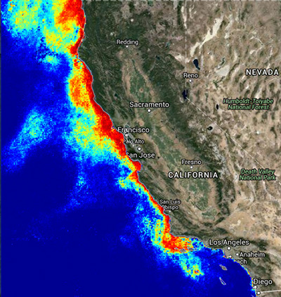
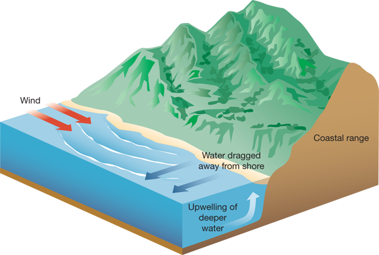
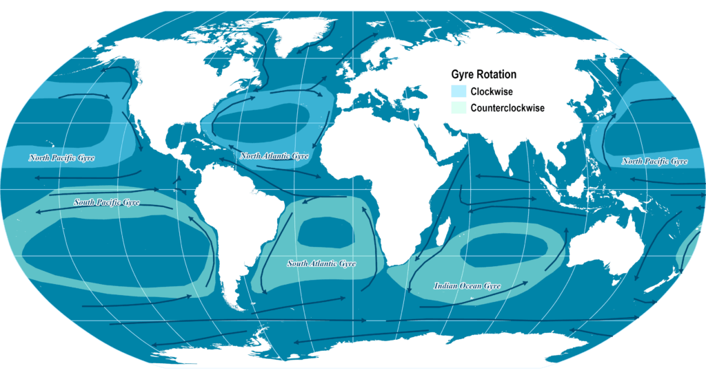

## Current vs Collective state of the atmosphere

## Elements of climate and weather

 

* **Precipitation**
    * process that ends with the fall of water to the earth’s surface.

 

* **Temperature**
    * amount of heat energy in the air

 

* **Atmospheric pressure**
    * force exerted on a surface by the weight of the atmosphere. 
    * varies vertically; decrease as you ascend

* **Wind**
    * dries humidity, causes storms, and drives evaporation

 

* **Solar radiation**
    * provides heat

 

* **Cloudiness**
    * form when humid air cools to dew point & water/ice attaches to dust, ash, etc.
    * type and # are important

## Climate vs Weather: Words matter

 

## The Earth is divided into different climate zones

**Distinguished by several key physical biosphere features**

## Slope of Earth's surface causes uneven heating

## Earth's axial tilt (23.5&deg;) and rotation creates seasons

**More uneven heating**

<!-- ## Fun Fact: Changes in Earth's tilt and Ice Ages -->
<!-- 
 -->

<!--  -->

## Atmosphere circulation creates moving via "Air Donuts"

**Creates wet and dry regions on land surfaces**

## Earth's atmosphere contains six rotating "Air Donuts"

## Earth surface features also impact climate

## Mountains and the rain shadow effect

## Closeness to large bodies 

## Surface features also impact weather: Atlantic hurricanes

## Surface features impact weather: Atlantic hurricanes

<iframe width="560" height="315" src="https://www.youtube.com/embed/h1eRp0EGOmE" frameborder="0" allow="autoplay; encrypted-media" allowfullscreen></iframe>

## Vegetation alters weather and climate

**Trees pull water from the ground and release water vapor through their leaves, generating atmospheric rivers of moisture**
 
https://www.youtube.com/watch?v=Y3OWgb0Bv-A

## Why is London warmer than Boston?

## Ocean currents heavily impact global climates

## Global climate: El Nino (https://www.climate.gov/enso)

## Biomes: Usually defined by communities of plants

 

## Climate controls life: Terrestrial biomes

 
 
 
 
 
 
 
 
 

**Why is the yin and yang of ecology and evolution key here?**

## How does climate impact ecology? A question of scale...

## Aquatic Biomes: Depth, light and nutrients

## Take home messages

* **Climate and weather are connected but should not be used interchangeably**
    + current vs collective atmospheric conditions

 

* **The Earth is round, tilted and spinning**
    + adds complexity to how energy interacts with the surface
    + more than just albedo

 

* **There are broad climate patterns with latitude and altitude**

 

* **HOWEVER - lots of other factors make weather and climate patterns more complex**
    + know some examples
    
 

* **Biomes represent climate zones composed of living things adapted to specific climate conditions**
    + largely related to precipiation and temperature

<!-- ## Ocean Biomes: Coastal productivity -->
<!-- 
 -->

<!--  -->

<!--  -->

<!-- ## Deep Ocean: Subtropical Gyres -->
<!-- 
 -->
<!--   -->

<!--  -->

<!-- ## How does climate impact ecology? A question of scale... -->
<!-- 
 -->

<!--  -->

