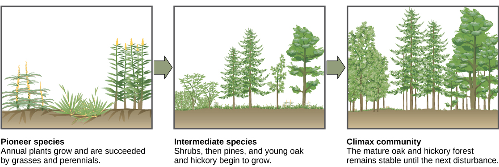
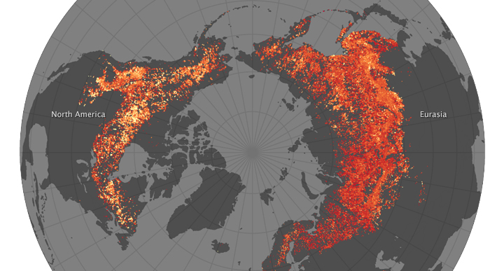

```{r setup, include=FALSE}
knitr::opts_chunk$set(echo = FALSE)
```

##


## Diverse communities broaden ecosystem function
<hr>
<br/>
<br/>
<br/>

<div style="float: left; width: 45%;">

* **Species occur together**
    + not all perfectly adapted
    + networks of trophic interactions

<br/>

* **Ecosystems work better as a group**
    + No single species performs all roles
    + larger threshold of environmental conditions
    + fosters ecosystem resilience
        + ball & cup model
 </div>   
        
 

## Diverse communities broaden ecosystem function
<hr>
<br/>
<br/>
<br/>

<div style="float: left; width: 45%;">

* **Species occur together**
    + not all perfectly adapted
    + networks of trophic interactions

<br/>

* **Ecosystems work better as a group**
    + No single species performs all roles
    + larger threshold of environmental conditions
    + fosters ecosystem resilience
        + ball & cup model
        
 </div>   
        
 

##

 

## Not all species are created equal
<hr>


## Reintroduction of wolves in Yellowstone: Top down control
<hr>


## Hierarchical levels in an community: Food webs
<hr>


## Energy flow limits length of food chain (10% rule)
<hr>


## Building ecosystems: Succession
<hr>


## Disturbance & succession
<hr>


<!--  -->

## Disturbances are the major cause of fluctuation in succession
<hr>
<br/>

<div style="float: left; width: 45%;">

* **Discrete event in time that:**
    + removes biomass
    + alters populations & communities
    + alters structure of ecosystems 
    + changes resources availability
    + changes physical environment

<br/>

* **Natural vs Human caused disturbance**
    + lightning, herbivory, flood
    + mining, clear-cutting

<br/>

* **Maintains communities in non-equilibrium**
    + ecosystems rarely reach steady-state
</div>
  


## Severity of disturbance: intensity and size
<hr>
<br/>


## Severity of natural disturbances: frequency
<hr>
<br/>


## Primary succession
<hr>
<br/>
<br/>
<br/>

* **After severe disturbances**
    + remove or bury biomass
    + *no soil or seeds remain*

<br/>

* **Glacial retreat, mud-flows, floodplains, lava flows**

<br/>

* **Colonization:**
    + species that handle stresses
    + low nutrients / minimal soil
    


## Primary succession: Facilitators
<hr>
<br/>
<br/>

* **Initial Species composition:**
    + nitrogen fixers (bacteria, plants)
    + **Facilitation**
 
 <br/>
 
* **Colonizers must disperse to site**
    + wind dispersed seeds/spores
    + algae & lichens
    + small seeded plants
    + distance matters

 <br/>
 
* **Is primary succession fast or slow?**


## Secondary succession
<hr>


## Secondary succession: pioneer species
<hr>
<br/>
<br/>
<br/>
<br/>

<div style="float: right; width: 40%;">

* **Potential growth rate:**

<br/>

* **Tolerance:**

<br/>

* **Seed size & Number:**

<br/>

* **Longevity:**
</div>


## Late succession: inhibition & tolerance
<hr>



## Wildlife and succession
<hr>


<!-- ## The Boreal: forests shaped by fire -->
<!-- <hr> -->

<!--  -->

<!-- ## Boreal forest succesion: Aspen - Spruce - Cedar -->
<!-- <hr> -->

<!--  -->

<!--  -->

<!-- ## Boreal forest: Secondary succesion -->
<!-- <hr> -->

<!--  -->

<!-- ## The future of boreal forests -->
<!-- <hr> -->

<!--  -->

<!--  -->

<!-- ## Disturbance regimes of Giant Sequoia forests -->
<!-- <hr> -->

<!--  -->

<!--  -->

<!-- ## Fire regimes and humans -->
<!-- <hr> -->

<!--  -->

## Study aid: Glacier Bay Alaska succession
<hr>
<br/>

https://www.youtube.com/watch?v=eEvRLAACNz4

<br/>

https://wps.pearsoncustom.com/wps/media/objects/2128/2179441/28_03.html

