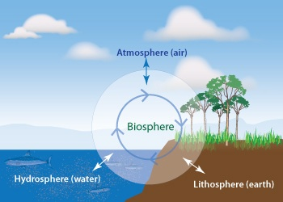

## Ecology is studied at very large scales: Biosphere

 
 
 
 
 
 
 
 
 
 
 
 
 
 
 
 

**What makes up the BIOSPHERE?**
 

**Energy and water exist and move around the biosphere in different forms**
 

**Where does energy come from?**

##

 
 
 
 
 
 
 
 
 
 
 
 
 
 
 
 
 
 

"A thing is right when it tends to preserve the integrity, stability, and beauty of the biotic community. It is wrong when it tends otherwise" -Aldo Leopold 

## Painting Chalon Sombrero

## Albedo

## Global albedo is highly variable

<iframe width="560" height="315" src="https://www.youtube.com/embed/O0B8Yi7AZvQ" frameborder="0" allow="accelerometer; autoplay; encrypted-media; gyroscope; picture-in-picture" allowfullscreen></iframe>

## Albedo feedbacks and Snowball Earth

##

**Earth's average albedo is ~0.3, keeping surface @ 15°C**
 

**Do you think albedo is changing?**
 

**Albedo: cold generates cold but.....**

## Sun is the Earth's primary form of heat energy, via radiation

 
 

* **~1/3 of sunlight energy reflects back to space**

 

* **Rest is absorbed by land, ocean and atmosphere**

 

* **Exact amount absorbed depends on both surface and atmosphere**

 
 
 

*  **The balance of incoming and outgoing radiation makes up Earth Energy Budget**

##

## Why clouds are cool...

 

##

##

## Atmospheric absorption spectra

 

## Composition of the atmosphere

 

 

* **Gases have different RESIDENCE TIMES**
    + N2 = 13 million years
    + O2 = 10,000 years
    + **N20 = 114 years**
    + **CH4 (methane) = 12 years**
    + **CO2 = 5-200 years (1/2 removed quickly)**

 
 

* **Water vapor is reactive and highly variable**
    + **10 day residence time**
    + seasonally and spatially

## Changes in composition impact atmospheric heating

## Water vapor is the most abundant greenhouse gas

 
 
 
 
 

* **NASA recently confirmed heat-trapping effect of water in the air**
    + critical component of global change
    + collects at tropical latitudes

 

* **2x climate warming caused by increased CO2**

<!-- ## Water vapor feedback loop -->
<!-- 
 -->
<!--   -->

<!--  -->

## Solar energy & water cycle connected

Water cycle = continuous movement of water within the earth and atmosphere

 
 
 
 
 
 
 
 
 
 
 
 
 
 
 
 
 
 
 

<strong>25% of incoming solar energy leaves the surface through evaporation</strong>

## Evapotranspiration: Energetics of water movement

 
 
 

* **Water has high specific heat**
    + 4x more energy to heat water than air
    + uses up solar energy

 

* **30% of oceans evaporate per year**
* **>60% of rainfall is lost to evapotranspiration**

 

* **Large energy fluxes when water changes state**
    + evapotranspiration cools surfaces
    + condensation warms atmosphere

<!-- ## Evapotranspiration USA -->
<!-- 
 -->

<!--  -->

## Global water cycle: 577,000 km^3^ of water circulates each year

## Global water cycle: Residence times matter

## Water for humans?

<!-- ## Changing water cycle -->
<!-- 
 -->

<!--  -->

