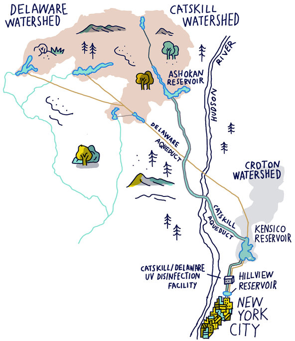

<!-- ## -->

<!--  -->

## Earth's vital signs: Millenium ecosystem assessment (2005)

## Ethics of ecology: Ego- versus Ecocentric

## Are humans apex predators?

## 4 major categories of ecosystem services

 
 
 
 

* **Provisioning services**

 

* **Regulating services**

 

* **Cultural services**

 

* **Supporting services**

 

## Provisioning services: Raw materials

 
 
 
 
 
 
 
 
 
 
 
 
 
 
 
 
 
 
 

**Forest Service economists estimated the minimum value of water from National Forest System lands to be $3.7 billion per year**

## Regulating services: Natural ecosystem processes

## Case study: Pollination

## Cultural services: Non-material benefits

<!-- ## Are we disconnected from nature? -->
<!-- 
 -->

<!--  -->

<!--  -->

## Supporting services: Underlying natural processes

<!-- ## Conservation and restoration -->
<!-- 
 -->

<!--  -->

<!-- ## The importance of connectedness -->
<!-- 
 -->

<!--  -->

<!--  -->

<!-- ## -->

<!--  -->

<!-- ##  -->

<!--  -->