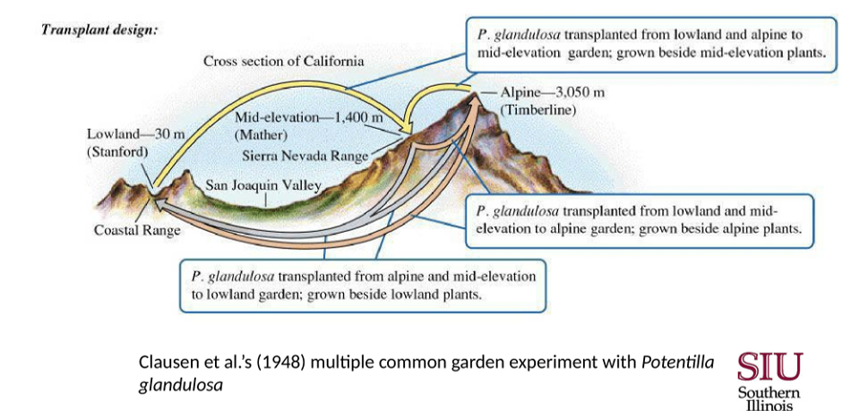

## Species are so specialized, they are absent almost everywhere

##

## Diversity of nature evolves over a long period of time...

## Evolution by **natural selection**: Darwin and Wallace

 

1. Individuals in a population are not identical

 

2. Some variation among individuals in heritable (genetic component)

 

3. Individuals sometimes die before reproducing 

 

4. Different ancestors leave different #'s of decendants

 

* **Evolution is the change, over time, in the heritable characteristics in a population or a species

## Why does this matter for Ecology?

 

* **Survival of the fittest** is tied to organisms interacting with their environemnt

 

* **This term is a little misleading, should read:**
 
* **Survivial of the bettter designed for an immediate, local environment**
    + survivied death and desctruction
    + reproduced successfully

 

* **Environment matters a lot!**

## Natural selection and evolution occur within a species

 

* **There are traits of plants and animals that are 'conserved'**
    + not easily modified
    
* **However,We often seem lots of variation within a species**

* **Species traits vary over geographic ranges**
    + as long as migration occurs
    
## Classic approaches to understand interspecific variation: Common Garden

## Interspecific variation can can occur at short distances

## Thought question:

* **Flowering times of plants at Zinc mines did not overlap with those of natural fields (for 40 years!)

* **Why is this important?**

## Reciprocal transplants: investigating local adaptation

eggs from Appalachian Mountains (AM) Coastal Plain (CP) and New York (NY)

AM and NY populations did experience reductions in egg viability under a southern winter at the CP site compared to control wintering conditions, while the CP egg masses had equivalent survival

## Ecology is more than just the environment...

* **The interactions between species also drive evolutionary processses**

* **Selection forces**

* **Steam guppies in trindidad are separated by waterfalls**
    + isolated populations
    + tons of different traits across guppy populations
    
* **What could be driving these changes?**

## Predation, sex and flamboyance in guppies

## When species interact, coevolution can occur

## Ecological speciation

 * **ecologically based divergent selection between different environments leads to the creation of reproductive barriers between populations.**
    + driven by difference in environment btn populations
    + driven by interaction with other species

* **populations are isolated, then selection drives change**

##

## Parallel evolution

## Convergent evolution

##
