## The Yin and Yang: Swallowtail butterflies

**The struggle for existence (ecology) drives changes in organisms (evolution)**

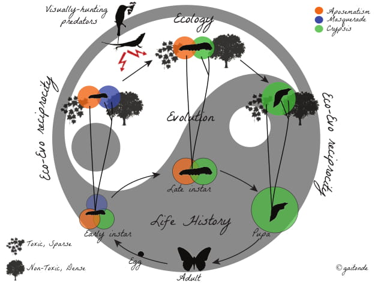

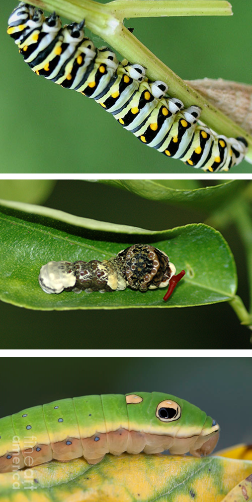

##
**Ecology creates the challenges. Evolution shapes the solutions.  Those solutions then change the ecology**

## Review: Evolution Basics

 
 
* **Evolution**:

    <!-- >- change in the genetic composition of a population over generational time -->
 

* **Population**: 

    >- group of individuals of the same species, occupying the same time and space, with the potential of interbreeding (Populations are the lowest unit of evolution, Individuals DO NOT evolve)
    
 

* **Species**:

    >- group of living organisms consisting of similar individuals capable of exchanging genes or interbreeding successfully
    
 

* **Evolution by Natural Selection**: 

    >- Due to the struggle for existence, organisms with heritable traits that favor survival and reproduction will tend to leave more offspring than their peers, causing those traits to **increase in frequency over generations**
    
## Brown et al. 2007: many genetically distinct lineages of giraffe

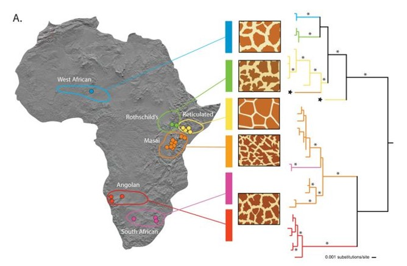

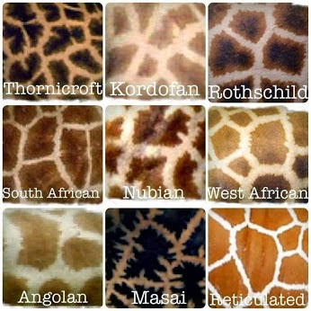

## Brown et al. 2007: UPDATE!!!!

**The IUCN now recognizes the Northern, Southern, Masai and Reticulated giraffe species**

 
 
 
 
 
 
 
 
 
 
 
 
 
 
 
 
 

The Giraffe Conservation Foundation performed the first-ever comprehensive DNA sampling of all major populations of giraffe throughout Africa, revealing 4 distinct species and several subspecies.

## Evolution by **Natural Selection**: Darwin and others

 
 

* **A few things need to be true for a population to adapt**

 

>- Individuals in a population are not identical

>- This variation among individuals is heritable

>- Individuals sometimes die before reproducing

>- Different ancestors leave different #'s of descendants

 
 

* **If enough change results in reproductive isolation between populations, new species *can* evolve**

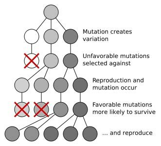

## What is Generational Time? Why does it matter?

**Generation time determines the rate (speed) of evolution**

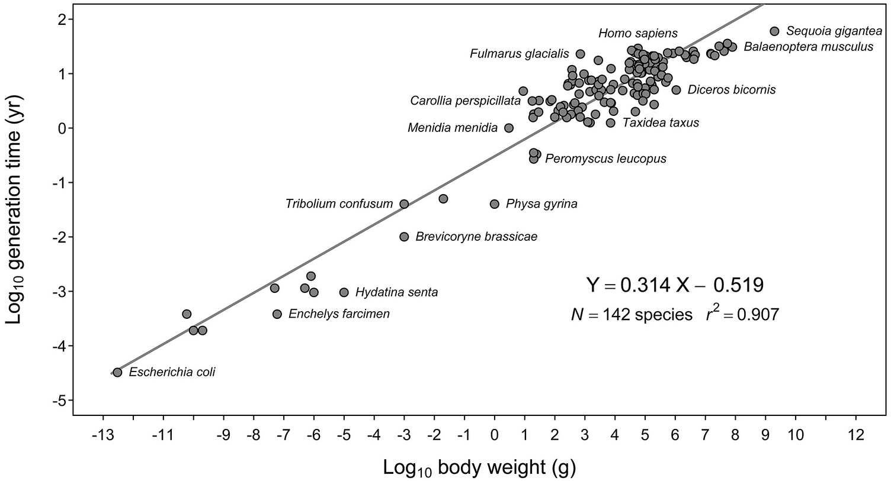

## Species are so specialized, they are absent almost everywhere

**How does this related to the dualism between ecology and evolution?**
 
 
 
 
 
 
 
 
 
 
 
 
 
 
 
 
 
 
 
 

**How many species of bees do you think there are in the USA?**

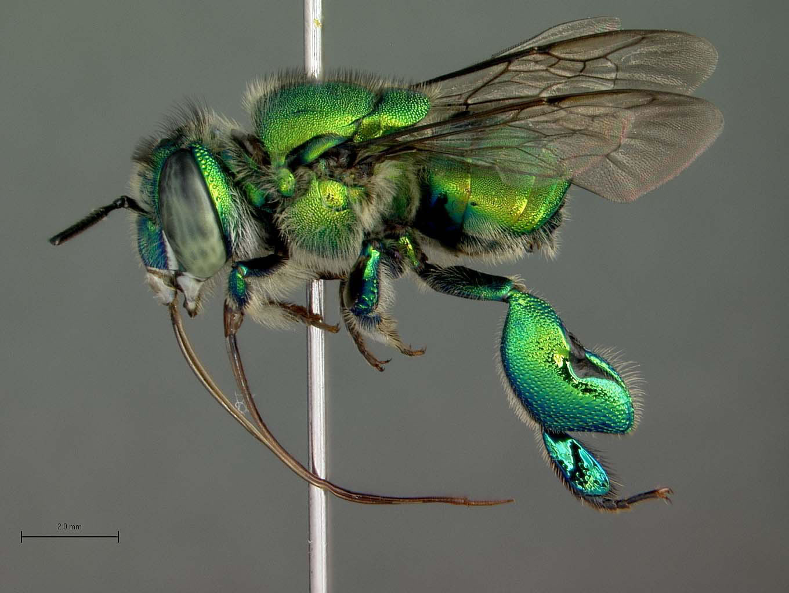

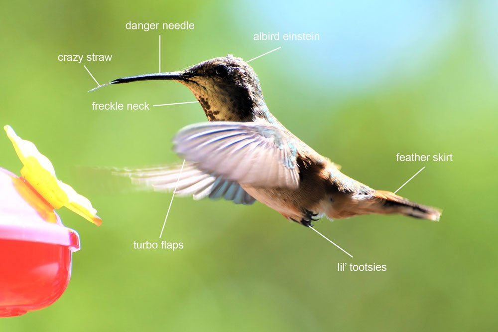

##

 
 
 

* **Ecology determines where an evolved organism can live**
    + bees require flowering plants, specific climates, and nesting habitats
    + bees are constrained by competitors, predators, parasites, and pathogens
    
 

* **Evolution determines what kind of organism ecology has to work with**
    + generations of natural selection have shaped bee species to succeed under particular sets of conditions.

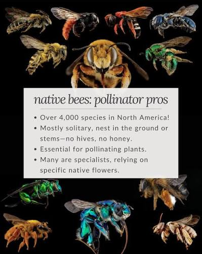

## The 'Tree of Life' evolved over geologic time periods (deep time)

**The fossil record allows us to explore ecology:evolution in deep time**
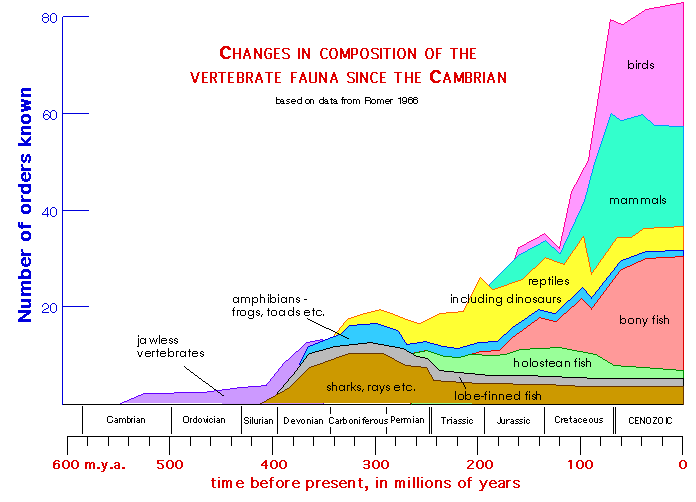

## Why does this matter for Ecology?

 
 

* **Survival of the fittest** is tied to organisms interacting with their environment (abiotic & biotic factors)

 

>- **This term is a little misleading, should read:**
 

>- **Survival of the better designed for an immediate, local environment**
      + survived death
      + reproduced successfully
      + passed on more genes than the less fortunate

 

>- **The components and themes of ecology matter a lot!**
      + environments are often not stable for very long
      + even when they are stable - natural selection is still occurring

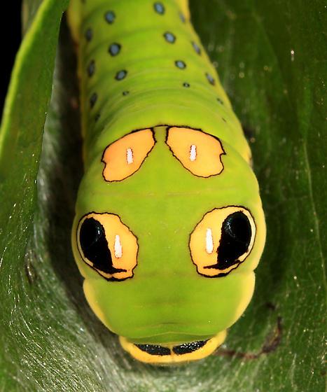

## Ecological forces drive evolution

 
 

* **Some traits of living things are 'conserved'**
    + The genes responsible for essential functions often change very little over evolutionary time because mutations would be selected against

 

* **Regardless, we often seem lots of variation within a species**

 

* **Traits of a species often vary over geographic ranges**
    + why?

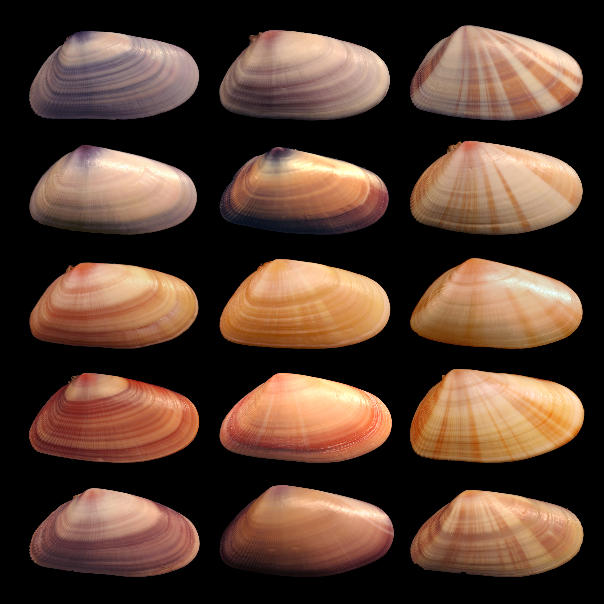
    
## 'Ohi'a lehua tree on Hawaiian Islands has many forms

  

**Ōhiʻa (*Metrosideros polymorpha*) occurs across the Hawaiian Islands from near sea level to more than 2,200 m elevation, and from dry habitats to extremely wet forests.**

 
 
 
 
 
 
 
 
 
 
 
 
 
 

**The species epithet, *polymorpha*, literally refers to its many forms, with 8 varieties now recognized**

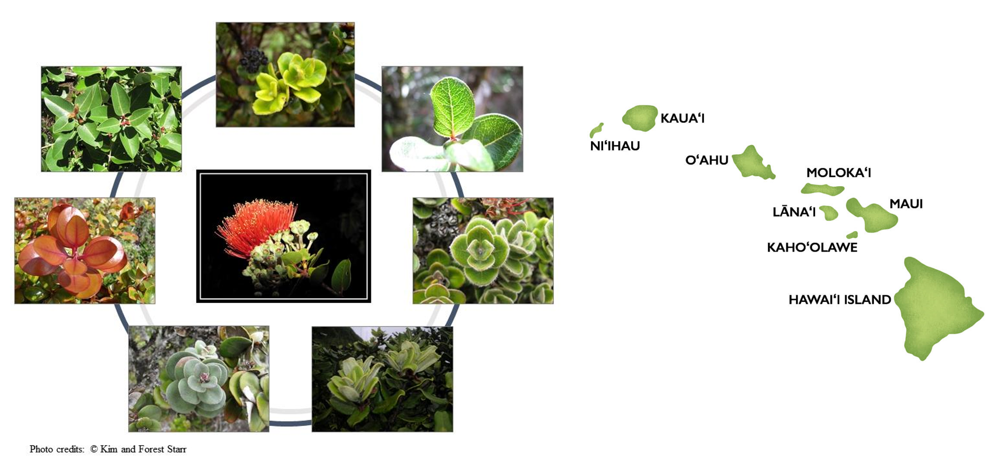
    
## Within species variation can occur at short distances

**Strong local selection can create genetically distinct populations over very short distances when a trait is advantageous only in a specific environment.**

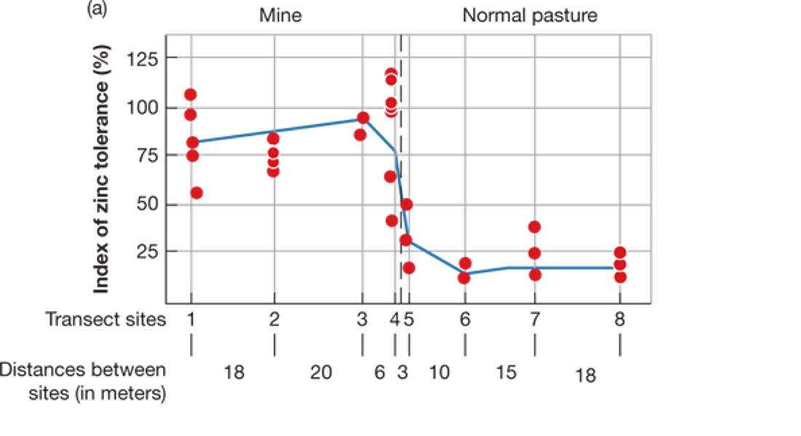

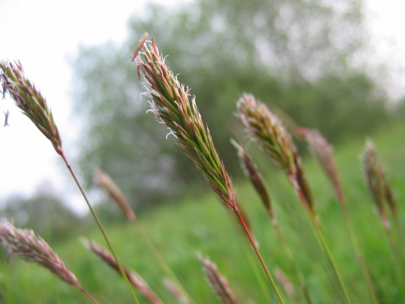

<!-- ## Thought question: -->
<!-- 
 -->
<!--   -->
<!--   -->
<!--   -->

<!-- 
 -->

<!-- * **Flowering times of plants at Zinc mines did not overlap with those of natural fields** -->
<!--     + for 40 years! -->

<!--   -->
<!--   -->
<!--   -->

<!-- * **Why is this important?** -->

<!-- 
 -->

<!-- 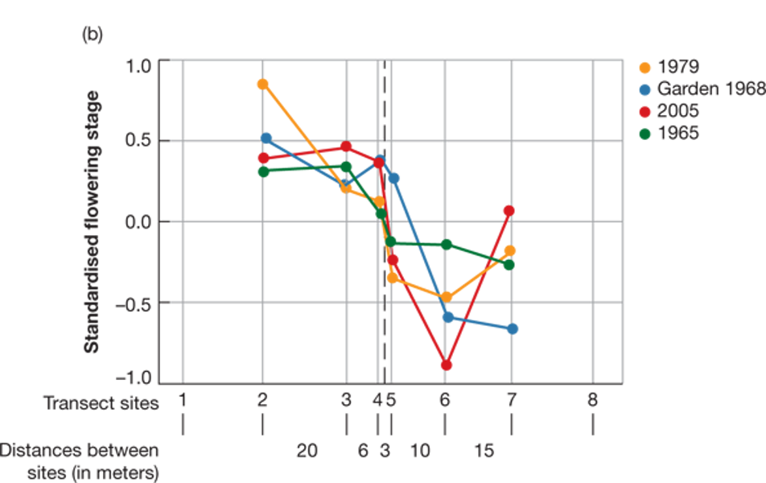 -->

<!-- ## Investigating local adaptation: Gypsy moth -->
<!-- 
 -->
<!--   -->
<!--   -->
<!--   -->

<!-- 
 -->

<!-- * **Eggs from Appalachian Mountains (AM) Coastal Plain (CP) and New York (NY)** -->

<!--   -->

<!-- * **AM and NY populations had reduced egg viability under a southern winter (CP site)** -->

<!--   -->

<!-- * **Coastal Plain eggs had equivalent survival** -->
<!-- 
 -->

<!-- 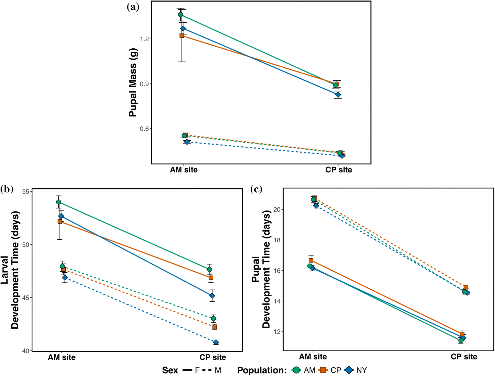 -->

## Evolution also driven by species interactions

 
 

* **Selection forces**: pressures on an trait by environmental factors driving evolution in a population 

 
 

* **Steam guppies in Trinidad are separated by waterfalls**
    + creates isolated populations
    + different traits appear across guppy populations

 

* **What selection forces could be driving these changes?**

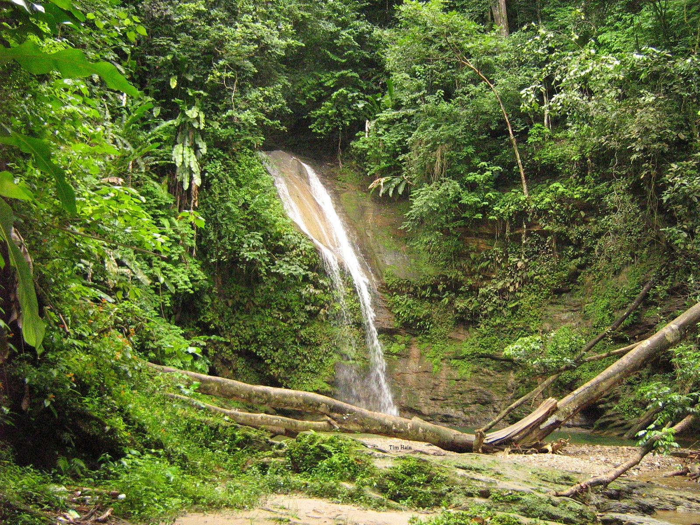

## Predation, sex and flamboyance in male guppies

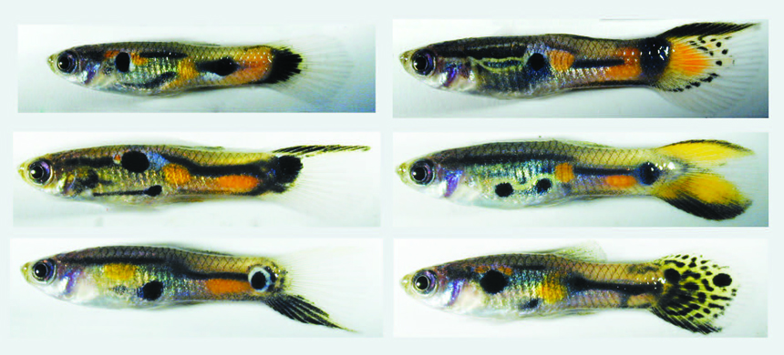

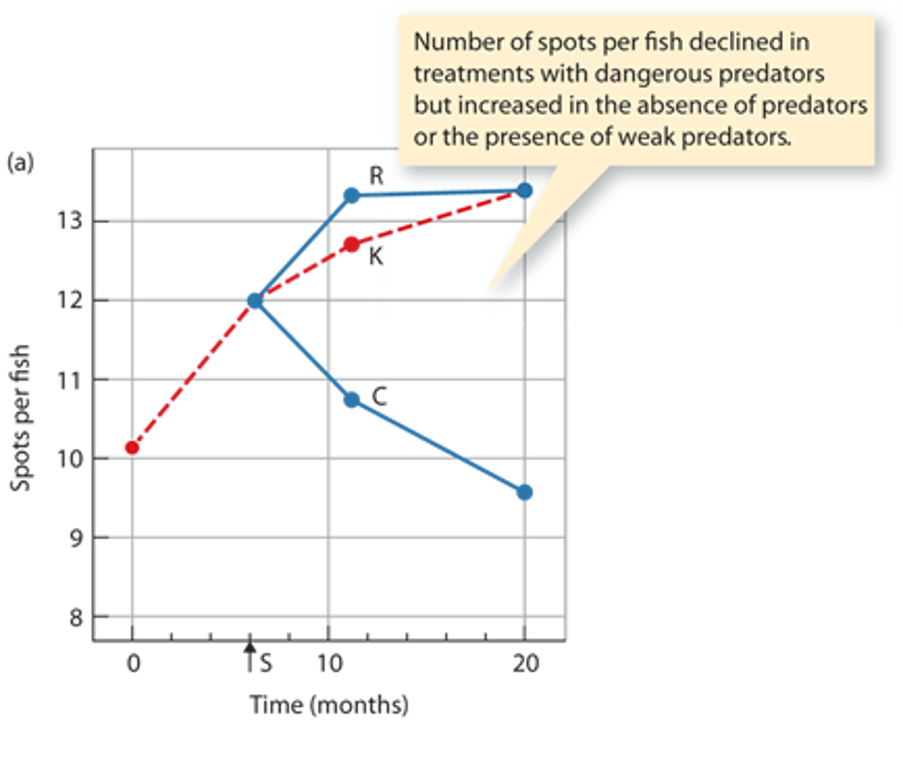

<!-- ## Great tit (Parus major) and bird feeders (Bosse et al. 2017) -->
<!-- 
 -->

<!-- 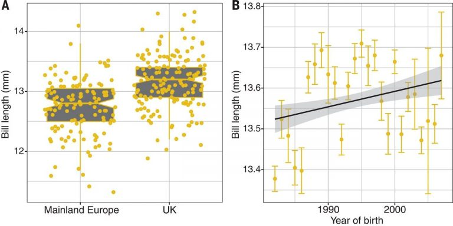 -->

<!-- 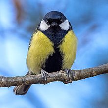 -->

## When species interact, co-evolution can occur

**Coevolution is the process in which two interacting species reciprocally influence each other’s evolution over time.**

 

* **Bats evolved echolocation to detect and capture flying insects in darkness**

 

* **Many moths evolved ears that detect bat ultrasound and trigger evasive flight**

 

* **Some bats evolved quieter or altered calls that make detection harder**

 

* **Some moths evolved ultrasonic clicks that can interfere with echolocation**

 

* **Each adaptation changes the selective pressure on the other species — a classic coevolutionary arms race**

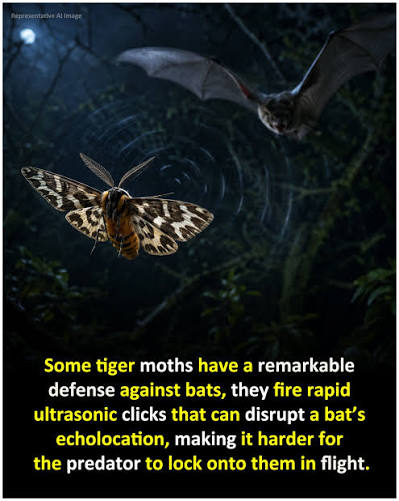

## Coevolution can also be evolutionary partnership

 

**Coevolution can be an evolutionary arms race—or an evolutionary partnership**

 

* **Some orchids are pollinated by only one or a few orchid bee species, creating an extremely specialized partnership**

 

* **This specialization can increase pollination efficiency—but it also means the orchid may be highly dependent on the presence of the right pollinator**

 

https://www.youtube.com/embed/_uHJGdTgtXE

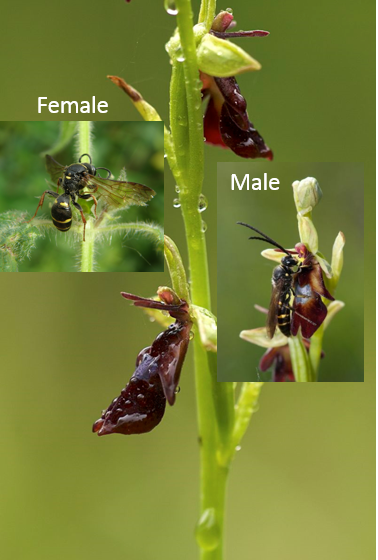

## Co-evolution shaped life on land

**Yin and Yang: Ecological interactions between flowering plants and insects created new selective pressures, while evolutionary innovations in both groups reshaped terrestrial ecosystems**

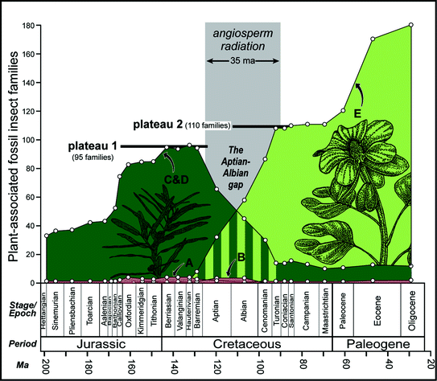

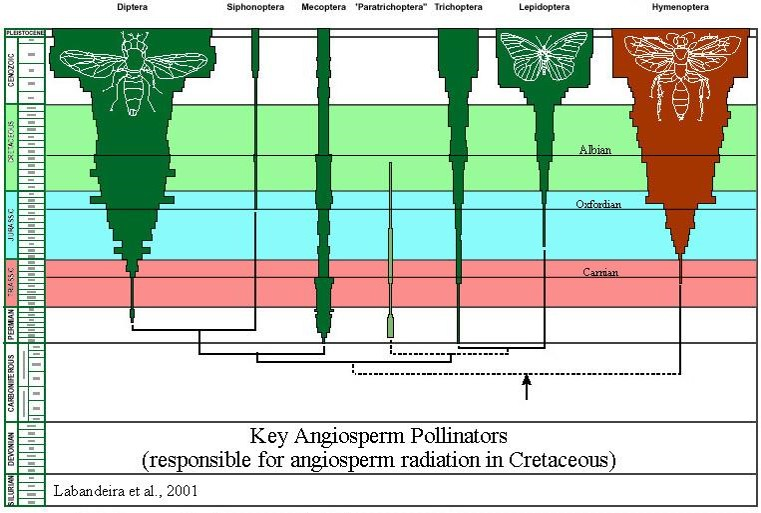

<!-- ## -->

<!-- 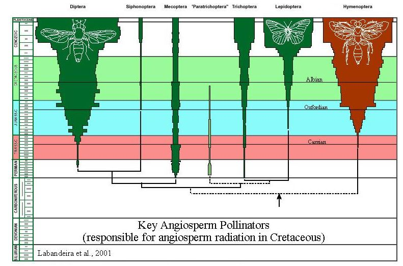 -->

<!-- ##  -->

<!-- 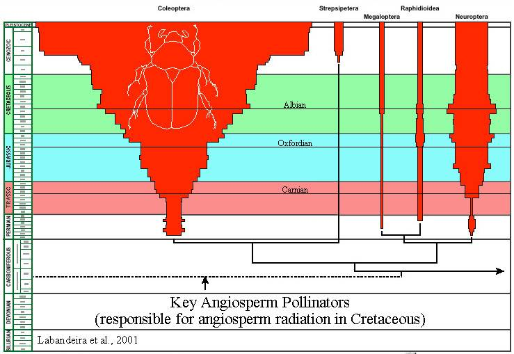 -->

## Ecologically driven speciation

 
 

* **Divergent selection between different environments can lead to the creation of reproductive barriers within a species**
    + driven by differences in environment
    + driven by interactions with other species

 
 

* **If populations become geographically isolated, new selection pressures drive change**

 

* **Eventually *may* lead to evolution of new species**

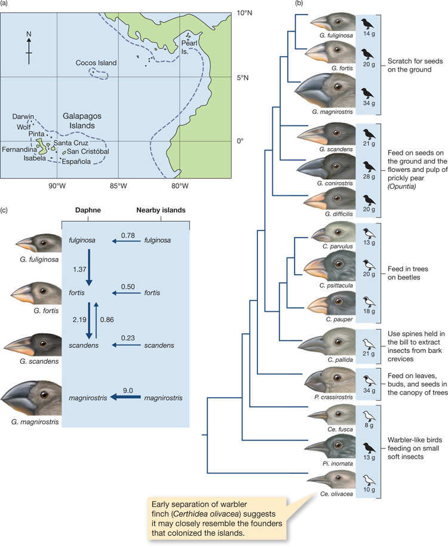

<!-- ## Ecologically driven speciation -->
<!-- 
 -->
<!--   -->
<!--   -->

<!-- 
 -->

<!-- * **Divergent selection between different environments leads to the creation of reproductive barriers** -->
<!--     + driven by selection pressures -->

<!--   -->
<!--   -->

<!-- * **Reproductive isolation and selection may eventually lead to the evolution of new species** -->
<!-- 
 -->

<!--  -->

<!-- ## Parallel evolution -->
<!-- 
 -->
<!--   -->
<!--   -->
<!--   -->

<!-- 
 -->

<!-- * **Divided populations evolving independently** -->
<!--     + large continental drift -->

<!--   -->

<!-- * **Ecological equivalents drive similar evolutionary processes** -->

<!--   -->

<!-- * **Ancestors were once connected** -->
<!--     + common set of potential traits -->

<!-- 
    -->

<!-- 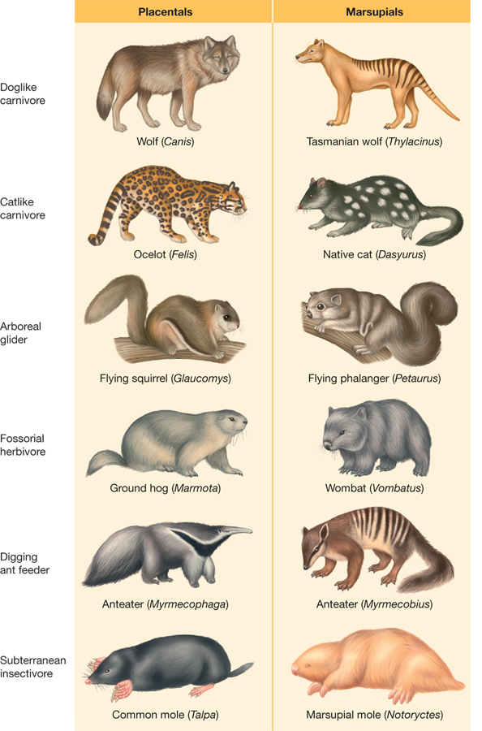 -->

<!-- ## Convergent evolution -->
<!-- 
 -->

<!-- 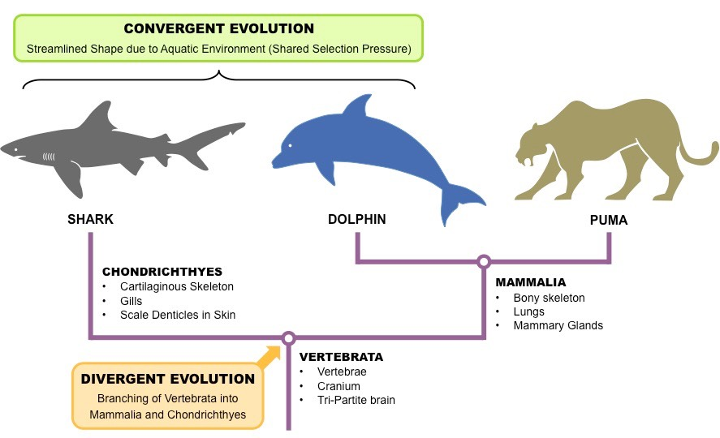 -->

<!-- 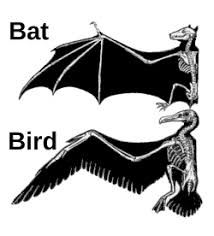 -->

<!-- ## -->

<!-- 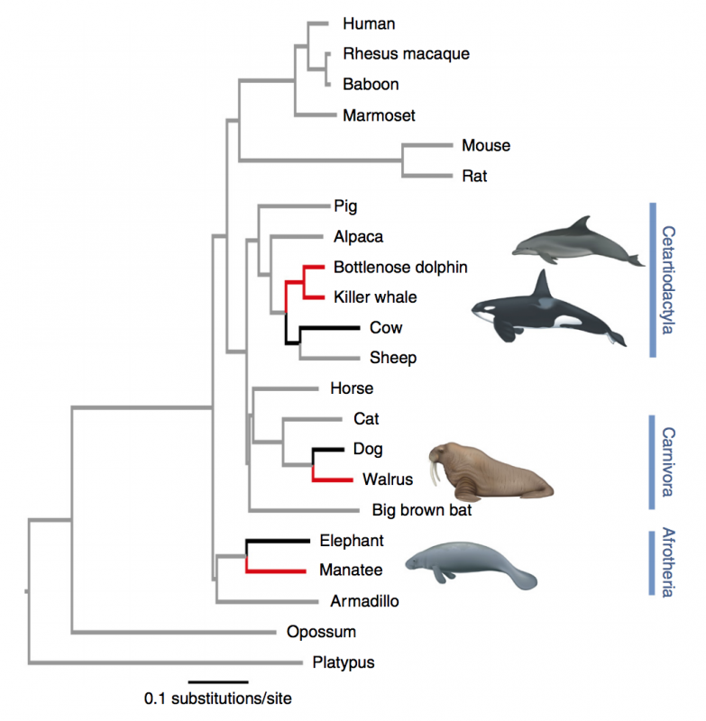 -->

<!-- ## Adaptive Radiation: Rapid speciation with sudden change -->
<!-- 
 -->

<!-- 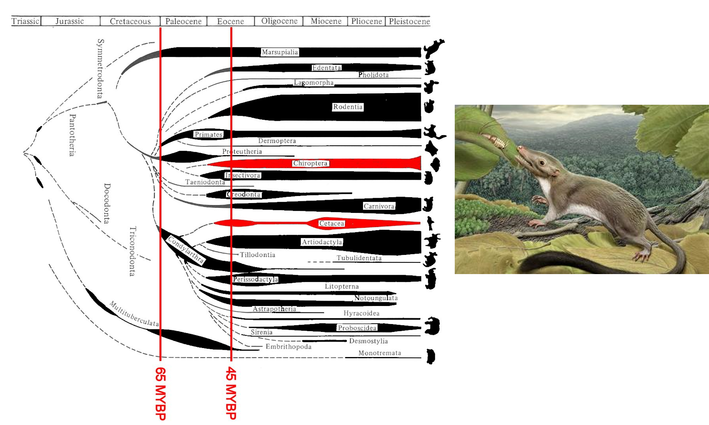 -->

## Creating new species can happen quickly...

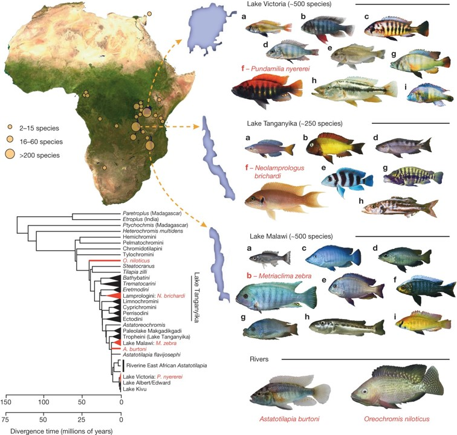

**Adaptive radiation =  rapid diversification of an ancestor into multiple species adapted to different ecological niches**

 

* **In Lake Victoria’s cichlid fishes, a relatively small number of ancestral lineages diversified into hundreds of species over a geologically short period**

 

* **Different species evolved to feeding on algae, insects, plankton, snails, other fish, or detritus.**
    + jaws, teeth, body form, behaviors, and habitat use changed separately

<!-- ## We view the macroevolution with phylogenetic trees -->
<!-- 
 -->

<!-- 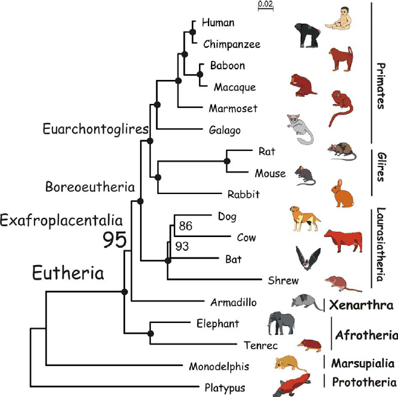 -->

<!--  -->

## Testable concepts in this lecture

 

* **The reciprocal relationship between evolution and ecology**

    
 

* **The ecological processes that enact strong selection pressures on species**
    
 

* **The specific role of ecology in *reproductive isolation* **
    
 

* **Patterns in ecological processes that have driven evolution over geologic time**

<!-- ## Ecology, Evolution and Global Change -->
<!-- 
 -->
<!--   -->
<!--   -->
<!--   -->

<!-- 
 -->

<!-- * **Evolution drives adaptation but time is important** -->

<!--   -->

<!-- * **Speed of environmental change may cause evolutionary mismatches** -->

<!--   -->

<!-- * **Rapid evolution can/may occur, but depends on what?** -->
<!--   + lizards with more sticky feed (15-20 generations) -->
<!--   + salmon migrating 2 weeks earlier (2 generations) -->

<!-- 
  -->

<!-- 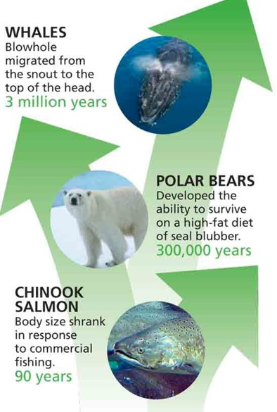 -->
