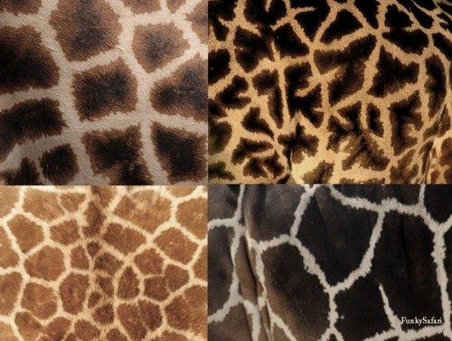
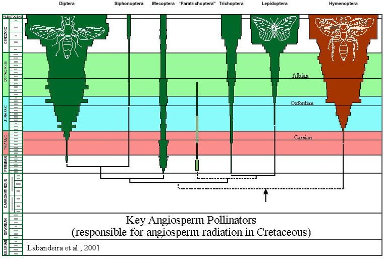

## The Yin and Yang: Swallowtail butterflies

##

## Review: Evolution Basics

 
 
* **Evolution**:

    <!-- >- change in the genetic composition of a population over generational time -->
 

* **Population**: 

    >- group of individuals of the same species, occupying the same time and space, with the potential of interbreeding
 

* **Species**:

    >- group of living organisms consisting of similar individuals capable of exchanging genes or interbreeding successfully
    
 

* **Evolution by Natural Selection**: 

    >- organisms with heritable traits that favor survival and reproduction will tend to leave more offspring than their peers, causing the traits to increase in frequency over generations

## Brown et al. 2007: 6 genetically distinct lineages of giraffe

The IUCN recognizes 1 species and 9 subspecies of giraffe.

 
 
 
 
 
 
 
 
 
 
 
 
 
 
 
 
 

However, the Giraffe Conservation Foundation performed the first-ever comprehensive DNA sampling of all major populations of giraffe throughout Africa, revealing 4 distinct species and several subspecies.

## Evolution by **Natural Selection**: Darwin and others

 
 

* **A few things need to be true for a population to adapt**

 

>- Individuals in a population are not identical

>- Some variation among individuals is heritable

>- Individuals sometimes die before reproducing

>- Different ancestors leave different #'s of descendants

 
 

* **If enough change results in reproductive isolation between populations, new species can evolve**

## What is Generational Time? Why does it matter?

**Generation time determines the rate (speed) of evolution**

## Species are so specialized, they are absent almost everywhere

**How does this related to the dualism between ecology and evolution?**
 
 
 
 
 
 
 
 
 
 
 
 
 
 
 
 
 
 
 
 

**How many species of bees do you think there are in the USA?**

##

## The 'Tree of Life' evolved over geologic time periods

## Why does this matter for Ecology?

 
 

* **Survival of the fittest** is tied to organisms interacting with their environment (living & non-living)

 

>- **This term is a little misleading, should read:**
 

>- **Survival of the better designed for an immediate, local environment**
      + survived death
      + reproduced successfully
      + passed on more genes that less fortunate

 

>- **The components and themes of ecology matter a lot!**
      + environments are often not stable for very long

## Ecological forces drive evolution

 
 
 

* **Some traits of living things are 'conserved'**
    + not easily modified

 

* **However,we often seem lots of variation within a species**

 

* **Traits of a species often vary over geographic ranges**
    + why?
    

    
## 'Ohi'a lehua tree on Hawaiian Islands has many forms

  

    
## Within species variation can occur at short distances

<!-- ## Thought question: -->
<!-- 
 -->
<!--   -->
<!--   -->
<!--   -->

<!-- 
 -->

<!-- * **Flowering times of plants at Zinc mines did not overlap with those of natural fields** -->
<!--     + for 40 years! -->

<!--   -->
<!--   -->
<!--   -->

<!-- * **Why is this important?** -->

<!-- 
 -->

<!--  -->

<!-- ## Investigating local adaptation: Gypsy moth -->
<!-- 
 -->
<!--   -->
<!--   -->
<!--   -->

<!-- 
 -->

<!-- * **Eggs from Appalachian Mountains (AM) Coastal Plain (CP) and New York (NY)** -->

<!--   -->

<!-- * **AM and NY populations had reduced egg viability under a southern winter (CP site)** -->

<!--   -->

<!-- * **Coastal Plain eggs had equivalent survival** -->
<!-- 
 -->

<!--  -->

## Evolution also driven by species interactions

 
 

* **Selection forces**: pressures on an trait by environmental factors driving evolution of a population 

 
 

* **Steam guppies in Trinidad are separated by waterfalls**
    + isolated populations
    + tons of different traits across guppy populations

 

* **What selection forces could be driving these changes?**

## Predation, sex and flamboyance in guppies

<!-- ## Great tit (Parus major) and bird feeders (Bosse et al. 2017) -->
<!-- 
 -->

<!--  -->

<!--  -->

## When species interact, co-evolution can occur

<!--  -->

<!--  -->

<!--  -->

## Co-evolution of orchid bee and ochid flowers

 
 
 

https://www.youtube.com/embed/_uHJGdTgtXE

## This Yin and Yang is key for life on land

<!-- ## -->

<!--  -->

<!-- ##  -->

<!--  -->

## Ecologically driven speciation

 
 

* **Divergent selection between different environments leads to the creation of reproductive barriers**
    + driven by differences in environment
    + driven by interactions with other species

 
 

* **Populations become isolated, then selection drives change**

 

* **Eventually may lead to evolution of new species**

<!-- ## Ecologically driven speciation -->
<!-- 
 -->
<!--   -->
<!--   -->

<!-- 
 -->

<!-- * **Divergent selection between different environments leads to the creation of reproductive barriers** -->
<!--     + driven by selection pressures -->

<!--   -->
<!--   -->

<!-- * **Reproductive isolation and selection may eventually lead to the evolution of new species** -->
<!-- 
 -->

<!--  -->

<!-- ## Parallel evolution -->
<!-- 
 -->
<!--   -->
<!--   -->
<!--   -->

<!-- 
 -->

<!-- * **Divided populations evolving independently** -->
<!--     + large continental drift -->

<!--   -->

<!-- * **Ecological equivalents drive similar evolutionary processes** -->

<!--   -->

<!-- * **Ancestors were once connected** -->
<!--     + common set of potential traits -->

<!-- 
    -->

<!--  -->

<!-- ## Convergent evolution -->
<!-- 
 -->

<!--  -->

<!--  -->

<!-- ## -->

<!--  -->

## Adaptive Radiation: Rapid speciation with sudden change

## Adaptive Radiation: Occurs at small scales too

## We view the macroevolution with phylogenetic trees

## Take Home Messages

* **There is a reciprocal relationship between evolution and ecology**
    + swallowtail catepillars
    
 

* **Ecological processes enact strong selection pressures on species**
    + guppy
    
 

* **Ecology plays a specific role in a tenant of natural selection: *reproductive isolation* **
    + giraffe
    
 

* **Patterns in ecological processes have driven evolution over very long periods of time...**
    + flowering plants and insects

<!-- ## Ecology, Evolution and Global Change -->
<!-- 
 -->
<!--   -->
<!--   -->
<!--   -->

<!-- 
 -->

<!-- * **Evolution drives adaptation but time is important** -->

<!--   -->

<!-- * **Speed of environmental change may cause evolutionary mismatches** -->

<!--   -->

<!-- * **Rapid evolution can/may occur, but depends on what?** -->
<!--   + lizards with more sticky feed (15-20 generations) -->
<!--   + salmon migrating 2 weeks earlier (2 generations) -->

<!-- 
  -->

<!--  -->
