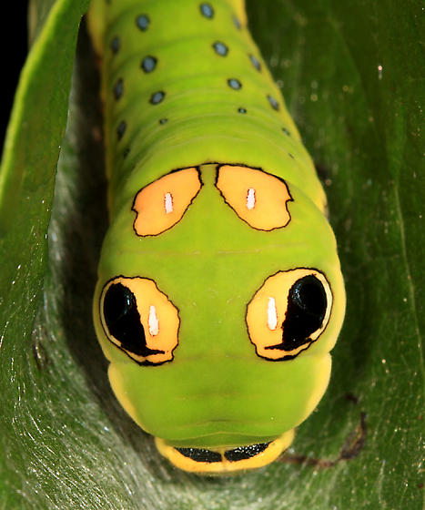
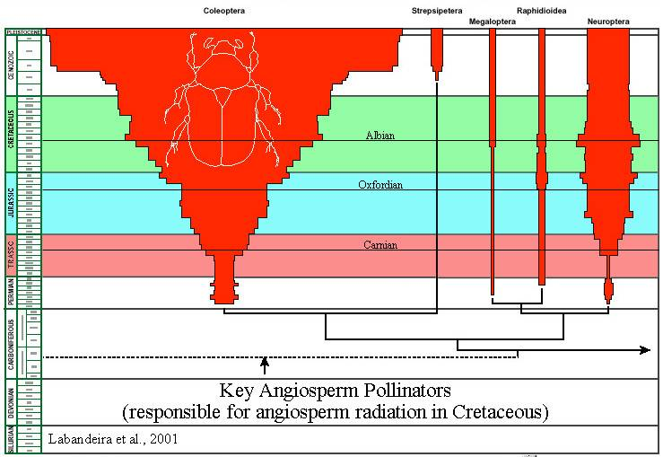

## The Yin and Yang: Swallowtail butterflies

## Review: Evolution Basics

 

* **Evolution**:

    >- change in the genetic composition of a population over generational time
 

* **Population**: 

    >- group of individuals of the same species, occupying the same time and space, with the potential of interbreeding
 

* **Species**:

    >- group of living organisms consisting of similar individuals capable of exchanging genes or interbreeding successfully
    
 

* **Evolution by Natural Selection**: 

    >- organisms with heritable traits that favor survival and reproduction will tend to leave more offspring than their peers, causing the traits to increase in frequency over generations

## Brown et al. 2007: 6 genetically distinct lineages of giraffe

## What is Generational Time? 

## Evolution by **Natural Selection**: Darwin and others

 
 
 
 

>- Individuals in a population are not identical

>- Some variation among individuals in heritable

>- Individuals sometimes die before reproducing

>- Different ancestors leave different #'s of descendants

 
 

* **How did giraffes get long necks? (Lamarck vs Darwin)**

## Species are so specialized, they are absent almost everywhere

##

## Diversity of living things evolves over long time periods

## Why does this matter for Ecology?

 
 
 

* **Survival of the fittest** is tied to organisms interacting with their environment

 

>- **This term is a little misleading, should read:**
 

>- **Survival of the better designed for an immediate, local environment**
      + survived death and destruction
      + reproduced successfully

 

>- **Environment matters a lot!**

## Natural selection and evolution occur within a species

 
 
 

* **Some traits of plants and animals are 'conserved'**
    + not easily modified

 

* **However,we often seem lots of variation within a species**

 

* **Species traits vary over geographic ranges**
    + as long as migration occurs
    
## 'Ohi'a lehua tree on Hawaiian Islands

  

    
## Intra-specific variation can occur at short distances

## Thought question:

 
 
 

* **Flowering times of plants at Zinc mines did not overlap with those of natural fields**
    + for 40 years!

 
 
 

* **Why is this important?**

<!-- ## Investigating local adaptation: Gypsy moth -->
<!-- 
 -->
<!--   -->
<!--   -->
<!--   -->

<!-- 
 -->

<!-- * **Eggs from Appalachian Mountains (AM) Coastal Plain (CP) and New York (NY)** -->

<!--   -->

<!-- * **AM and NY populations had reduced egg viability under a southern winter (CP site)** -->

<!--   -->

<!-- * **Coastal Plain eggs had equivalent survival** -->
<!-- 
 -->

<!--  -->

## Evolution also driven by species interactions

 
 
 

* **Selection forces**: pressures on an trait by natural selection driving evolution of a population

 

* **Steam guppies in Trinidad are separated by waterfalls**
    + isolated populations
    + tons of different traits across guppy populations

 

* **What selection forces could be driving these changes?**

## Predation, sex and flamboyance in guppies

## Great tit (Parus major) and bird feeders (Bosse et al. 2017)

## When species interact, co-evolution can occur

<!--  -->

## Co-evolution of orchid bee and ochid flowers

 
 
 

https://www.youtube.com/embed/_uHJGdTgtXE

## The massive diversification of flowering plants

<!-- ## -->

<!--  -->

<!-- ##  -->

<!--  -->

## Ecological speciation

 
 
 

* **Divergent selection between different environments leads to the creation of reproductive barriers**
    + driven by difference in environment
    + driven by interaction with other species

 
 

* **Populations become isolated, then selection drives change**

##

<!-- ## Parallel evolution -->
<!-- 
 -->
<!--   -->
<!--   -->
<!--   -->

<!-- 
 -->

<!-- * **Divided populations evolving independently** -->
<!--     + large continental drift -->

<!--   -->

<!-- * **Ecological equivalents drive similar evolutionary processes** -->

<!--   -->

<!-- * **Ancestors were once connected** -->
<!--     + common set of potential traits -->

<!-- 
    -->

<!--  -->

<!-- ## Convergent evolution -->
<!-- 
 -->

<!--  -->

<!--  -->

<!-- ## -->

<!--  -->

## Ecology, Evolution and Global Change

 
 
 

* **Evolution drives adaptation but time is important**

 

* **Speed of environmental change may cause evolutionary mismatches**

 

* **Rapid evolution can/may occur, but depends on what?**
  + lizards with more sticky feed (15-20 generations)
  + salmon migrating 2 weeks earlier (2 generations)

 

## Take Home Messages

* **There is a reciprocal relationship between evolution and ecology**
    + swallowtail
    
 

* **Ecological processes enact strong selection pressures on species**
    + guppy
    
 

* **Ecology plays a specific role in a tenant of natural selection: *reproductive isolation* **
    + giraffe
    
 

* **Patterns in ecological processes have driven evolution over very long periods of time...**
    + flowering plants and insects
