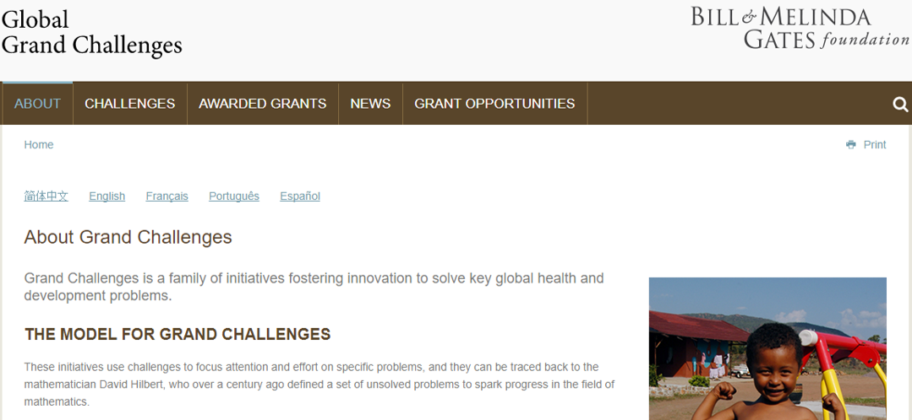
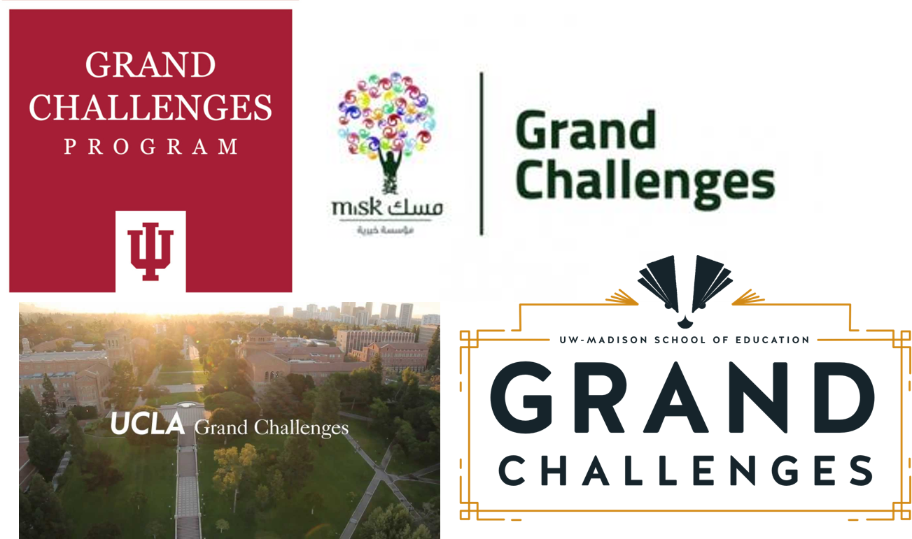
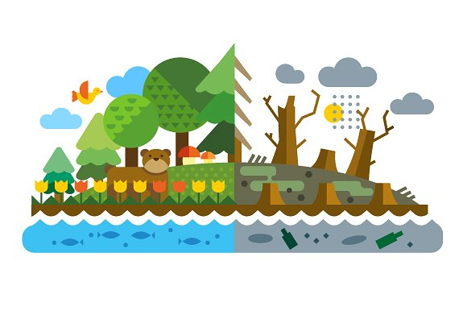
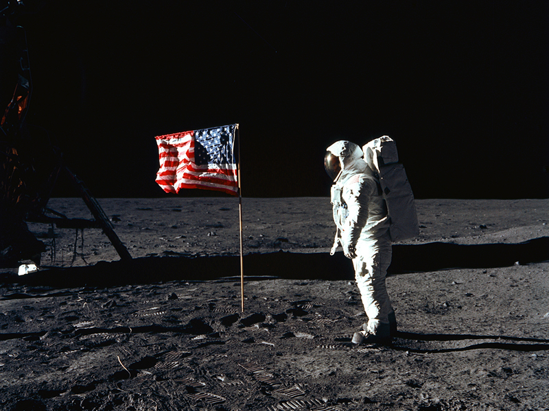
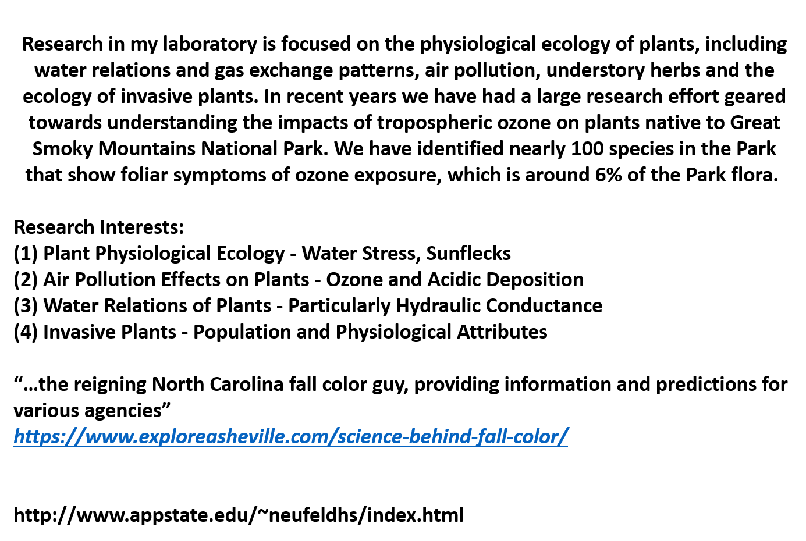
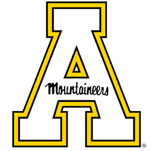
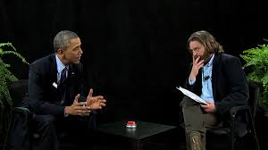
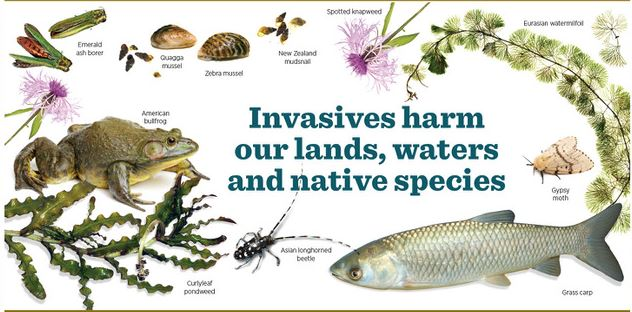

##

## Grand Challenges: What it is....

<strong>https://gcgh.grandchallenges.org/
</strong>

 

<strong>https://www.chapman.edu/scst/undergraduate/grand-challenges-initiative.aspx</strong>

## Grand Challenges: Shepherd General Ecology

 
 
 
 

* Tasked to solve a major ecological problem/issue

 

* Teams of ~4

 

* One grade per team (see rubric) + self assessment

 
 
 

<strong>What will be your ?</strong>

## Grand Challenges: Why?

## My Role: Survey scientists to extract current ecological issues

 

I was wondering if you would propose an ecological problem related to your interests, which students could try to solve. The problem could be regionally related to the USA or possibly at a larger scale.

 

<strong>However, any topic you would like to propose would be totally great. Whatever you truly believe is a pressing issue.</strong>

 

The idea is that students have the semester to work towards potential solutions and develop an **Ecological Action Plan**.

 

Although they may not be able to solve the problem this concept brings in work-related deadlines, active self-learning, inclusive and diversity driven group work and most importantly activism. 

## Prof. Howard Neufeld (Appalachian State University)

 

## Semester Theme: Invasive

 
 
 

**Invasive species cause over $135 billion dollars in damages to North American ecosystems and can alter the services that natural ecosystems provide to society. Some of these introductions were deliberate while others were inadvertent. In both cases, the functional traits that allow a species to be invasive are poorly known, and worse, many introductions, once established, are difficult if not impossible to eradicate. Therefore, we do not yet know how to predict which species could become problems in the future, which makes it difficult to predict future impacts.**

 
 

>- How should the U.S. deal with the subject of invasive species, especially from the standpoint of maintaining maximum services from our natural ecosystems?</strong>

## Your assignment:

 

* Work in diverse teams to solve your invasive species problem
  + Dig into the background/history/available literature
  + Present your background information to class as a podcast (episode 1)

 
  
* Develop an **Ecological Action Plan**
  + Solutions oriented
  + 'Unconstrained' = Lots of Freedom
  +  Written EAP + episode 2 of your podcast
  
 

  + Examples of EAP's are on SAKAI (also see this link)
  + http://www.cityofsydney.nsw.gov.au/__data/assets/pdf_file/0009/135882/GreeningSydneyPlan.pdf

## Extra Credit: Something Awesome (+5 points)

 
 
 

* Promote activism and solutions
    + Interview experts
    + Get on NPR
    + Interview a politician
    
   
   
  
* Move beyond a collegiate assignment
    + treat this as a job assignment
    + impress me
 
 
 
 
  
## My Role (#2): Mentor

 
 
 

* Progress meetings: Lab time
  + Provide advice
  + Help you network
  + Push you
  + **Always come prepared** 
  + You will write EAP in steps

 

* Guide EAP formation
  + No set format
  + We will decide sections together
  

##

<iframe src="https://giphy.com/embed/7sWxABjElNTO0" width="480" height="384" frameBorder="0" class="giphy-embed" allowFullScreen></iframe>
<a href="https://giphy.com/gifs/7sWxABjElNTO0">via GIPHY</a>

  
##

## Choose your species

 
 

* There are two invasive species grab bags
  + Regional
  + Continental

 

* Chat with your team and choose a species at random
  + remember treat this as a job assignment

 

* If you have a strong reason for a certain species, and no one has chosen it, let me know
  + NO take backs!

## Getting Started

 

*  **Divide an conquer**
    + set up a google group

 

*  **Use the diversity of interests within your group to manage tasks**
 

*  **Lab time**
    + outside of class

 

* **Have Fun!**

 

<!-- ## Tuesday Lab Teams -->
<!-- 
 -->
<!--   -->
<!--   -->
<!--   -->
<!--   -->
<!--   -->

<!-- 1. Bailey (Horse), Bradford (Wombat), Petretta (Armadillo) & Wetzel (Wolf) -->
<!-- 2. Corcoran (Lynx), Rowland (Giraffe), Smith (Elephant) & Spaid (Lion) -->
<!-- 3. Jenkins (Horse), Mellott (Bull), Strider (Sloth) & Turner (Rat) -->
<!-- 4. Dominiski (Turtle), Grant (Shark), Hayes (Dolphin) & Phillips (Penguin) -->

## Thursday Morning Lab Teams

 
 
 
 

1. Ajello (Tiger), Burgess (Polar bear), Cruse (Manatee), Reynold (Chihuahua)
2. Ball (Boxer), Cupp (Labrador), Dean (Jellyfish), Wilson (Charlotte)
3. Beecher (Labrador), Gantt (Penguin), McCormick (cat), Nguyen (Sloth)
4. Farmer (Box turtle), Garcia (Elephant), Grove (Beagle), Miller (Cat)

## Thursday Afternoon Lab Teams

 
 
 
 
 
 

1. Flores (Vivian), Kees (Kees), Prado (elephant), Smith (manatee)
2. Leskinski (squirell), Ramirez (horse), Snyder (deer), Vega (cat)

