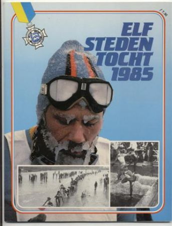
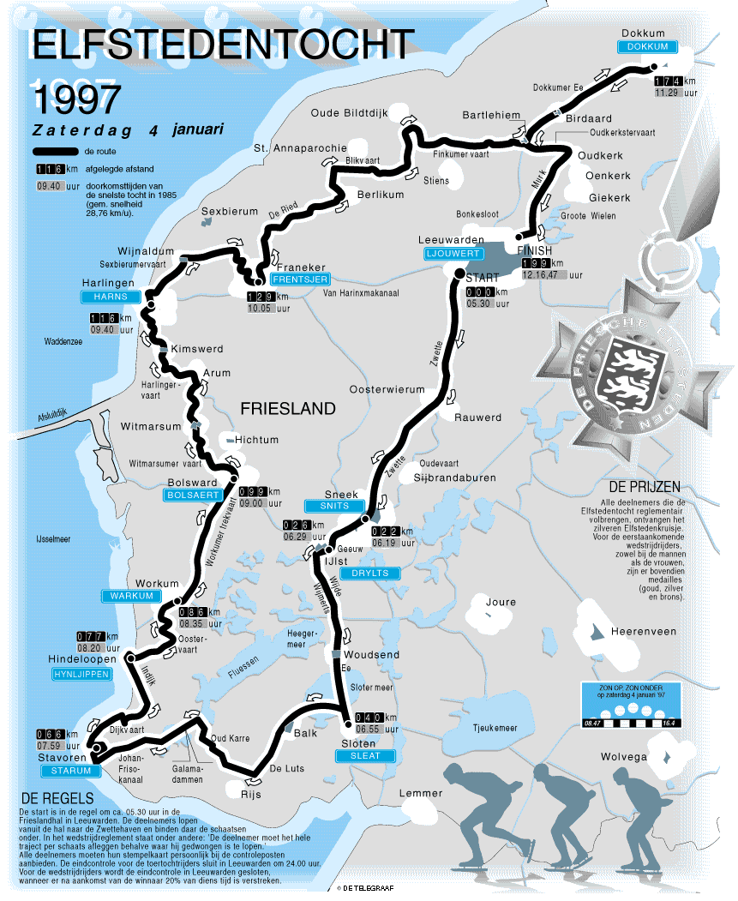
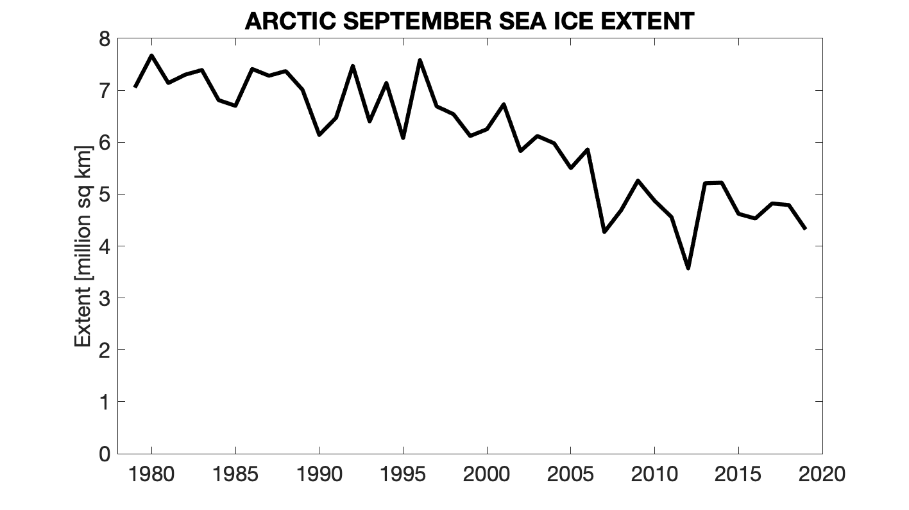
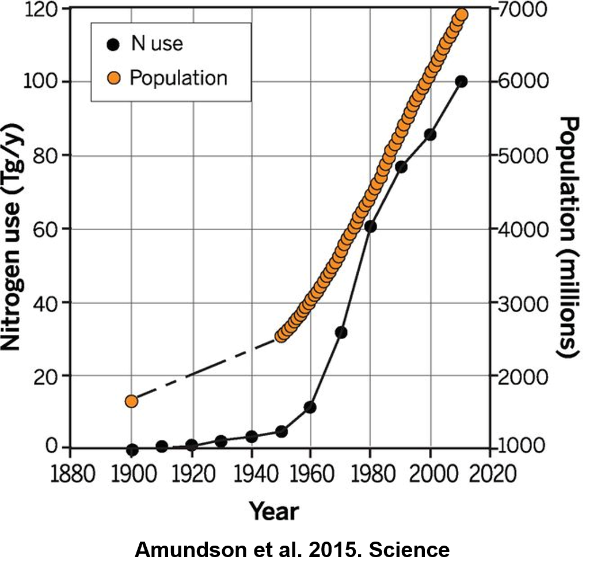
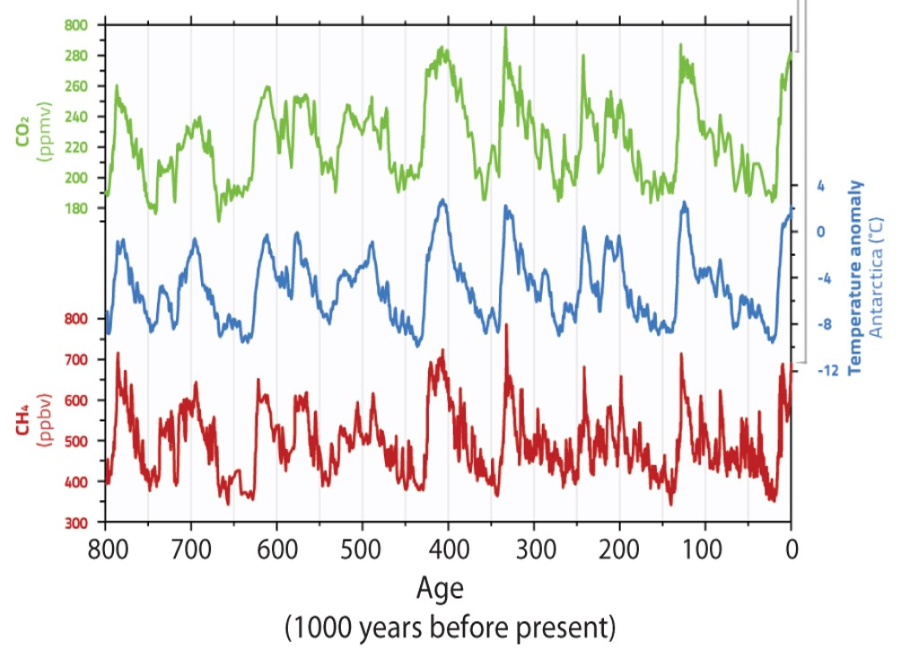
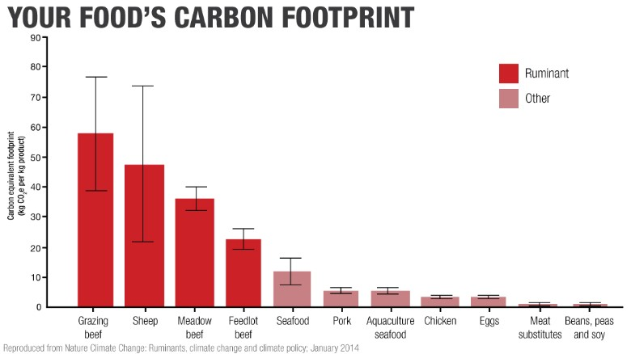

## Whats in a name...

## Unprecedented warming and the 'Hockey stick' controversy

## Current global change at unprecedented rates

## Review: Enhancing the greenhouse gas effect

## Dutch Elfstedentocht: February 1985

##

## NOAA: climate at a glance

 
 
 
 
 
 
 
 

https://www.ncdc.noaa.gov/cag/global/time-series/globe/land_ocean/all/3/1880-2019

## Last several years are the warmest ever recorded (Ed Hawkins)

 
 
 
 
 
 
 
 

http://blogs.reading.ac.uk/climate-lab-book/files/2018/12/spiral_2018_WMO_large.gif

## Physical impacts of climate change

## Last 12 years are smallest sea ice extents (Ed Hawkins)

 
 
 
 
 
 
 
 
http://blogs.reading.ac.uk/climate-lab-book/files/2017/05/maparctic_sept.gif

##   

## Haber-Bosch process (1909) and human population

## 

## Greenhouse gases (ice cores)

##

## Greenhouse gases: Carbon dioxide (CO~2~)

## Greenhouse gases: Methane (CH~4~)

## In the news: Methane

## Land use and biogeochemical cycles: Carbon sinks

 

## Land use and biogeochemical cycles: Energy & water

## Land use and biogeochemical cycles: Water Scarcity

## Land use and biogeochemical cycles: Nutrients

## Biological effects of global change: Oceans

## Biological effects of global change: Greener Earth?

## Biological effects of global change: Homogenization

 

##

## Is 1.5C target of the Paris Climate Agreement reachable?

## What should we do....

 
 

* **If CO~2~ emissions stopped today:**
    + 50% absorbed by land/water in 30 yrs
    + 30% in atmosphere for centuries
    + 20% in atmosphere for 1000 yrs

 

* **Future warming is inevitable**
    + land sinks uncertain
    + ocean sinks weakening

 

* **Response options?**

## What should you do

