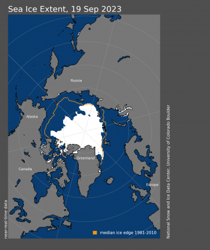

## What's in a name...

## Unprecedented warming and the 'Hockey Stick' controversy

## Current global change at unprecedented rates

## Review: Enhancing the greenhouse gas effect

## Dutch Elfstedentocht: February 1985

##

## NOAA: climate at a glance

 

https://www.ncdc.noaa.gov/cag/global/time-series/globe/land_ocean/all/3/1880-2019

## How warm has is gotten? (Ed Hawkins)

http://blogs.reading.ac.uk/climate-lab-book/files/2020/05/spiral_2020_large.gif

 

* **Globe: combined land and ocean-surface temperature was 0.93 of a degree C above the 20th-century average for July**

 

* **Northern Hemisphere: land-surface temperature was the highest ever recorded for July, 1.54 degrees C above average**

 

* **Asia had its hottest July on record, Europe had its second-hottest July and North America, South America, Africa and Oceania all had a top-10 warmest July**

## Physical impacts of climate change

## Last decade reveals smallest sea ice extents

http://blogs.reading.ac.uk/climate-lab-book/files/2017/06/maparctic_sept_large2_L.gif

##   

## Haber-Bosch process (1909) and human population

## 
Anthropocene Era: http://www.anthropocene.info/great-acceleration.php

## Greenhouse gases (ice cores)

##

## Greenhouse gases: Carbon dioxide (CO~2~)

## 

<!-- ##  -->

<!--  -->

## Global Change and Water are intimately linked

 

 
## Global Change: Fresh Water Scarcity

<!-- ## Groundwater now supports 40% of modern agriculture -->
<!-- 
 -->

<!--  -->

<!--  -->

## Global Change: Ocean acidification

## Global Change: Sea Level Rise

<!-- ## Global Change: Greener Earth? -->
<!-- 
 -->

<!--  -->

<!-- ## Global Change: Homogenization (Journal Club) -->
<!-- 
 -->

<!--   -->

## 

## Paris Climate Agreement

 

* **Accord between nation in UN to address climate change**

 

* **Goal to keep increase in global temperature below 2 °C**
    + pursue efforts to limit increase to 1.5
    + pursue net zero emissions
    
 

* **Contributions by country determined by that country**
    + no emissions targets or dates
    + must go beyond current efforts
    + framework for transparency

## Are targets of the Paris Climate Agreement reachable?

## What should we do....

 
 

* **If CO~2~ emissions stopped today:**
    + 50% absorbed by land/water in 30 yrs
    + 30% in atmosphere for centuries
    + 20% in atmosphere for 1000 yrs

 

* **Future warming is inevitable**
    + land sinks uncertain
    + ocean sinks weakening

 

* **Negative emissions techology?**

<!-- ## What should you do (Journal Club) -->
<!-- 
 -->

<!--  -->

<!--  -->
