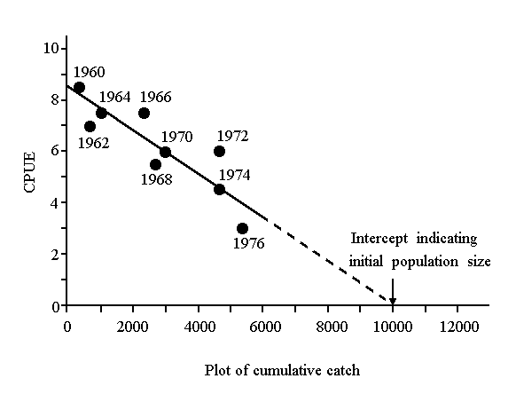
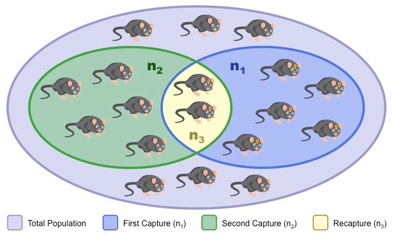
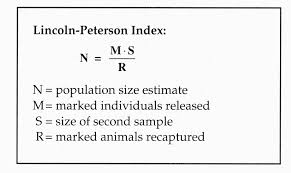
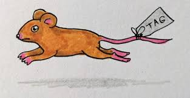
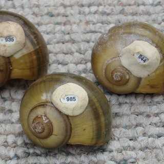
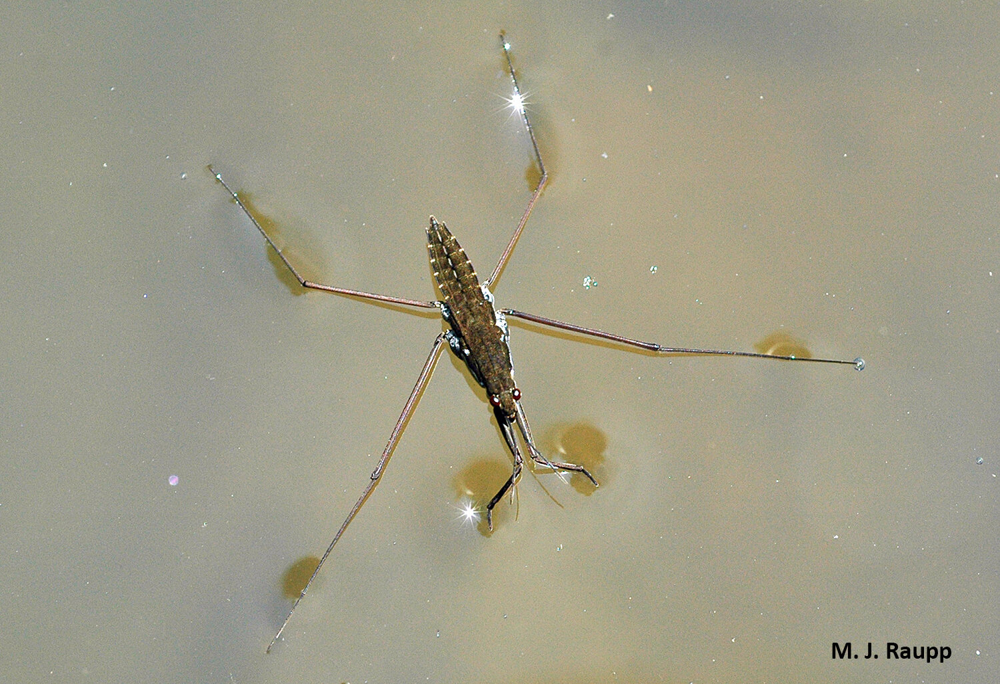
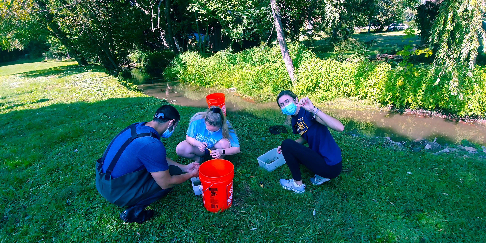

## Estimating population sizes can be tricky

 

* **Various techniques based on biology of organism**
    + enumeration method: capture and count all animals
    + population surveys: deer counts

 

* **Most organisms are not easy to count in a straightforward way**
    + aquatic organisms
    + small animals
    + elusive animals

 

* **Often we use indirect methods to calculate population size**

## Depletion method (DeLury)

 
 
 

* **Popular for fish estimates**

 

* **Methods relies on:**
    + CPUE: Catch per unit effort
    + Cumulative catch

 

* **The X intercept gives an approximate measure of population size.**

## Assumptions of DeLury method

* **Catchability remains the same**

 

* **Intensity of effort stays the same**
    + methods of capture do not interfere
    
 

* **Population is constant**
    + no recruitment or immigration
    + no births or deaths

 

* **All organisms are equally vulnerable to capture**

 

* **Linear line describes the data!**

## Mark and Re-capture method

## Lincoln-Peterson index

## Assumptions of Mark and Re-Capture

* **All organisms are equally vulnerable to capture**

 

* **Marked individuals are randomly dispersed**

 

* **Individuals with marks have the same probability of survival**

 

*  **Marks do not come off**

 

* **Recapture rates are high enough to support an accurate estimate**

 

* **Population is constant**
    + no recruitment or immigration
    + no births or deaths
    

## Water Strider Biology

 
 
 

* **Predatory insects that skate on the surface of slow-moving water**

 

* **To mobile to count easily**

 

* **Not overly difficult to catch with nets**
    + DeLury method possible

 

* **Thorax large enough to mark**
    + Mark Re-Capture possible

## Open up the excel file!

