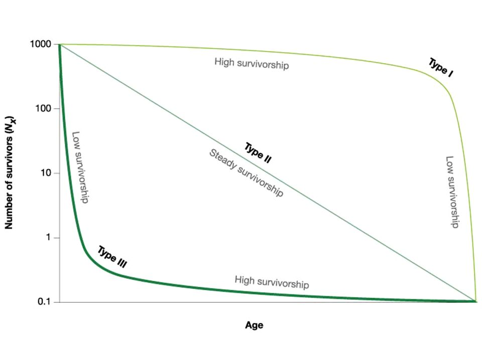

## Static vs Cohort life tables

 

* **Static life table: Based on age distribution at one point in time**
    + Assumes age distribution is stable

 

* **Cohort life table:Follows a cohort across time**
    + assumes age distribution is stable
    + difficult long-lived and/or highly mobile animals

## Understanding life tables (page #1 handout)

 

* **Age Class (usually years)**

 

* **Number alive**

 

* **Survivorship (Lx): mortality based on original cohort**

 

* **Fecundity (Mx): average offspring born to individuals of each age**

 

* **Survivorship x Fecundity: # of female young produced per indivdual**
    + basic reproductive rate (age class)

 

* **Population growth Paratmeter (Ro): Sum of Survivorship x Fecundity**
    + net reproductive rate
    + if Ro > 1, population is growing

## Survivorship curves: log(Lx) versus cohort age

##

## Verreaux’s Sifakas Lemurs

 

* **Diurnal primates found in the dry forests of southern Madagascar**

 

* **Limited range and habitat loss has resulted in Endangered status**

 

* **Females are socially dominant and territorial**

 

* **Females have just one infant at a time**
    + Relative to other mammals of their size, female sifakas reach reproductive maturity later and live longer

## Richard et al 2002

 

* **Observational study of a population of sifakas in the Beza Mahafaly Special Reserve in southwest Madagascar**

 

* **1984 – 1999: Captured 426 animals**
    + Each animal assigned an age based on toothwear analysis
    + Recorded sex, survival and fertility
    + No females under 3 years old gave birth.

* **Today we will complete a static life stable**

##

## Estimating Fecundity (mx)

 

* **mx = per capita birth rate (number of offspring born per individual in age class x)**

 

* **Richard et al. (2002) recorded the proportion of female sifakas of every age (3 – 26) that gave birth in each year from 1984 – 1999**

 

* **From these data, the median birthrates for 3 year age classes are reported in Table 1 of the handout**

## Estimating Fecundity (Mx)

 

* **Life tables often include only data for females, as females limit reproduction, and hence population growth**

* **Since Nx values are for females, we need an Mx estimate for number of females/female**

* **Does m3-5 = 0.07?
No, because every female sifaka mated with a male to produce a baby and female sifakas produced both male and female babies.

