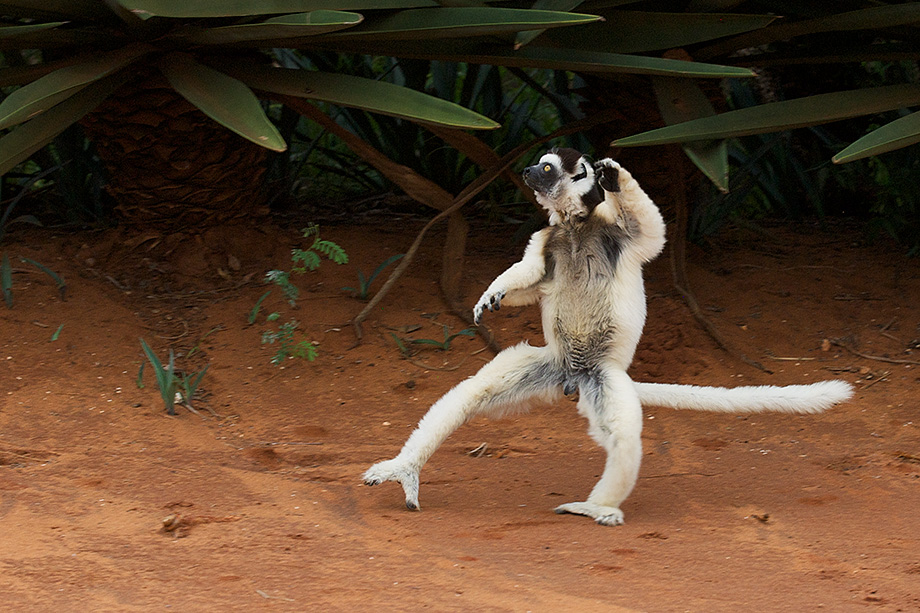
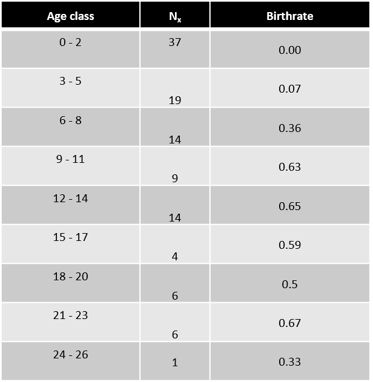

## Static vs Cohort life tables: Tracking survivorship

 
 
 

* **Static life table: Based on age distribution at one point in time**

 

* **Cohort life table: Follows individuals across time**
    + difficult for long-lived and/or mobile animals

 

* **Both must assume age distribution is stable**

## Understanding life tables (page #1 handout)

* **Age Class (usually years)**

 

* **Number alive (n~x~)**

 

* **Survivorship (l~x~): mortality based on starting cohort size**

 

* **Birthrate per capita (m~x~): average offspring born to individuals of each age**

 

* **Fecundity (F~x~): total number of females produced by females**

 

* **Net reproductive rate(R): Survivorship x Birthrate (age class)**
    + some will die without making offspring
    
## Survivorship curves: log(l~x~) versus cohort age

## Survivorship curves: constructed for a cohort from life table

## Verreaux’s Sifakas Lemurs

 

* **Diurnal primates found in the dry forests of southern Madagascar**

 

* **Limited range and habitat loss has resulted in Endangered status**

 

* **Females are socially dominant and territorial**

 

* **Females have just one infant at a time**
    + Compared to similar sized mammals, sifakas reach reproductive maturity later and live longer
    + r vs K selected species?
    

## Richard et al 2002

 

* **Observational study of a population of sifakas in the Beza Mahafaly Special Reserve in southwest Madagascar**

 

* **1984 – 1999: Captured 426 animals**
    + Each animal tagged and aged based on tooth wear
    + Recorded gender, survival and fertility through time
    + No females under 3 years old gave birth.

 

* **Today we will complete a static life stable (1999) to determine whether this threatened population is at risk of extinction**

## Q1. Estimating Birthrate (m~x~) and Fecundity (f~x~)

 
 

* **m~x~ = per capita birth rate (number of offspring born per individual in age class)**
    
    
 

* **Richard et al. (2002) recorded the proportion of female sifakas of every age (3 – 26) that gave birth in each year from 1984 – 1999**

 

* **From these data, the median birthrates for 3 year age classes are reported in Table 1 of the handout (page 2)**

## Q1. Estimating Birthrate (m~x~) and Fecundity (f~x~)

 
 

* **Life tables often include only data for females, as females limit reproduction**
    + only females add to a population

 

* **Since N~x~ values are for females, we need an m~x~ estimate for number of female offspring/female**

 

* **Does m~x~(3-5) = 0.07?**

## Estimating Birthrate (m~x~) and Fecundity (f~x~)

 
 

* **Sex ratio matters since our table is constructed for females**
    + assume 1:1 Male:Female
 
  
 
* **Lemurs exhibit a male-biased sex ratio at birth**
    + 46.5 % chance of being a female

  
 
* **Female birthrate (m~x~):**
    + Age class 3-5 = .07 x 0.465

  
 
* **How would we calculate total number of female births (fecundity, f~x~)?**

## Age-dependent life table

 
 

* **Calculate survivorship and maternal reproduction rate as a function of age**

 

* **In nature, survivorship and reproduction rate depend on numerous factors**
    + temperature, population density, etc.
    + the effect of these factors are encompassed into age class dynamics

 

* **Population growth parameter (R~o~): Sum of Survivorship x Birth Rate (each age class)**
    + net reproductive rate
    + if R~o~ > 1, population is growing
    + R~o~ = 2.5 = a female produces 2.5 baby lemurs on average in a lifetime