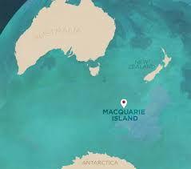
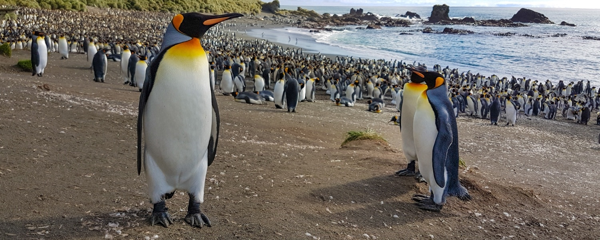
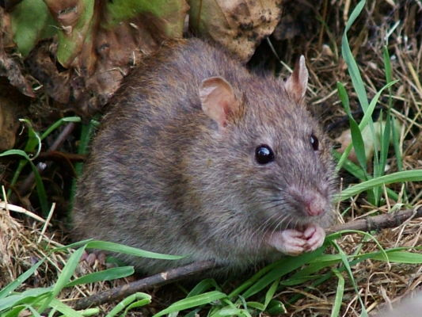
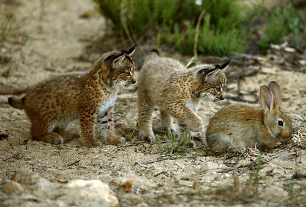
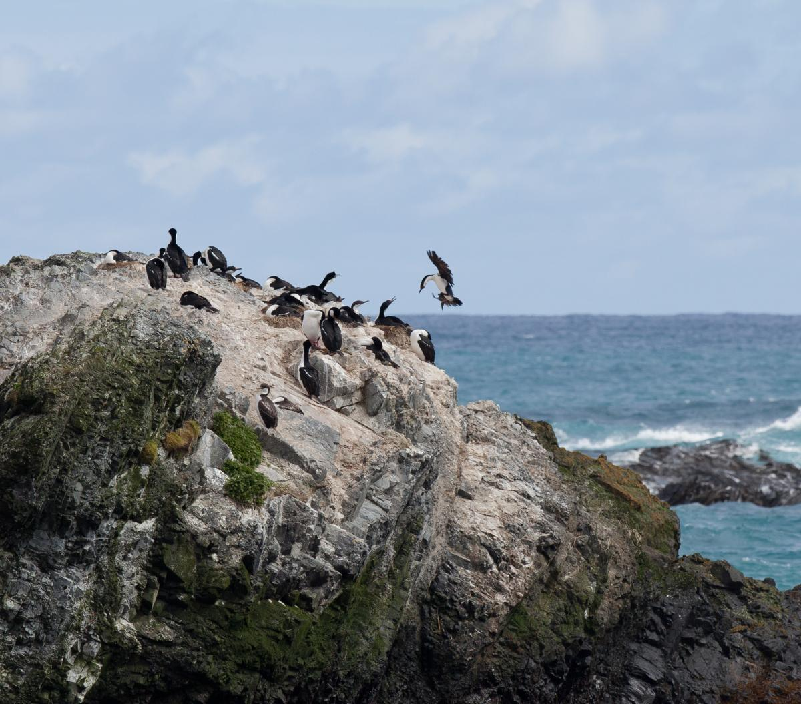
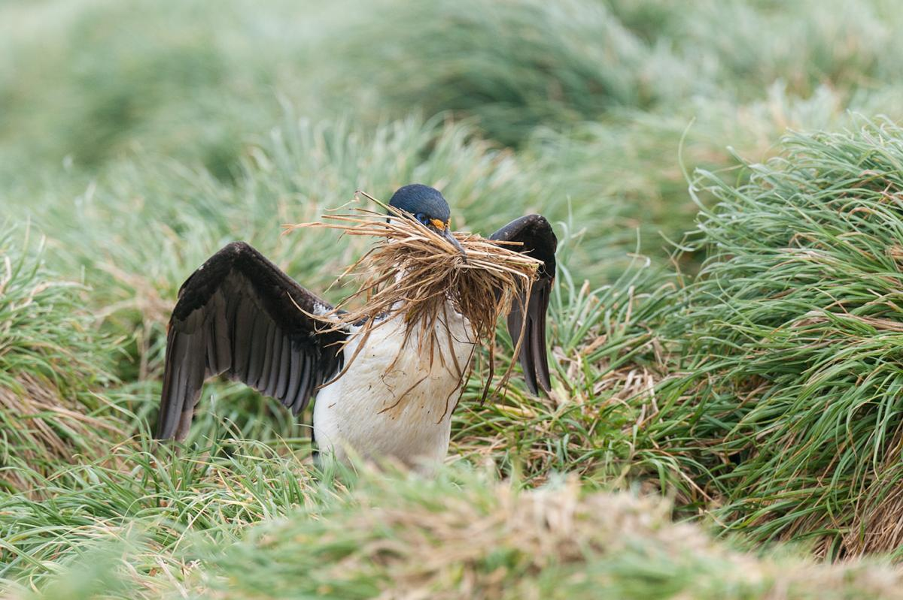
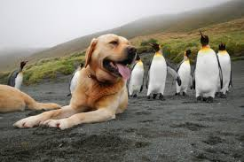
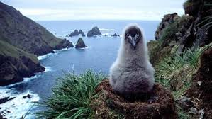

## Macquarie Island ecosystem

 
 

* **Macquarie island is part of the state of Tasmania**
    + UNESCO world heritage site
    + halfway between New Zealand and Australia

 

* **Important ecosystems to conserve**
    + breeding grounds for elephant seals, penguins and birds
    
  
 
* **Currently home to dozen(ish) scientists & rangers**
    + did not use to be that way

## The sealing era: Captain Frederick Hasselborough

 

* **Seals and penguins had no natural predators on the island until 1810**
    + populations ~200,000 - 400,000

 

* **What happened: Humans happened!!**

 

* **Europeans arrived on the Perseverance**
    + hunted seals to near local extinction for oil

 

* **Then exploited penguins for oil**
    + processed 2,000 penguins a day for .5 liters of oil each

## Unintended ecosystem consequences of human acitivities

 
 
 
 

* **Any place on earth, at the time, visited by ships likely faced rat introductions**

 

* **Macquarie island had no rodents before seal hunting**

 

* **Soon, rats and mice populations exploded on Macquarie island**

## Any good seafarer knows how to control rats...

 
 
 

* **Most ships had a cat or two just for this purpose**

 

* **Within 10 years, large feral cats populations**
    + Unfortunately, cats eat more than rats....
    
 
 

* **The Otago Whaling Company also released rabbits**
    + food source for workers in 1870
    + rabbits share niche with sea birds...
 
 

 

## Macquarie Island is an vital nesting site for seabirds

## 1970: Scientists decided to fix things (sigh)

* **Ecosystem was wrecked**
    + Seals & penguins were recovering
    + Rabbits were everywhere
    + Bird were declining

 

* **Scientists introduced Myxoma (via fleas)**
    + fatal rabbit virus
    + reduced rabbits fro 130,000 - 10,000
    + but........

 

* **With the rabbits gone the feral cats.....**

 

* **Hunting dogs were used to kill the cats**
    + some rabbits survived....

## Today: Unravel the species interactions of Macquarie island

 
 
 

* **Use the integrated diagrams to unpack species interactions on the island**
    + petrel, prion, shearwaters and wekas are all birds
    + examine the interactions between species on Figure 2
        + *read captions carefully*

 

* **These graphs are complex, so collaborate to find answers**

 

* **Work together to understand the new plan hatched in 2010:**
    + eliminate all invasive species at one time

