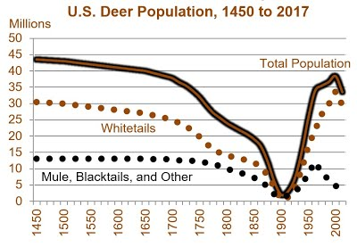
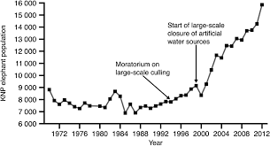
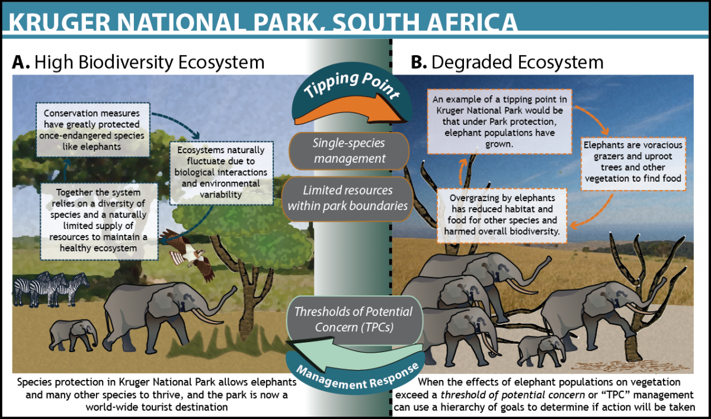

## WHAT: Defining a population can be tricky

 

* **A group of organisms from one species**
    + abundance
    + sex ratios
    + age structure
    
 

* **Defining the population boundary...**
    + a lake
    + ecosystem
    + country or state

 

* **Aphid population: leaf, plant, grassland, ecosystem?**
    + depends on the study and the questions

## WHY: understanding population structure (aka Demography)?

 
 
 

* **# of individuals is how we measure populations**
    + is it growing, declining, holding steady?
    
 

* **Understanding the results of interactions in ecology**
 
 
 
* **Measuring, predicting and evaluating population sizes guides ecologist**
    + management and conservation

## Case Study: Deer population size

 

## Case Study: Deer population density

 

## Case Study: Zombie Deer

 

## WHO: Definition of an individual can be tricky

 
 

* **Unitary organism: forming a single entity**
    + deer, bird, spider, etc.

 

* **Modular organisms are harder**
    + bacteria, algae, corals
    + plants: ferns grow by rhizomes

 

* **Some modular organisms may themselves be populations**

## HOW: Estimates from representative sample

 
 
 
 
 

* **Lessons from Lab: **
    + Census techniques
    + Mark & Recapture
    + Spatial component
    + Temporal Component

## What forces control deer abundance in Jefferson Co.?

## Life History: more than just birth and death

## Reproductive effort and life cycles: Long lived organisms

## Semelparous: One-off reproduction

 

## Populations and life cycles: Annuals & Ephemerals

## Life History: growth vs making babies conflict

 
 

* **Annuals vs Perennials**
    + not just plants

 
 
 

* **When and how to spend your resources**
    + reproduction comes at a cost of growth
    + flowers + seeds = ↓ leaves and roots
    + are enough resources available to support pregnancy?
    

## The mystery of large 'Mast' years in botany

## Populations and life cycles: Dormancy

 

* **Annual organism may spend part of the year dormant**
    + Seeds,Spores, Cysts, etc.

 

* **Thousands of seeds per square meter of soil**

 

* **Dormancy can last for long periods of time**
    + protection from harsh environments

 

* **How would this affect a population? **  

## Populations and life histories: Wood Thrush

 

## Populations dynamics: monitoring birth and death

 
 

* **Measuring rates of birth and death can tell us if a population is growing or shrinking**

 

* **Cohort Life tables: follow the fate of individuals from a single cohort**
    + survivorship
    + difficult for mobile animals

 

* **Static life table: describe the # of survivors at different ages**

## r/K selection theory: growth and reproduction strategies

 
 
 
 

* **r-selected species: “cheap” offspring**

 

* **K-selected species: “expensive” offspring**

 
 

* **These are the 2 ends of a spectrum**

## 

## Populations dynamics: movement (dispersal and migration)

 

## Populations with unlimited resources: exponential growth

## Population growth regulation

 

* **Density dependent**
    + competition
    + predation
    + disease
    + resources
 
 

* **Density independent**
    + weather
    + disturbance

 

* **Carrying Capacity**
    + environmental resistance
    

## Population cycles

