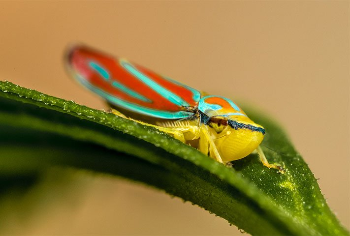
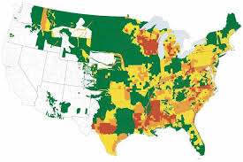
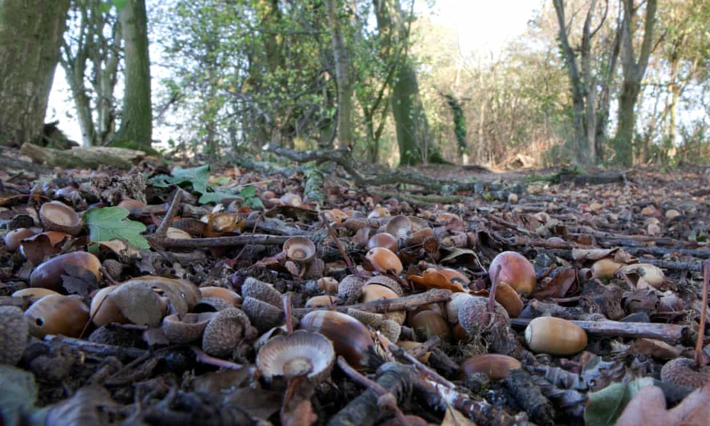

## Defining population can be tricky

 

* **SIMPLE: A group of organisms from one species**

 

* **Defining the population boundary...**
    + a lake
    + ecosystem
    + ocean

 

* **Leaf hooper population: leaf, tree, forest, ecosystem?**
    + depends on the study and the questions

## Why measure populations (aka Demography)?

 

* **SIMPLE: # of individuals is how we measure populations**
    + is it growing, declining, holding steady?
    
 

* **Understanding the results of species interactions**
 
 
 
* **Measuring, predicting and evaluating population sizes guides ecologist**
    + management and conservation

## Case Study: Deer population size

 

## Case Study: Deer population density

 

## Case Study: Zombie Deer

 

## Definition of an indivdual can be tricky

 

* **Unitary organims are easy: forming a single entity**
    + deer, bird, spider, etc.

 

* **Modular organisms are harder**
    + bacteria, algae, corals
    + plants: ferns grow by rhizomes
    + trees: seedling, sapling or mature tree?

 

* **Some modular organisms may be themselves populations**
    

## Can we ever really count everything?

 

* **Lessons from Lab: Estimates from respresentative sample**

## 

* **forces that control the abundance of a population act on stages of an organinsms life cycle**

## Life History: more than just birth and death

* **sequence of events in life cycle

## Sexual conflict: growth vs making babies

 

* **Annuals vs Pernnials**

* **When and how to spend your resources**
    + reproduction comes at a cost of growth
    + flowers + seeds = ↓ leaves and roots
    + are enough resouces available to support pregnancy?
    

## The mystery of large 'Mast' years in botany

 

## Reproductive effort and life cycles: Long lived organisms

## Semelparous: One-off reproduction

 

## Populations and life cycles: Annuals

## Populations and life cycles: Annuals

## Populations and life cycles: Ephemerals

## Populations and life cycles: Dormancy

 

* **Most annual organism spend part of the year dormant**
    + Seeds,Spores, Cysts, etc.

<br/

* **Tens of thousands of seeds per square meter of soil**
<br/

* **Dormancy can last for long periods of time***
    + great protection from harsh environments

<br/

* **How would this affect a population? **  

## Populations and life histories: Wood Thrush

 

## Populations dynamics: monitoring birth and death

 

* **Measuring rates of birth and death can tell us if a population is growing or shrinking**

 

* **Cohort Life tables: follow the fate of individuals from a single cohort**
    + survivorship
    + difficult for mobile animals
    + **Marmot HANDOUT**

 

* **Static life table: describe the # of survivors at different ages**
    + Lemurs: Data Fridays

## Understanding life tables

 

* **Age Class (usually years)**

 

* **Number alive**

 

* **Survivorship (Lx): mortality based on original cohort**

 

* **Fecundity (Mx): average offspring born to individuals of each age**

 

* **Survivorship x Fecundity: # of female young produced per indivdual**
    + basic reproductive rate (age class)

 

* **Population growh Paratmeter (Ro): Sum of Survivorship x Fecudity**
    + net reproductive rate
    + if Ro > 1, population is growing

## Survivorship curves: log(Lx) versus cohort age

## 

## r/K selection theory: growth and reproduction strategies

r-selected species: “cheap” offspring
    + unstable environments
    + many offspring - little parental care -high mortality
    + small offspring - fast maturity
    + variable and fluctuating population sizes
    
K-selected species: “expensive” offspring

  + stable environments - resources maximise longveity
  + few offspring - parental care - low mortaility
  + large size - slow maturity
  + stable population sizes
  
* **These are the 2 ends of a specturm**

## 

