## WHAT: Defining a population is multi-faceted

* **A group of organisms from one species can be evaluated in many ways**
    + abundance
    + sex ratios
    + age structure
    + density
    
 

* **Defining the population boundary is tricky**
    + a lake
    + a lake and incoming streams
    + the whole watershed 

 

* **Aphid population: leaf, plant, grassland, ecosystem?**
    + depends on the study and the question

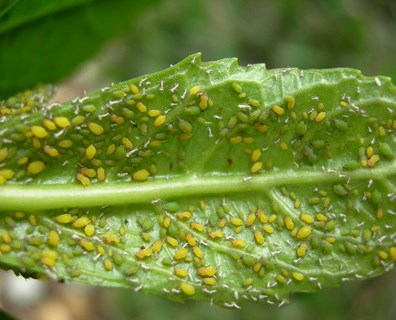

## WHY: Understanding population structure (*Demography*)

 

* **Central Question: Is population size ↑ ←→ ↓ ?**
    
 

* **Age of a population, peak reproductive ages**

 

* **Frequency of reproduction, reproductive output**

 

* **Sex ratios determining mating potential**
 
 
 
* **Measuring, predicting, and evaluating population structure/sizes guides decisions**
    + conservation, pest management, harvesting

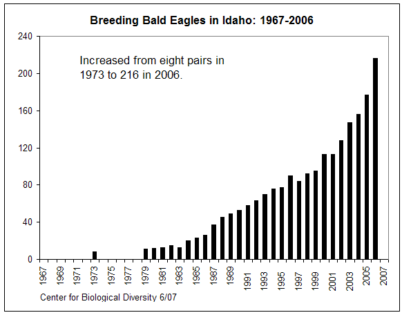

## Case Study: White-tailed deer population size 

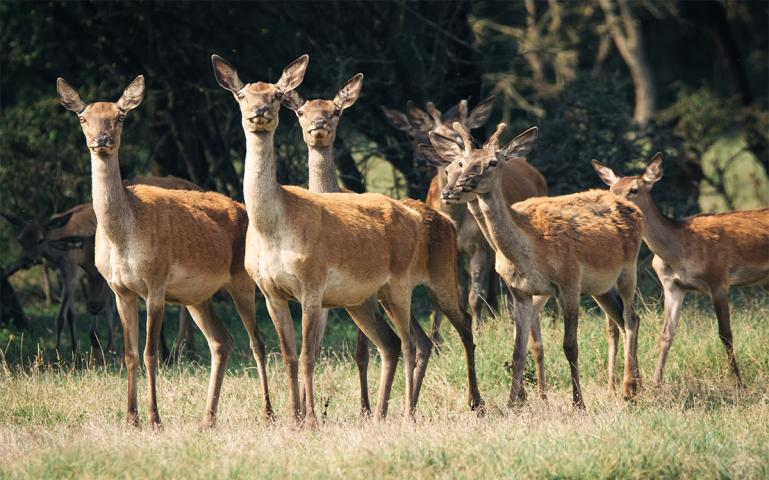

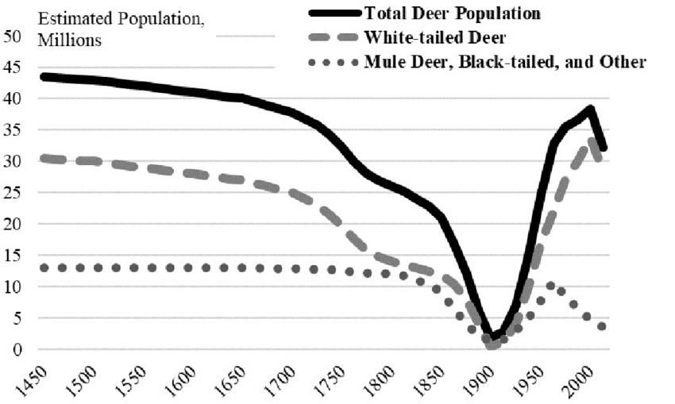

## Case Study: Deer population *density* is super informative

**Hunting regulations, disease vectors, car insurance...**

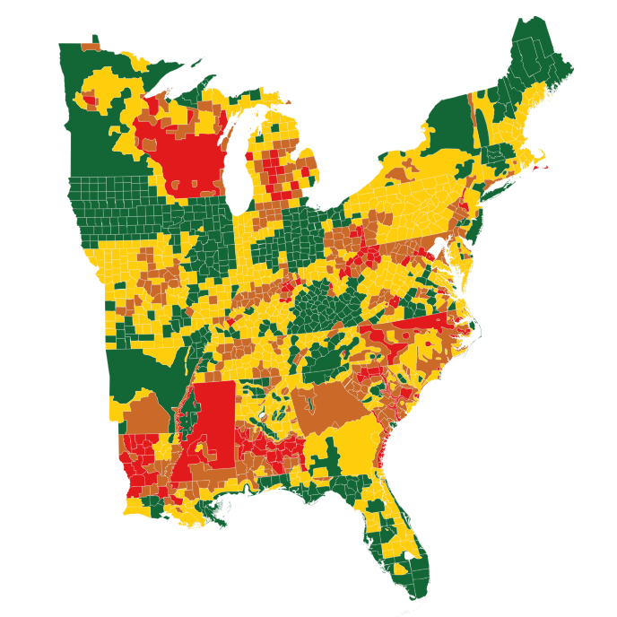

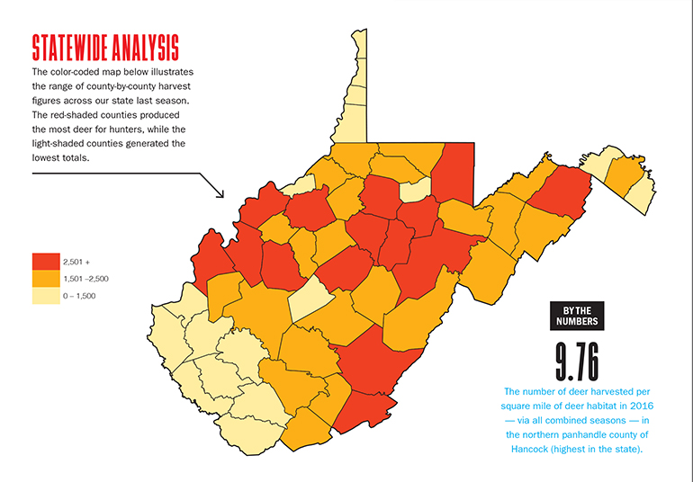

## Case Study: Zombie deer

**Understanding deer density helps predict spread of CWD**

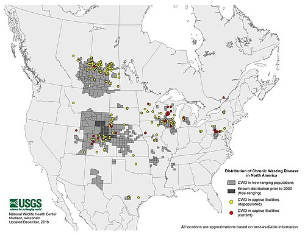

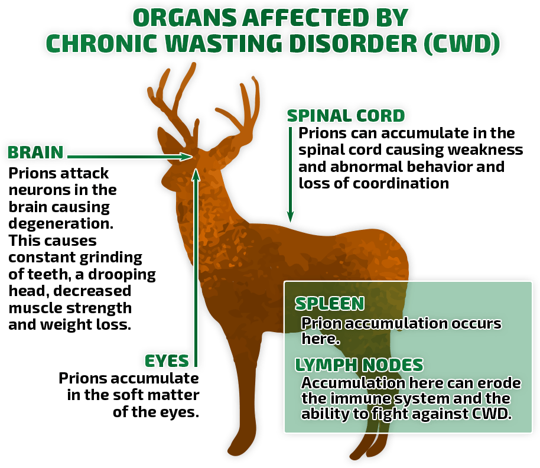

## WHO: Definition of an individual can be tricky

 
 

* **Unitary organism: forming a single entity**
    + deer, bird, spider, human, etc.

 

* **Modular organisms: colonies**
    + bacteria, algae, corals, biofilms
    + certain plants: ferns grow by rhizomes

 

* **Some modular organisms may themselves be ecological populations**
    + One coral colony contains many connected polyps, and each polyp grows, feeds, reproduces, and dies
    

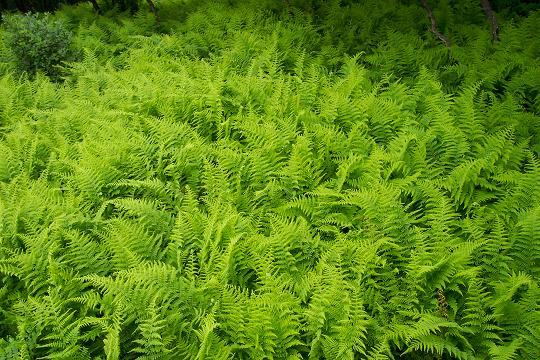

## HOW: Estimates from representative samples

 
 
 

* **Most methods are indirect estimates**

 
 

* **Lessons from lab: **
    + census techniques
    + mark & recapture
    + spatial component
    + temporal component

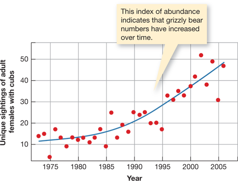

## Populations dynamics: Movement

**Immigration and emigration can change population size even when births and deaths stay the same, making population dynamics harder to interpret.**

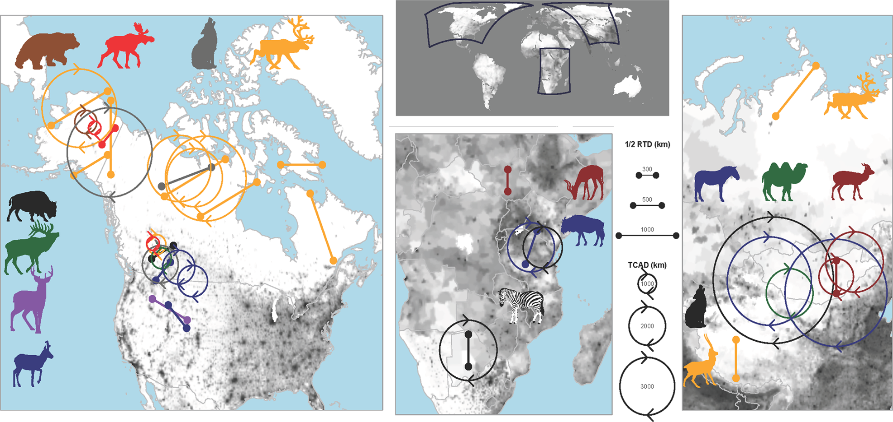

<!-- ## What forces control deer abundance in Jefferson Co.? -->
<!-- 
 -->

<!-- 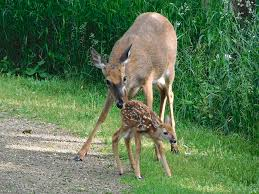 -->

<!-- 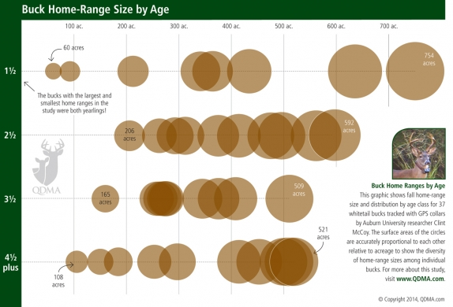 -->

## Life history traits determine reproductive output/timing

## Life history traits differs vastly across organisms

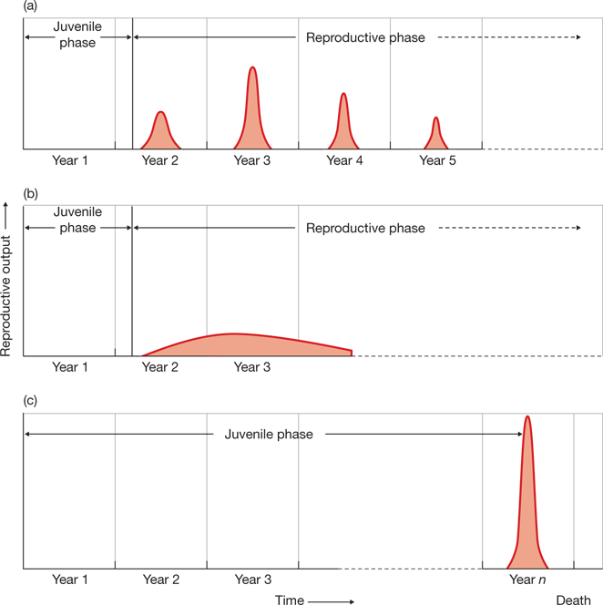

## Life history trait examples: One-off reproduction

**Making offspring is expensive, so reproductive output is a  strategy under natural selection**

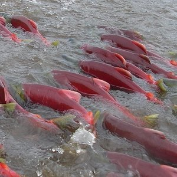

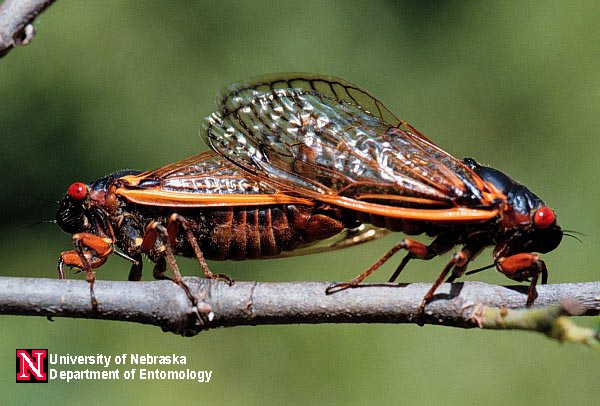

## Life history trait examples: Species with short life cycles

**Making offspring is expensive, so reproductive output is a strategy under natural selection**

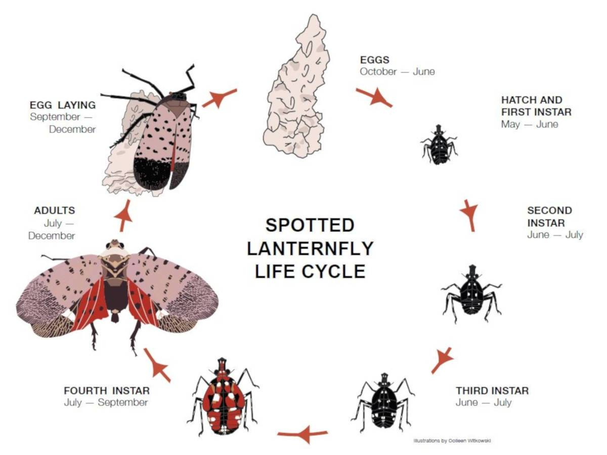

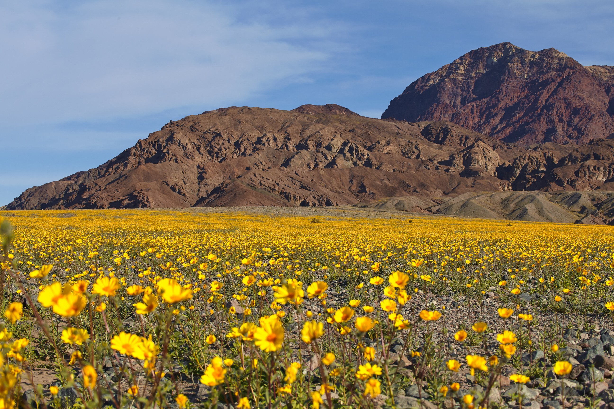

## Life history trait examples: Dormancy

* **Some organisms spend part of their life cycle dormant**
    + seeds, spores, resting eggs, developmental arrest, etc.

 

* **Dormant individuals can be a large, hidden part of a population**
    + thousands of viable seeds may occur in a square meter of soil
    
 

* **Allows individuals to survive unfavorable conditions**
    + some remain dormant for very long times

 

* **How does this complicate population dynamics?**  
    + dormant individuals are easy to miss when estimating population size
    + offspring produce may not enter the next active generation
    

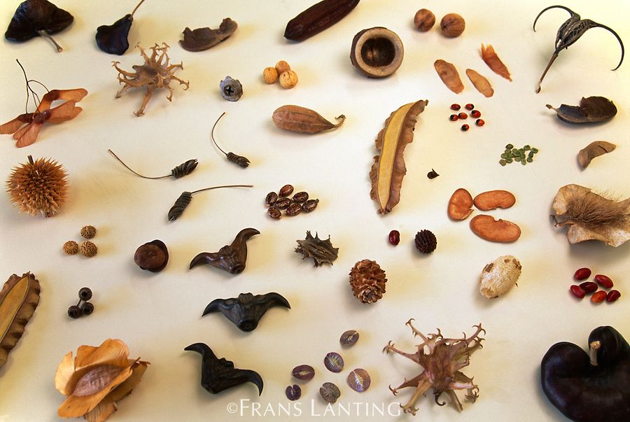

## Life history traits: Reproductive conflict

 

* **Goal to pass on genes...**

 
 
 
 
 
 
 
 

* **When and how to spend your resources**
    + reproduction comes at a cost of growth
    + ↑ flowers + seeds = ↓ leaves and roots
    + are enough resources available to support pregnancy in animals?
    + *surviving vs growing the population is the conflict*
 

* **Life histories of males and females may differ due to reproductive investment**
    
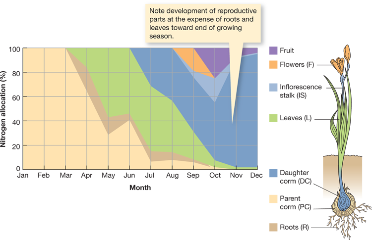

## 
 
 
 
 
 
 
 
 
 
 
 
 
 
 

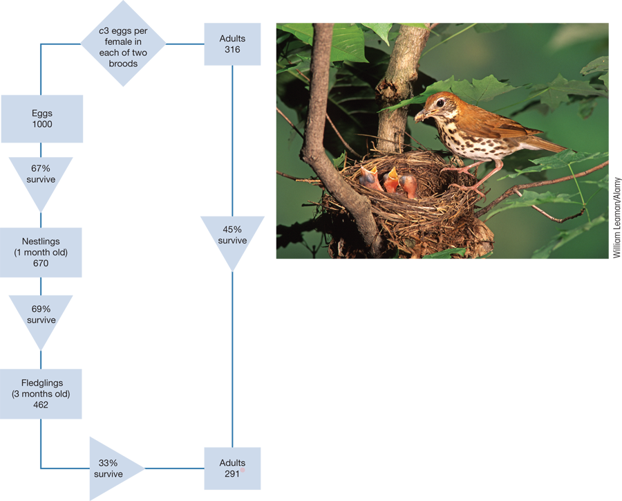

* **Populations are composites of individual life histories**
    + who survived from previous year
    + new individuals (births/immigration)
    + survivability of offspring and parents in a year
    
 

**Survivorship = **

## Survival and reproduction determine population change

* **Birth rates and survivorship tell us whether a population is likely to grow, shrink, or remain stable**

 

* **Survival and reproduction differ among ages or life stages**
    + juveniles, reproductive adults, and older individuals contribute differently to population growth

 

* **Life tables summarize these age-specific patterns**
    + *Cohort*: follow individuals born at the same time through their lives
    + *Static*: compare the ages of individuals present at one point in time

 

* **These patterns reveal more than population size alone**
    + age structure, when mortality is high, which age contributes the most to population growth, etc.
    

## r/K selection theory: Growth and reproduction strategies

 
 
 
 

* **r-selected species: “cheap” offspring**

 

* **K-selected species: “expensive” offspring**

 
 

* **These are the 2 ends of a spectrum**

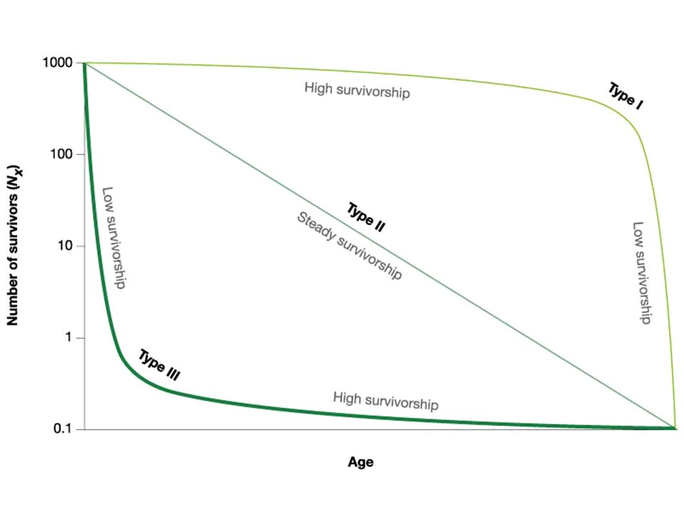

## 

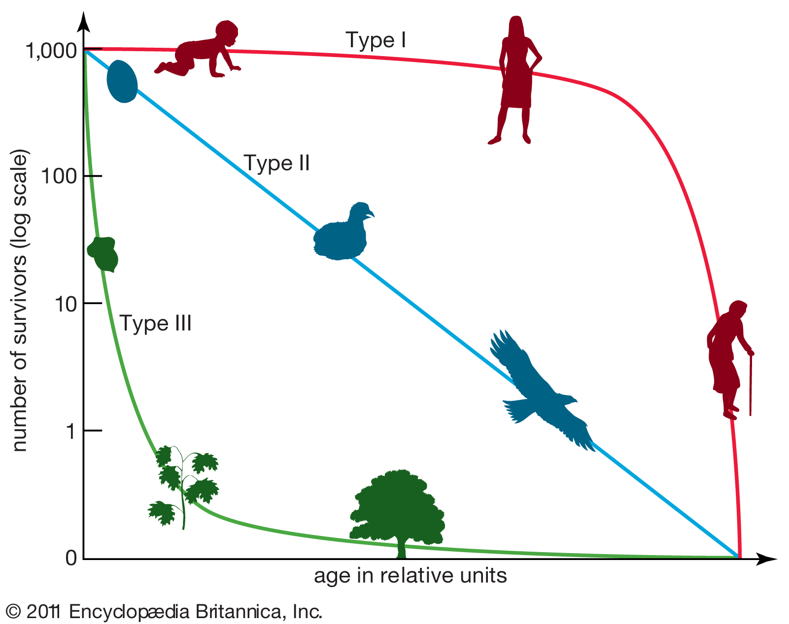

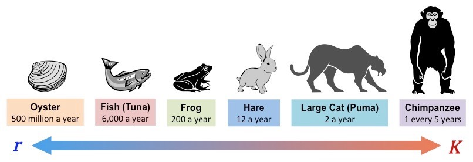

## Populations with unlimited resources: **Exponential growth**

**Population growth that accelerates because a larger population produces more new individuals at constant rates**

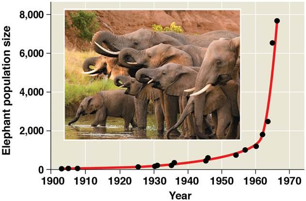

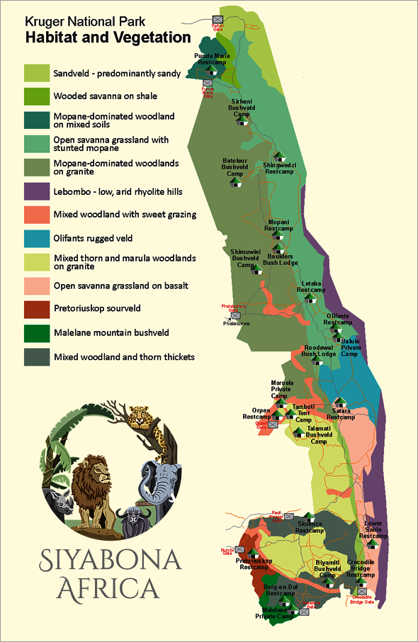

## Population growth eventually faces environmental resistance

 

* **Density-dependent**
    + competition
    + predation
    + disease
    + resources
 
 

* **Density-independent**
    + catastrophic events
    + disturbances

 

* **Carrying Capacity: maximum size of a population an environment can support**
    + environmental resistance leads to **Logistic growth (S-shaped curve)**
    
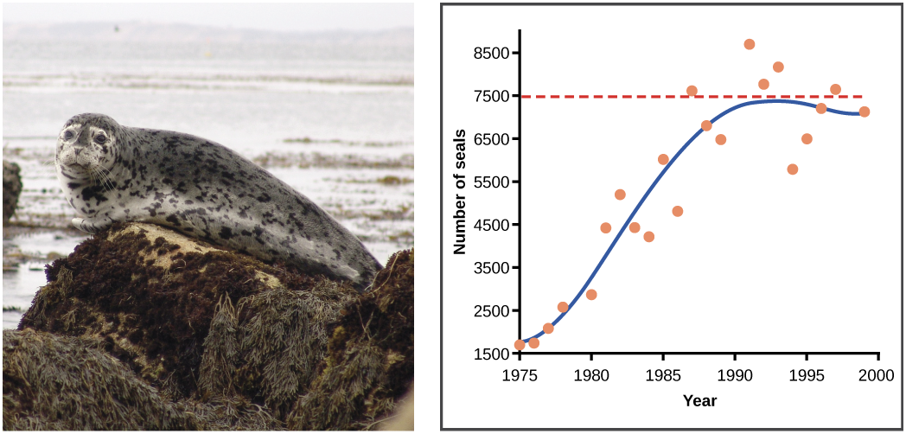

<!-- ## Population cycles are often tied to other species -->
<!-- 
 -->

<!-- 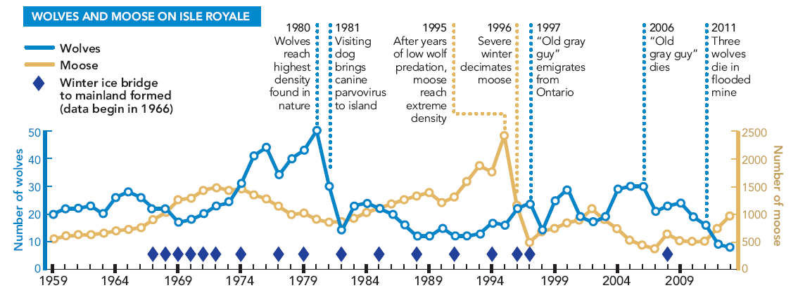 -->

## Testable concepts in this lecture

* **Population structure and measurement**
    + abundance, density, demographics, and population boundaries
    
 

* **Population change**
    + births, deaths, immigration, emigration, and demographic structure
    
 

* **Life history and survivorship**
    + reproductive strategies, dormancy, survivorship curves, and r/K selection
    
 

* **Population growth and environmental limits**
    + exponential vs. logistic growth, environmental resistance, and carrying capacity
