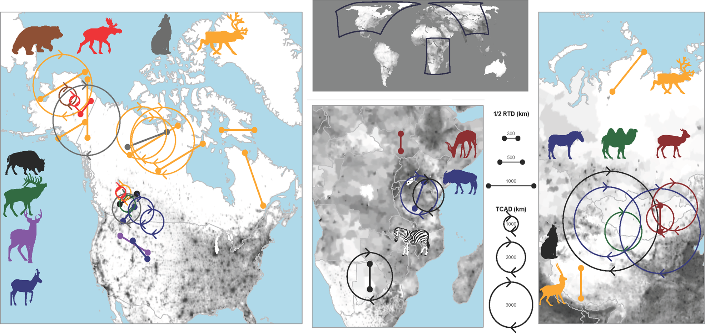

## WHAT: Defining a population is multi-faceted

 

* **A group of organisms from one species...**
    + abundance
    + sex ratios
    + age structure
    + density
    
 

* **Defining the population boundary...**
    + a lake
    + ecosystem
    + country or state

 

* **Aphid population: leaf, plant, grassland, ecosystem?**
    + depends on the study and the questions

## WHY: Understanding population structure (Demography)

 

* **Is population size ↑ ←→ ↓ ?**
    
 

* **Age of a population, peak reproductive ages**

 

* **Frequency of reproduction, reproductive effort**

 

* **Sex ratios determining mating potential**
 
 
 
* **Measuring, predicting and evaluating population sizes guides decisions**
    + conservation, pest management, harvesting

## Case Study: Deer population size 

 

## Case Study: Deer population density matters too...

 

## Case Study: Zombie deer and population density

 

## WHO: Definition of an individual can be tricky

 
 

* **Unitary organism: forming a single entity**
    + deer, bird, spider, etc.

 

* **Modular organisms: colonies, etc.**
    + bacteria, algae, corals
    + plants: ferns grow by rhizomes

 

* **Some modular organisms may themselves be populations**

## HOW: Estimates from representative samples

 
 
 

* **Most methods are indirect estimates**

 
 

* **Lessons from Lab: **
    + Census techniques
    + Mark & Recapture
    + Spatial component
    + Temporal component

## Populations dynamics: Movement (dispersal and migration)

 

<!--  -->

<!--  -->

<!-- ## What forces control deer abundance in Jefferson Co.? -->
<!-- 
 -->

<!--  -->

<!--  -->

## Life History: More than just birth and death

## Reproductive effort and life cycles differ greatly

## Semelparous: One-off reproduction

 

## Species with short life cycles: Annuals & Ephemerals

## Populations and life cycles: Dormancy

 

* **Annual organism may spend part of the year dormant**
    + Seeds, Spores, Cysts, etc.

 

* **Thousands of seeds per square meter of soil**

 

* **Dormancy can last for long periods of time**
    + protection from harsh environments

 

* **How does this affect population estimates? **  
    + Reproductive effort and offspring may not be synced

## Life History: Sexual conflict

 
 

* **Goal to pass on genes...**

 
 
 
 
 
 

* **When and how to spend your resources**
    + reproduction comes at a cost of growth
    + flowers + seeds = ↓ leaves and roots
    + are enough resources available to support pregnancy in animals?
    + *surviving vs growing the population...*
 

* **Life histories of males and females may differ**
    

<!-- ## The mystery of large 'Mast' years in botany -->
<!-- 
 -->

<!--  -->

<!--  -->

## 
 
 
 
 
 
 
 
 
 
 
 
 
 
 

* **Populations are composites of individual Life Histories**
    + who survived from previous year
    + new individuals (births/immigration)
    + survivability of offspring
    
 

**Survirvorship = **

## Populations dynamics: Monitoring birth and death

 
 

* **Measuring rates of birth and death can tell us if a population is growing or shrinking**

 

* **Cohort Life tables: follow the fate of individuals from a single cohort**
    + survivorship
    + difficult for mobile animals

 

* **Static life table: count # of survivors at different ages**

 

* **Tells us a lot about age structure of a population**

## r/K selection theory: Growth and reproduction strategies

 
 
 
 

* **r-selected species: “cheap” offspring**

 

* **K-selected species: “expensive” offspring**

 
 

* **These are the 2 ends of a spectrum**

## 

## Populations with unlimited resources: **Exponential growth**

## Population growth regulation

 

* **Density-dependent**
    + competition
    + predation
    + disease
    + resources
 
 

* **Density-independent**
    + weather events
    + disturbances

 

* **Carrying Capacity:**
    + environmental resistance leads to **Logistic growth**
    

<!-- ## Population cycles -->
<!-- 
 -->

<!--  -->

