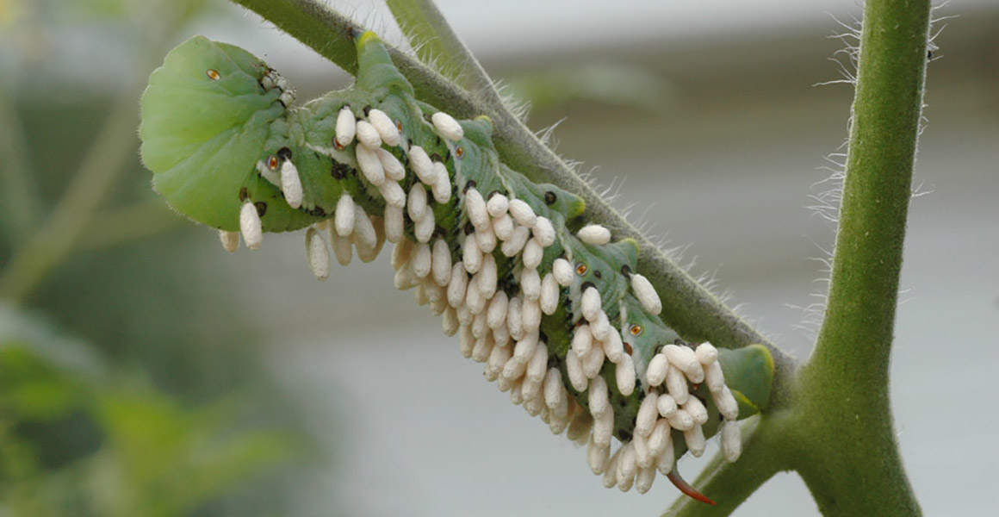
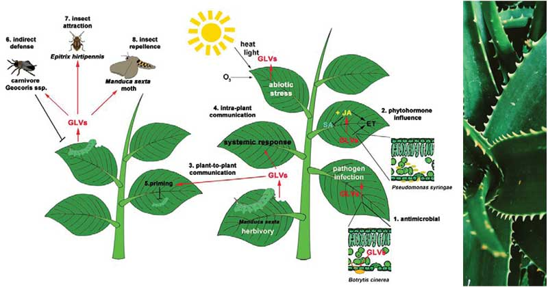
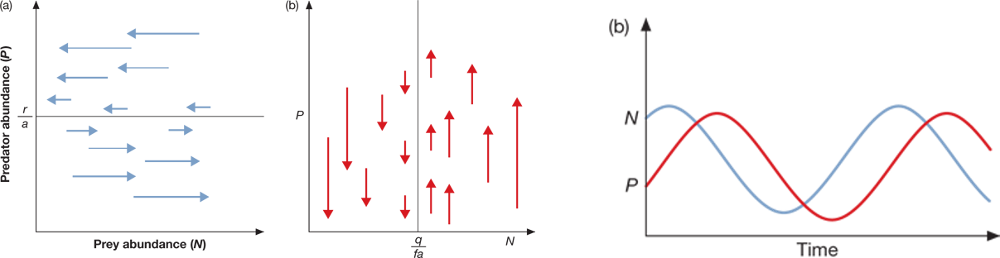

## Defining Predation (+,-)

 
 

* **An organism (predator) that consumes all or part of another organism (prey)**
    + benefits its own fitness
    + reduces the growth, fecundity and survival of the prey population

 

**1. True predators: **

**2. Grazers: **

**3. Parasites: **

 

## Parasitoid Bodysnatchers: complicating predator definitions...

 

## Predator behavior is super diverse

 

* **Behaviors to capture prey differ vastly**
    + *consumption rate*: 
    + consumption rate impacts population sizes

 

* **True predators and grazers are mostly foragers**
    + searching (active foraging)
    + sit and wait (passive foraging)
    
 

* **Prey behavior (evasiveness) impacts consumption rate**

 

* **Parasites rely on direct transmission**
    + contact is density dependent

## Optimal Foraging Theory

 
 
 

* **Obtaining food provides energy**

 

* **Searching for and capturing food uses energy**

 

* **Foraging is a banking problem: Return on Investment**

 

* **To maximize fitness a forager must balance these**

##

## Optimal foraging should be related to density

 
 
 

* **Can predators be choosy?**
    + Prey densities impact handling/search times

        
 

* **# of foragers also relates to prey density**
    + competition for available prey
    + group foraging? (Hintz & Lonzarich 2018)

 

* **Take Home: Predators should choose to forage in a patch with the highest quality**
        

## Optimal foraging in African predators: Energy use

 
 

* **Calorie use by big predators**
    + Cheetahs = 9,000 Kj
    + Wild dogs = 15,000 Kj
    + Lions = ?
    + Humans = 9000 Kj

 

* **Foraging Strategies**
    + Laziness
    + Thievery
    + Group hunting 
    + Seasonal prey choice
    
    

## Optimal foraging in African predators: Prey choice

<!-- ## Optimal foraging in African predators: Energy use -->
<!-- 
 -->

<!--  -->

## Consumption is an agent of natural selection: Defense

## Defenses can be 'constitutive' of 'induced'

## Predators also adapt to prey (Cattau et al. 2017)

<!-- ## Is predation always bad for prey? Grazers -->
<!-- 
 -->

<!--  -->

## Predation can promote biodiversity

 
 
 

* **If predators consume the strongest competitor then the community may become more 'even'**

 

* **Relieves competitive pressure on other species enabling coexistence**

 

* **Predation structures communities**

<!-- ## Predation structures communities: Anoles lizards -->
<!-- 
 -->

<!--  -->

## Predator vs Prey populations (Basics)

## Prey populations are always lower in the presence of predators

## Impacts of predation on populations is complex...

 

* **Behavior/adaptations of predators and prey**
  + natural selection

 

* **Compensatory responses (not kill)**

 

* **Assumption of a 1 vs 1 relationship**

 

* **Life histories via reproductive traits**

 

* **Start Simple: Lynx vs Rabbit**

   
 

## Lotka Voltera: Modelling predator-prey dynamics

 

* **These predator-prey patterns are described in the Lotka-Voltera 2 species model**
    + 2 basic components:
    + *P* = # of predators
    + *N* = # of prey

  

1. Start with a lot of rabbits, who does well?
2. Populations of lynx will ....
3. Why does **time** matter at this step?
4. Populations of prey will....
5. Food for predators will....
6. Over time predator populations will ....

## Lotka-Voltera predicts coupled population cycles

## Lotka Voltera equations

 

* **With no predators, prey populations (N) increase exponentially**
    + *dN/dt* = *rN* 
    + *r* = growth rate

 

* **Predators remove prey at some rate**
    + *dN/dt* = *rN - aPN*
    + *a* = attacking efficiency
    

 
 

* **Prey stable when *dN/dt* = 0**

 
  

* **In the absence of food, predator populations (P) will decline**
    + *dP/dt* = *-qP*
    + *q* = mortality rate

 

* **Mortality buffered by births (*faPN*)**
    + *dP/dt* = *faPN -qP*
    + food gain (*aPN*)
    + efficiency of food to offspring (*f*)

 

* **Predator stable when *dP/dt* = 0**

 

<!-- ## Start each population cycle at the zero isocline -->
<!-- 
 -->

<!--  -->

<!-- ## Leftover questions: What does the prey eat? -->
<!-- 
 -->

<!--  -->

<!-- ## Leftover questions: Are predator-prey cycles that simple? -->
<!-- 
 -->

<!--  -->

<!-- ##  -->
<!--   -->
<!--   -->
<!--   -->
<!--   -->
<!--   -->
<!--   -->
<!--   -->
<!--   -->
<!--   -->
<!--   -->

<!-- * **Leftover questions: Are the cycles sustainable?** -->

<!--  -->
