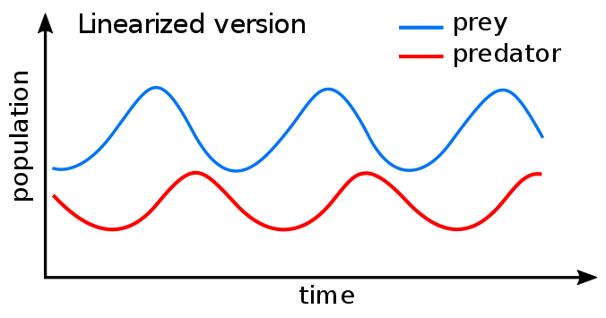

## Defining predation

 
 

* **an organinms that consumers all or part of another organims (prey)**
    + benefits its own fitness
    + reduces the growth, fecudity, survival of the prey population

 

**1. True predators: attack, kill & consume**

**2. Grazers: attack many things, eat only a part and do not kill**

**3. Parasites: attack, consume (host), keep alive in short term**

 

## Parasitoid Bodysnatchers: complicating predator definitions...

 

## Predator behavior

 
 

* **Behaviors to capture prey differ vastly**

 

* **True predators and grazers are mostly foragers**
    + searching (active)
    + sit and wait (passive)

 

* **Parasite rely on transmission**
    + contact between infected host and new host
    + density dependent

## Optimal Foraging Theory

 
 

* **Predicts how an animal behaves when searching for food**

 

* **Obtaining food provides energy**

 

* **Searching for and capturing food requires energy and time**

 

* **To maximize fitness a predator must balance these**
    + alpine bumble bees

<!-- ## Optimal Foraging Theory depends on density -->
<!-- 
 -->

<!--  -->

<!-- 
 -->

<!-- * **TYPE1: rate of prey capture increases linearly with food density** -->
<!--     + low prey densities = long search time -->
<!--     + predator searches a lot, so eats every prey item  -->

<!--   -->

<!-- * **TYPE2: rate of prey capture negatively accelerates as it increases with food density** -->
<!--     + predator is limited by capacity to process food -->
<!--     + predator searches less with more time handling prey -->

<!--   -->

<!-- * **TYPE3: prey capture increases at first with prey density but then at high densities changes to the negatively accelerated form (TYPE 2)** -->
<!--     + only at high prey densities can predator become choosy -->

<!-- 
 -->

##

## Optimal foraging should be related to density

 

* **Prey densities impact predator search time**
    + can predators be choosy?

 

* **Foraging for prey may increase competition**
    + What kind?
        
 

* **# of foragers relates to amount of prey**
    + minimize competition
    + group foraging? (Hintz & Lonzarich 2018)

 

* **Predators should choose to forage in a patch with the highest quality**
        

## Optimal foraging in African predators: Energy use

 
 

* **Calorie use by big predators**
    + Cheetahs = 9,000 Kj
    + Wild dogs = 15,000 Kj
    + Lions = ?
    + Humans = 9000 Kj

 

* **Foraging Strategies**
    + Laziness
    + Theivery
    + Group hunting
    + Seasonal prey choice
    
    

## Optimal foraging in African predators: Energy use

## Optimal foraging in African predators: Energy use

## Predation may promotes biodiversity

 
 
 

* **If they consume the strongest competitor**
    + invasive species...

 

* **Relieves competitive pressure on other species enabling coexistence**

 

* **Predation structures communites**

## Consumption is an agent of natural selection: Defense

## 

## Predators also adapt to prey (Cattau et al. 2017)

## Predator vs Prey populations (Basics)

## 

## Is predation always bad for prey? Grazers

## Compensatory response of grasshoppers to predation

## Predation may also increase interspecific competition

## Impacts of predation on populations is complex...

 

* **Behavior/adaptataions of both predators and prey**
  + natural selection

 

* **Compensatory responses**

 

* **Life histories**

 

* **Start Simple: Lynx vs Rabbit**

   
 

## Can we model competition?

 

1. Start with a lot of rabbits, who does well?
2. Populations of lynx will ....
3. Why does time matter at this step?
4. Populations of prey will....
5. Food for predators will 
6. Over time predator populations will ....

 

* **These predator-prey patterns described in the Lotka-Voltera model**
    + 2 basic components:
    + *P* = # of predators
    + *N* = # of Predy

## Lotka-Voltera predicts coupled population cycles

## Lotka voltera

 

* **With no predators, prey populations (N) increase exponentially**
    + *dN/dt* = *rN* 

 
 

* **Predators then need to remove prey at some rate**
    + *dN/dt* = *rN - aPN*
    + *a* = attacking efficiency

 

* **Prey stable when *dP/dt* = 0**

 
  

* **In the absense of food predator populations (P) will decline**
    + *dP/dt* = *-qP*
    + *q* = mortality rate

 

* **Mortaility buffered by births, which depends on food gain (aPN) and efficiency of food into offpsring (F) **
    + *dP/dt* = *faPN -qP*

 

* **Predator stable when *dP/dt* = 0**

 

## Zero Isoclines: when does each species + or - in abundance?

## Leftover questions: What does the prey eat?

## Leftover questions: Are predator-prey cycles that simple?

## 
 
 
 
 
 
 
 
 

* **Leftover questions: Are the cycles sustainable?**

