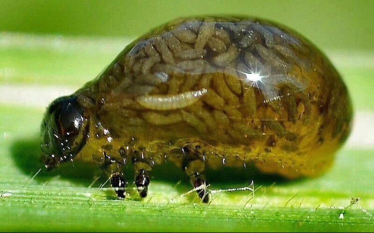

## Defining predation

 

* **an organinms that consumers all or part of another organims (prey)**
    + benefits its own fitness
    + reduces the growth, fecudity, survival of the prey population

 

1. True predators: attack, kill & consume
2. Grazers: attack many things, eat only a part and do not kill
3. Parasites: attack few, consume (host), keep alive in short term

 

## Parasitoid Bodysnatchers: complicating predator definitions...

 

## Predator behavior

 

* **Depending on the type of predator, behavior to capture prey differs**

 

* **True predators and Grazers are mostly foragers**
    + searching (active)
    + sit and wait (passive)

 

* **Parasite rely on transmission**
    + contact between infected host and new host
    + density dependent

## Optimal Foraging Theory

 
 

* **Predicts how an animal behaves when searching for food**

 

* **Obtaining food provides the animal with energy**

 

* **searching for and capturing the food require both energy and time**

 

* **To maximize fitness a predator must balance these**
      + alpine bumble bees

## O.F.T. functional response curves

* **Amount of time searching depends on the density of the prey**

 

* **TYPE1: rate of prey capture increases linearly with food density**
      + low prey densities = long search time
      + predator spends most of its time searching, so eats every prey item 

 

* **TYPE2: rate of prey capture negatively accelerates as it increases with food density**
      + predator is limited by its capacity to process food
      + predator spends less time searching and more and more time handling the prey

 

* **TYPE3: prey capture increases at first with prey density but then at high densities changes to the negatively accelerated form (TYPE 2)**
    + only at high prey densities can predator become choosy

## Optimal foraging in Oystercatcher Birds

## Ideal Free Distribution

 

* **Forgaing for prey likely increases competition**
        + What kind?
 

* **I.F.D. predicts that the # of foraging species in a patch relates to amount of rources**
        + minimize competition

 

* **animals are aware of each patch's quality, and they choose to forage in the patch with the highest quality**
        + free = they can move

## Predation may results in loss of prey abundance.....
* **less food for predator...**

* **may be subtle for grazers...**

## Prey abundance

## 

## Predation and age: African predators

## Predation and age: African prey

## Can predation help a prey population?

## Consumption and co-existence

Predators are commonly thought to promote diversity if they preferentially consume the strongest competitor species. Such a consumptive effect relieves competitive pressure on other species, thereby enabling the coexistence of multiple species

## Predation and fear?....Refuge competition

without predators, brown and green anoles live in disparate locations and the green anoles competitively dominate the brown ones (left). Predator introduction had a non-consumptive effect: fear caused brown anoles to seek refuge higher up, which intensified competition with green anoles and thwarted coexistence (right).

## Consumption leads to Defenses: Plants

## Consumption leads to Defenses: Animals

## Predators also adapt to prey (Cattau et al. 2017)

## Consumption is an agent of natural selection

## Impacts of predation on populations is complex...

 

* **behavior/adaptataions of predators and prey**

 

* **compensatory responses**

 

* **life histories**

 

* **Start SIMPLE and add on**
        * lynx vs rabbit
        

   
 

## Can we model competition?

 

1. Start with a lot of rabbits, who does well?
2. Populations of lynx will ....
3. Why does time matter at this step?
4. Populations of prey will....
5. Food for predators will 
6. Over time predator populations will ....

 

* **These predator-prey patterns are mathematically described in the Lotka-Voltera model**
        + 2 basic components:
        + P = # of predators
        + N = # of Predy

#Lotka voltera

 

* **With no predators, prey populations (N) increase exponentially**
        + dN/dt = rN 

 

* **Predators then need to remove prey at some rate**
        + dN/dt = rN - aPN
        + a = attacking efficiency

 

* **Prey stable when dP/dt = 0**

 
  

* **In the absense of food predator populations (P) will decline**
        + dP/dt = -qP
        + q = mortality rate
        
* **mortaility is buffered by births, which depends on food gain (aPN) and efficiency of food into offpsring (F) **
        + + dP/dt = faPN -qP

 

* **Predator stable when dP/dt = 0**

 

## Zero Isoclines: when does each species + or - in abundance?

## Predator-prey have coupled population cycles

## What about what the prey eats?

##

## Predation structures communites

* **predator mediated coexistence**

