## Consumer-resource interactions (+,-)

 

* **One organism benefits by consuming all or part of another organism**
    + consumer gains energy/resources
    + resource organism experiences a fitness cost

 

* **Consumer strategies occur along a continuum**
    + true predators = many prey, usually lethal
    + grazers = many prey, usually partial consumption
    + parasites = prolonged interaction with one/few hosts
    + parasitoids = prolonged interaction that ultimately kills the host

 

* **Question: Why might these strategies have different effects on prey populations?**

 
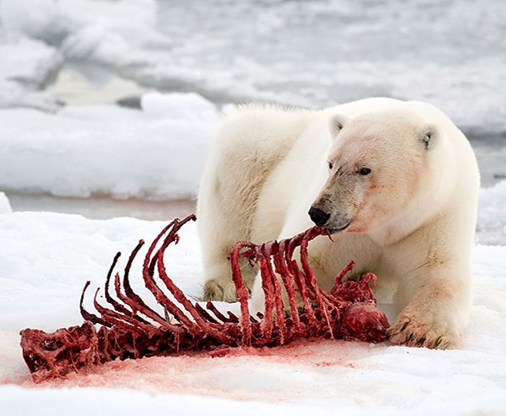

## Predator behavior determines consumption rate

* **Encounters with prey depend on predator behavior**
    + active searching
    + sit-and-wait / passive foraging

 

* **Captures depend on prey behavior and defenses**
    + evasiveness, refuge use, vigilance, etc.
    + not every encounter results in consumption
    
 

* **Consumption rate impacts population dynamics**
    + impacts survivorship + energy for reproduction
    
 

* **Parasite transmission may depend on host density, vectors, or the environment**

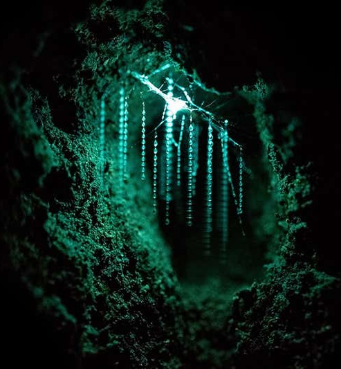

## Prey density changes predator consumption

 

* **Holling's Functional response = how predator consumption changes with prey density**

 

* **Type I:** consumption tracks prey density

* **Type II:** handling time causes saturation

* **Type III:** low consumption when prey are rare, then saturation

 

* **Which response provides prey the greatest refuge at low density?**

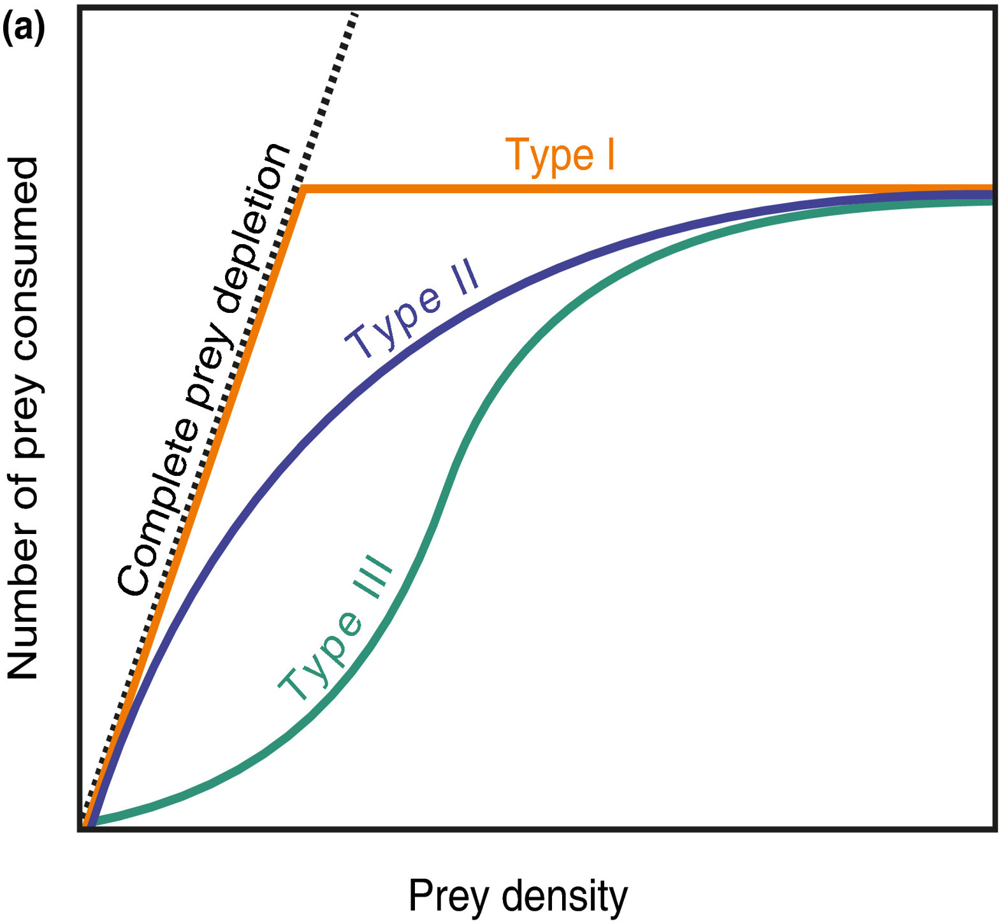

## Optimal Foraging Theory

 
 

* **Obtaining food provides requried energy**

 

* **Searching for and capturing food uses energy**

 

* **Profitability ≈ energy gained / (search time + handling time)**

 

* **Optimal foraging theory:**

<!-- predators should choose foraging strategies that maximize energetic gain while minimizing search and handling costs -->

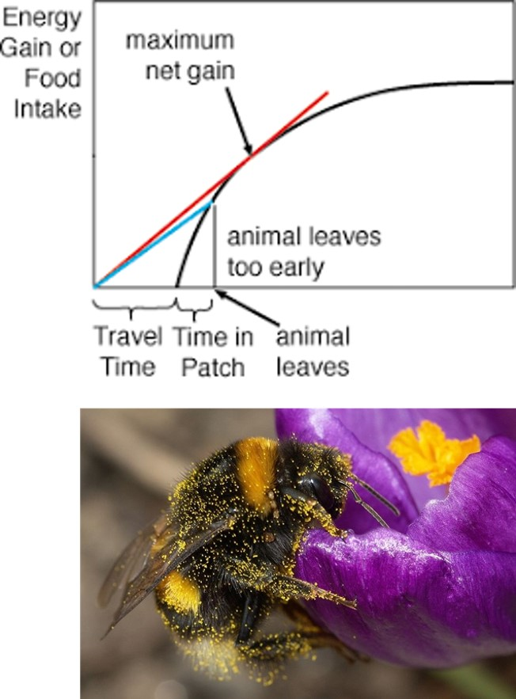

## Which prey should an optimal predator choose?

**Predict the most profitable mussel size first. Then ask: Why might observed prey choice differ from the theoretical optimum?**

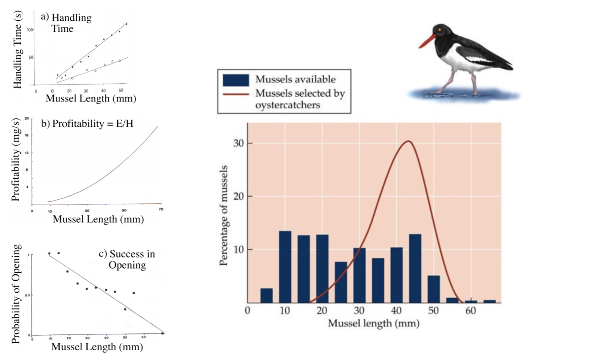

## Optimal foraging depends on prey density

 
 

* **Can predators afford to be choosy?**
    + prey density changes searching time
    + availability constrains the theoretical optimum

 

* **Predator density also matters**
    + competition between each other for available prey
    + animals that group forage introduce neat dynamics

 

* ***Take Home:* Best choice depends on energetic value AND ecological context**
        

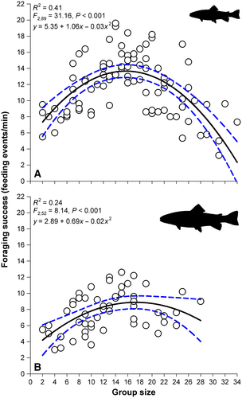

## Optimal foraging in African predators: Prey choice

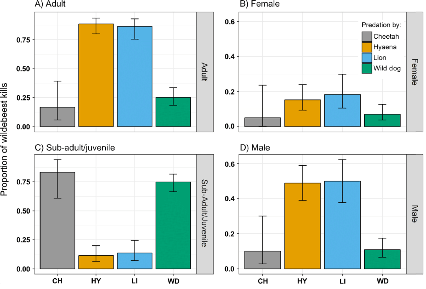

**What prey traits appear to change profitability for different predators?**

<!-- ## Optimal foraging in African predators: Energy use -->
<!-- 
 -->

<!-- 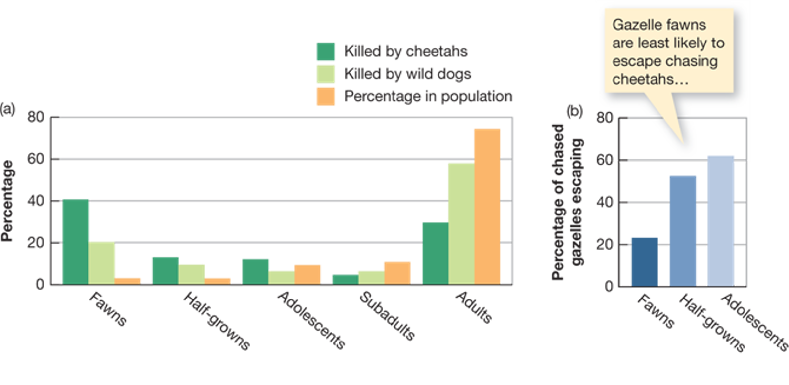 -->

## Consumption is a powerful driver of natural selection: Defense

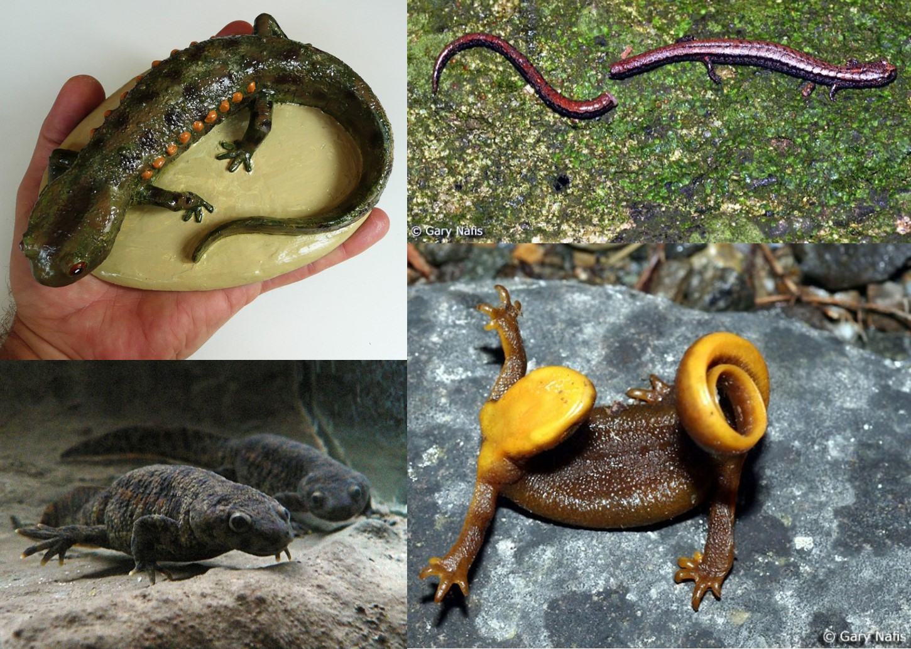

**Predator-prey interactions create reciprocal selection: predators improve capture while prey improve avoidance or defense.**

## Why aren't all defenses constitutive?

 

* **Constitutive defenses = **
    + always present
    + continuous protection
    + continuous energetic/resource cost

 

* **Induced defenses = **
    + activated by damage or a cue
    + reduce costs when enemies are absent
    + protection may be delayed

 

* **Defense is a fitness trade-off**

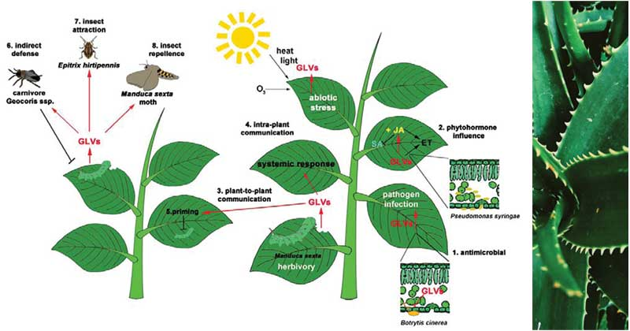

## Predators also adapt to prey (Cattau et al. 2017)

**Prediction: Sustained exposure to novel prey can favor predator traits that improve capture or handling.**

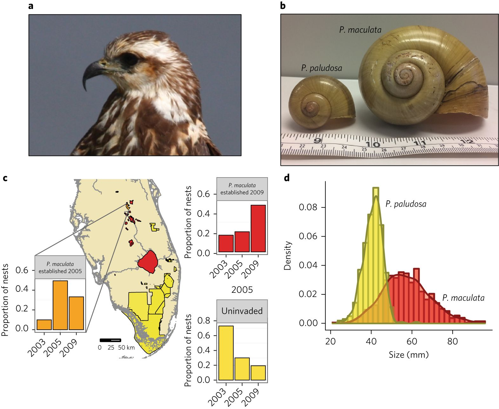

## Predation can promote coexistence

 

* **A predator may suppress the strongest competitor**

 

 

* **Reduced dominance relieves competitive pressure**
    + weaker competitors can persist
    + community diversity may increase

 

* **A predator with a disproportionately large community effect can function as a *keystone predator***

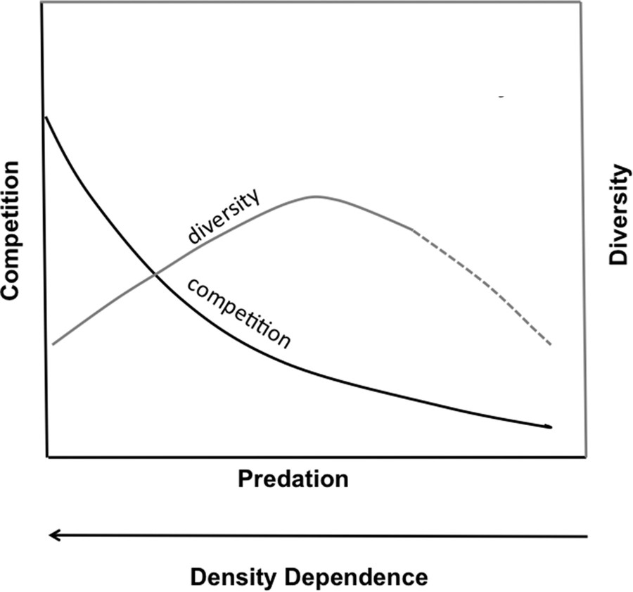

## Predation creates indirect community effects

 

* **Predator** removes **Dominant competitor** promotes **Weaker competitor**

 

* **Suppressing the dominant competitor can indirectly benefit another species**

 

* **Direct effect: predator → prey**

 

* **Indirect effect: predator → prey/competitor → another species**

 

* **<b>Community outcomes cannot always be predicted from one pairwise interaction.</b>**

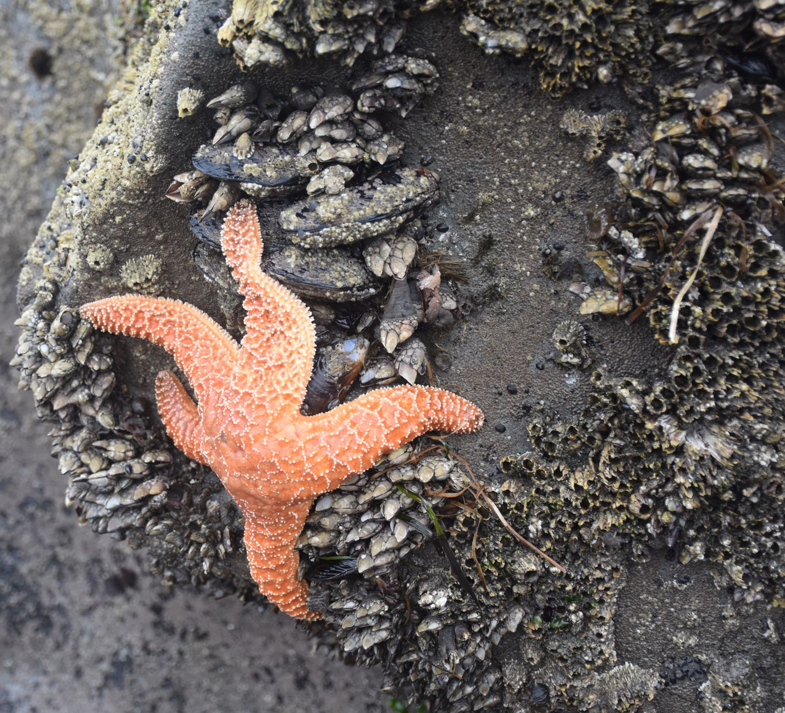

## Predator carrying capacity depends on prey abundance

**More available prey can support more predators—but only if prey can actually be captured and converted into predator fitness**

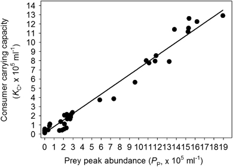

## Predators can regulate maximum prey population sizes

**In this system, parasitoids lower average host abundance. Is that outcome inevitable in every predator-prey system?**

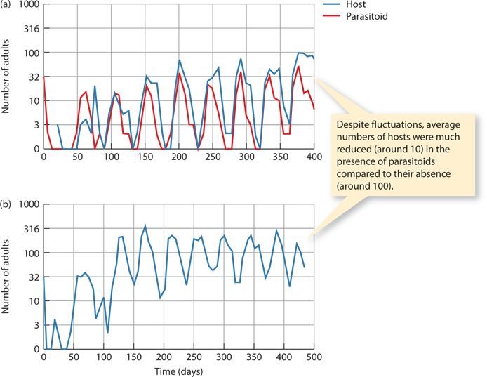

## Predator-prey feedbacks can generate cycles

 

* **More prey can support predator population growth**

 

 

* **More predators can increase prey mortality**

 

* **Declining prey eventually reduces predator growth**

 

* **Time lags in survival and reproduction can produce offset oscillations**

 

* **Real systems may cycle, stabilize, dampen, or be driven by other species/environmental factors**

   
 
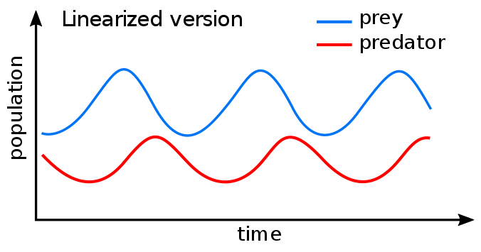

## Lotka-Volterra: Modelling predator-prey dynamics

 

* **Start with a simplified 2-species model**
    + *P* = # of predators
    + *N* = # of prey

  

1. Start with a lot of rabbits: who responds first?
2. Predator populations will ....
3. Why should the predator response be delayed?
4. Prey populations will....
5. Food available to predators will....
6. Over time predator populations will ....

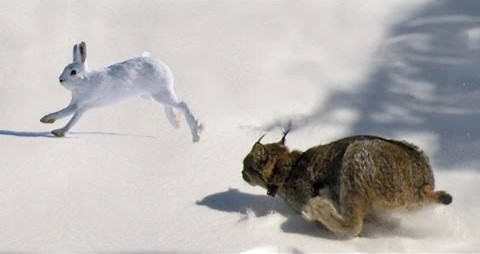

## Lotka-Volterra predicts coupled population cycles

**Look for the lag: predator peaks should follow prey peaks rather than occur at exactly the same time**

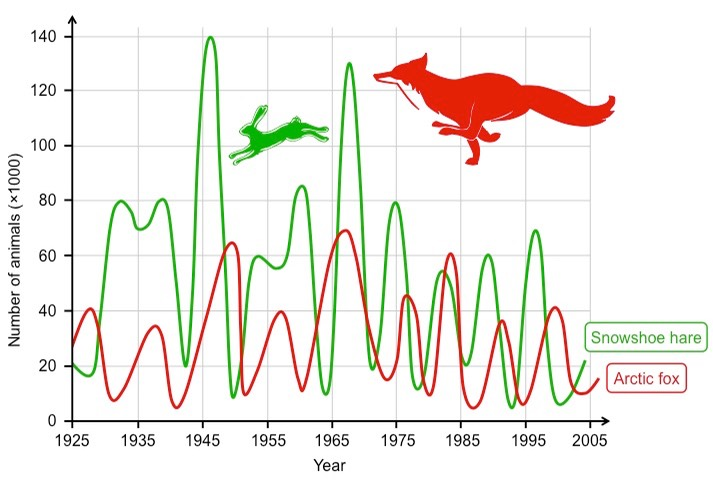

## Lotka-Volterra equations

 

* **With no predators, prey populations (N) increase exponentially**
    + *dN/dt* = *rN* 
    + *r* = growth rate

 

* **Predators remove prey at some rate**
    + *dN/dt* = *rN - aPN*
    + *a* = attack/encounter efficiency
    
 

* **Prey stable when *dN/dt* = 0**

 
  

* **Without prey, predator populations (P) decline**
    + *dP/dt* = *-qP*
    + *q* = mortality rate

 

* **Consumption can produce predator births (*faPN*)**
    + *dP/dt* = *faPN - qP*
    + food gain (*aPN*)
    + conversion efficiency (*f*)

 

* **Predator stable when *dP/dt* = 0**

 

## What assumptions does Lotka-Volterra make?

 
 **How many of these have we challenged today?**
 
  
 

* **Prey grow exponentially without predators**

 

* **Predators decline without prey**

 

* **Encounters depend on predator × prey abundance (*PN*)**

 

* **All prey are equally vulnerable**

* **All predators are equally effective**

 

* **No prey refuge**

 

* **No alternative prey**

 

* **No immigration/emigration**

## Where does this simple model break?

 

* **The predation term (*aPN*) assumes encounters translate simply into consumption**
    + but handling time can saturate feeding rates
    + prey may hide, escape, switch behavior, or evolve defenses

 

* **Predators can switch prey or change foraging behavior**
    + functional responses and optimal foraging alter consumption

 

* **Real communities contain competitors, alternative prey, parasites, mutualists, and environmental variation**

 

* **Models are useful because they isolate mechanisms—not because nature follows every assumption**

## Wolves and moose on Isle Royale (Michigan upper peninsula)

**You can see aspects of Lotka-Voltera BUT disease, weather, forage, age structure, inbreeding, immigration, reintroductions, and beavers make it messy over decades of tracking**

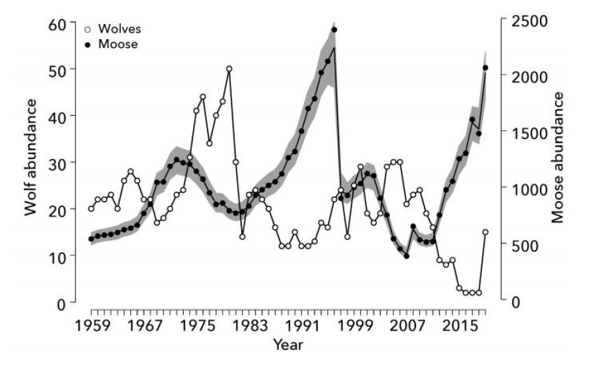

## Testable concepts

 

* **Consumer-resource interactions and predation strategies**
    + predator types, consumption rate, Holling's functional responses

 

* **Optimal foraging and prey choice**
    + energetic trade-offs, search/handling time, prey density

 

* **Predator-prey evolution and community effects**
    + defenses, coevolution, keystone predators, indirect effects

 

* **Predator-prey population dynamics**
    + feedbacks, time lags, Lotka-Volterra equations and assumptions