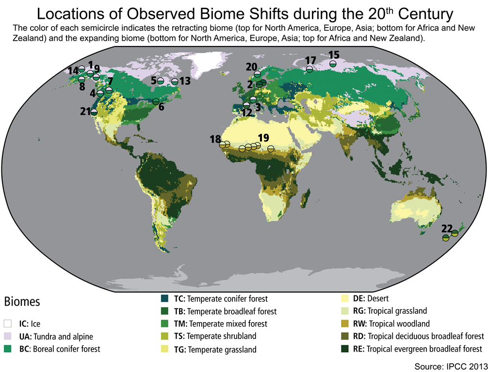
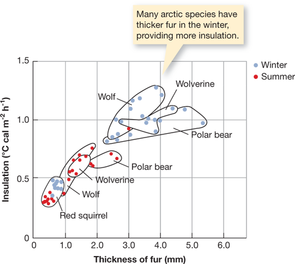
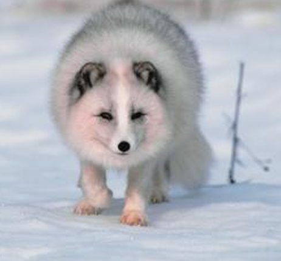
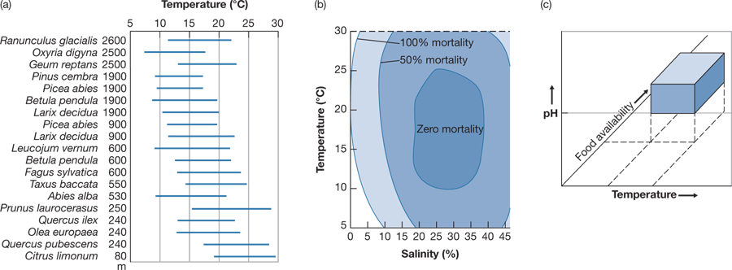
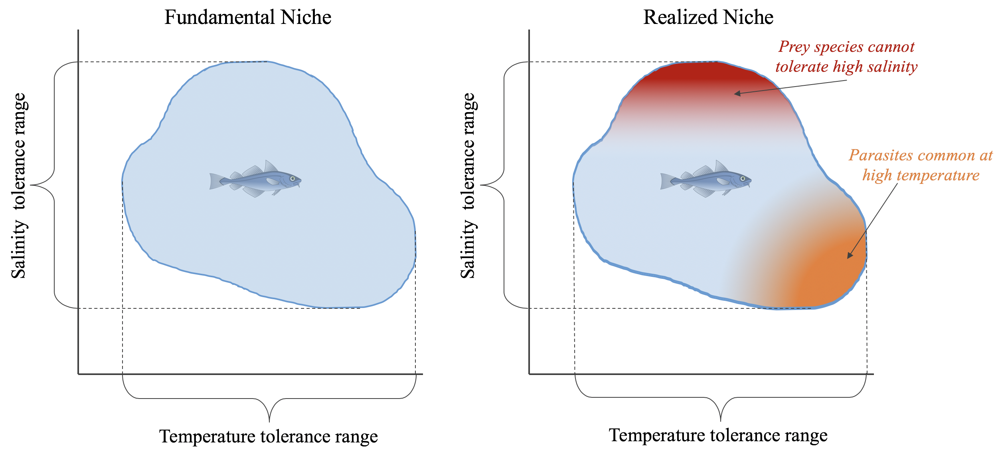
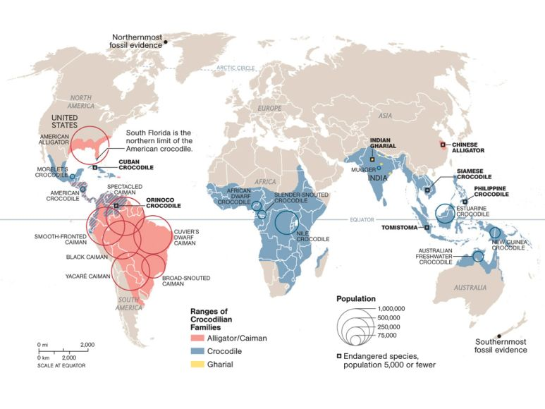

## Species composition of the biospere

 

* **Intricate webs of interacting organisms**
    + 2,000,000 species are known 
    + ~18,000 plants & animals discovered yearly
    + estimated 87% of Eukaryotas unknown

 

* **Current composition reflects billions of ways organisms have adapted, over and over, to a changing planet**

 

* **Humans have altered 75% of ice-free surface**
    + alters species composition
    
 

 

## "Essay of the geography of plants” by Humboldt, 1817

## Underlying causes of the uneven distribution of plants....

## Humboldt lessons: Species are spatially arranged

## Humboldt lessons: Species are spatially arranged

## Similar biological communities reside within our biomes

## Climate drives broad distribution of terrestrial biomes

## Biomes have distinct soil types

## Species distribution varies widely within biomes

## Seasons may impact species distributions

## Migration can cross many biomes: Birds

<iframe width="560" height="315" src="https://www.youtube.com/embed/fpK3U1EkwYU" frameborder="0" allow="accelerometer; autoplay; encrypted-media; gyroscope; picture-in-picture" allowfullscreen></iframe>

## Species may also be adapted for seasonal habitats

## Niche defines the limiting factors for a species

**Ecological Niche = **

## Tolerance Ranges: Coral Reefs

## Ecological niches exist in n-dimensions (many factors)

## Distribution of species within biological communities overlap

**Fundamental vs Realized Niche = **

<!--  -->

<!--  -->

## Species distributions are related to their realized niche space

## Niches often overlap for different species

## Species ranges versus distribution: Crocodiles

## Species ranges versus distribution: Crocodiles

## Ranges versus distribution: Plants

**dispersal: movement of individuals or gametes**
 
**seed dispersal: gravity, wind, ballistic, water, and by animals **

## Species ranges versus distribution: Coconut tree

## Biogeography and species ranges: Alfred Wallace 1859

## Zoogeographic regions: Wallace

<!-- ## Global change: climate refugia (Polar bear) -->
<!-- 
 -->

<!--  -->

<!-- ## Global change: Range shifts of plants -->
<!-- 
 -->

<!--  -->

<!-- ## Global change: Range expansion -->
<!-- 
 -->

<!--  -->

<!-- ## Species distributions: Human impacts -->
<!-- 
 -->

<!--  -->
