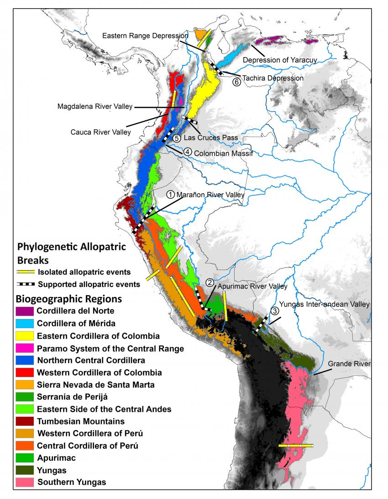

## Species composition of the biospere

 

* **Intricate webs of interacting organisms**
    + 2,000,000 species are known 
    + 18,000 plants & animals discovered per year
    + estimated 87% of Eukaryotas unknown

 

* **Reflects billions of ways organisms have adapted, over and over, to a changing planet**

 

* **Humans have altered 75% of ice-free surface**
    + alters species composition
    
 

 

## "Lines of the geography of plants” by Humboldt, 1817

<!--  -->

## 

<!--  -->

## Species are spatially arranged

## Species are spatially arranged

## 

## Climate drives broad distribution of terrestrial biomes

## Soils play a huge role

## Species distribution varies within biomes

## Seasons can impact species distribution

## Distribution within biological communities

## Species distributions are related to their niche space

## Species distributions are related to their niche space

## Niches define the limiting factors for a species

## Coral Reefs

## Ranges versus distribution: Crocodile

<!-- ## Species ranges: Polar Bear -->
<!-- 
 -->

<!--  -->

## Ranges versus distribution: Plants

## Species distributions: Coconut tree

## Biogeography and species ranges: Alfred Wallace 1859

## Zoogeographic regions: Wallace

<!-- ## Biogeography and species ranges: Andes uplift -->
<!-- 
 -->

<!--  -->

<!--  -->

## Species distributions: Human impacts

## Global change: climate refugia (Polar bear)

## Global change: range shifts of plants

## Global change: range expansion

<!-- ## Can we predict species distributions? -->
<!-- 
 -->

<!--  -->

<!-- ## Predicting aids in conservation: salamander -->
<!-- 
 -->

<!--  -->

<!--  -->
