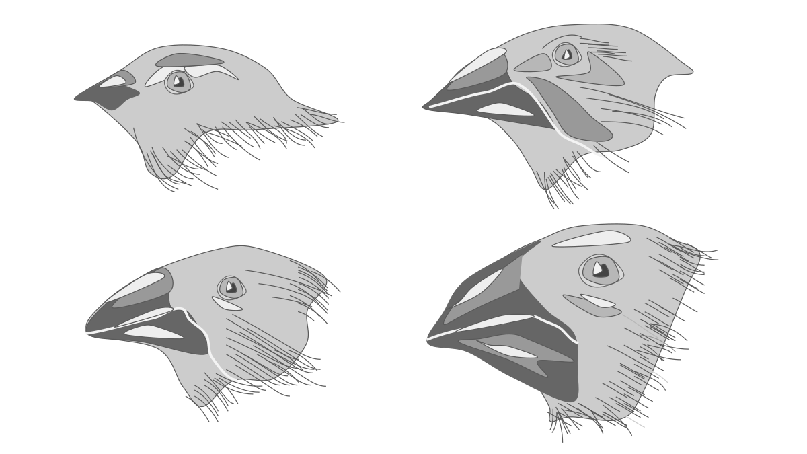
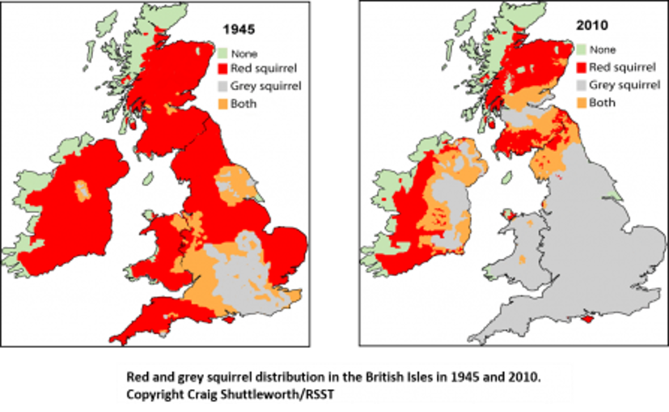

## Species in a community interact constantly

## Bird Networks in the Amazon (complexity)

## Relations between organisms are broad

 

* **Competition**
    + today

 

* **Mutualisms**
    + jigsaw

 

* **Predation and Consumption**
    + next week

 

* **Parasites and hosts**
    

## What is competition?

## Species relationships may have benefits/costs

## WHO: Intra vs Inter-specific competition

## Competition limits population growth

## Competition is a powerful driver of evolution

 
 
 

* **Natural selection favors individuals that do not compete**

 

* **Drives niche separation, specialization and species diversification**

 

* **Directional selection can occur causing character displacment**

## Gause's Law: Theory of Competitive Exclusion

 
 

* **Two species cannot occupy the same niche if they need the same resource**

 

* **Species cannot coexist at constant population values**
    + winner and loser

 

* **Leads to local extinction of weaker competitor or shift to a different ecological niche**

## Gause's test tube Paramecium study

## Red vs Grey Squirrel in Britain (Murphy 2015)

## Competitve exclusion, however, is rare in nature

 

* **Spatial heterogeneity: resources are variable in an environment**

 

* **Multiple resource competition: exclusion based on a single resource is too simple**

 

* **Complete niche overlap (test tube) is rare** 

 

* **TAKE HOME: Greater the overlap = greater the competition**
 

## Competition does result in the 'Realized Niche'

## Josepth Connel: Competition among barnacles

## Can't we all just get along?

## Co-existence and natural selection

* **Overlaping species may evolve to use a niche differently**
    + resource partitioning = division of resources

 

* **Species whose niches only partly overlap coexist easier**
    + use the environment differently (niche differentation)
    + evolve traits to use different/less overlapping resources (character displacement)

 

* **Species sharing one niche dimension may differ along another (niche complementarity)**
    + temporal separation

## 

    
## Co-exissitence through resource partitioning in lizards

## Co-exissitence through resource partitioning in birds

## Niche complementarity: different use of microhabitats

## Coexistence and character displacement: 

## 

