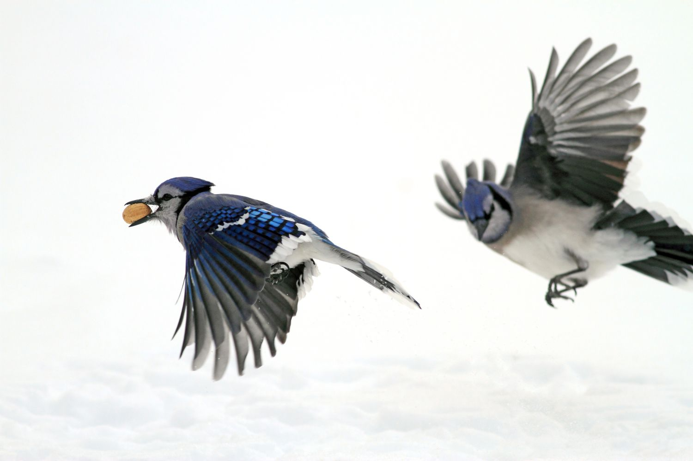
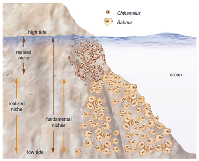
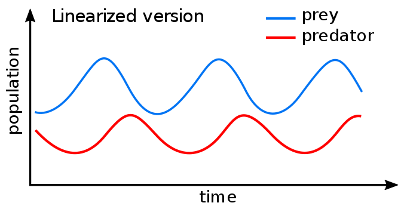

## Species in a community interact constantly

## Bird Networks in the Amazon (complexity)

## Species interactions in ecology are broad

 

* **Competition**
    + today

 

* **Mutualisms**
    + jigsaw

 

* **Predation and Consumption**
    + all next week

 

* **Parasites and hosts**
    

## What is competition?

## Species relationships may have benefits/costs

## WHO: Intra vs Inter-specific competition

## Competition limits population growth

## Competition is a powerful driver of evolution

* **Drives niche separation, specialization and species diversification**

 

* **Natural selection favors individuals that do not compete**

 

* **Directional selection can occur causing character displacment**

# Gause's Law: Theory of Competitive Exclusion

 

* **Two species cannot occupy the same niche if they need the same resource**

 

* **species cannot coexist at constant population values**
    + winner and loser

 

* **leads to extinction of weaker competitor or to shift toward a different ecological niche**

# Gause's labaratory Paramecium study

## Competition results in the 'Realized Niche'

## Divide sections

1. Ecological effects
  + fundamental and realized niches
  + competitive exclusion
  + patch habitats
  
2. evolutionary effects
  + did ancestors compete? hard to prove but what are some of these traits
  
3. Interspeciric compeition structures communites
  + niche differentation: how to use same resouces
    + microhabit, small distirbution, temperoal
    
  + ourcomes: exlcusion - realized, coexistence, evolution

## Competition among barnacles

## Possible and actual consequences of competiton

* **coexisting species overlap at larger spatial scales but tend to have distinct distributions when you zoom in** 

species get excluded from suitable habitat by interspecific competiion

# Coesitence through resource partitioning

niche complementarity and temporal separation of resources

The tendency for coexisting species which occupy a similar position along one niche dimension to differ along another.

## Coexistence through niche differentation

## competition through unrelated species (large taxonimic differences)

## Intraspecific competition (members of the same species)

* **rate of population increase that is limited by intraspecific competition **

equation:rN, the intrinsic rate of increase [r] times the population size [N]) describes a population's growth in the absence of competition. The second term ([K-N] / K) incorporates intraspecific competition, or density-dependence, into the model, and takes a value between 0 and 1. As population size (N) approaches carrying capacity (K), the numerator (K-N) becomes smaller but the denominator (K) stays the same and the second term decreases. 

rate of population growth that slows down as population size increases,

#Lotka voltera

* **Question: Under what circumstances does each species increase or decrease in abundance?

* **Take the intraspecific equationa and add a competition coefficient
alpah12: the affect that species one has on species 2
alpha21: the affect that species 2 has on 1

the effect that species 2 has on species 1 (a12) is multiplied by the population size of species 2 (N2). When a12 is < 1 the effect of species 2 on species 1 is less than the effect of species 1 on its own members. Conversely, when a12is > 1 the effect of species 2 on species 1 is greater than the effect of species 1 on its own members

# Lotka voltera: Case study

## Zero Isoclines for 2 species

Note that the zero isoclines divide each graph into two parts. Below and to the left of the isocline the population size increases because the combined abundances of both species are less than the carrying capacity of the one, while above and to the right the population size decreases because the combined abundances are greater than the carrying capacity. For the graph of the isocline of species 1, the isocline intersects the graph on the x-axis when N1 reaches its carrying capacity (K1) and no individuals of species 2 are present. The isocline intersects the graph on the y-axis at K1/a12, when the carrying capacity of species 1 is filled by the equivalent number of individuals of species 2 and no individuals of species 1 are present. The intersections of the isocline for species 2 are essentially the same, but on different axes.

## character displacment

When Brown and Wilson (1956) described character displacement, they proposed the following process: populations of two closely related species, after first coming into contact with each other, interact “in such a way as to diverge further from one another where they occur together”. Such divergence minimizes the chances of both competition and hybridization between the species, and therefore favors coexistence over exclusion.

evolutionary reponse to ineterspec competition - to avoid competition

Character displacement is the phenomenon where differences among similar species whose distributions overlap geographically are accentuated in regions where the species co-occur, but are minimized or lost where the species’ distributions do not overlap.

sympatry - living together

