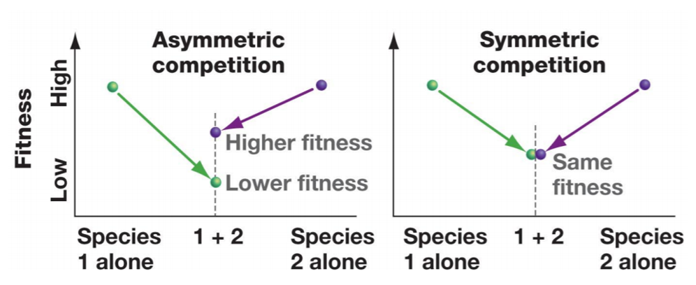
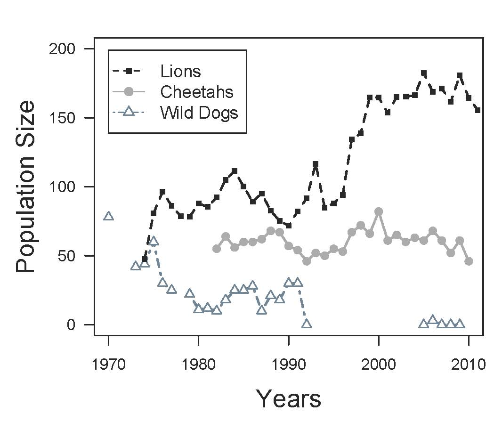

##

## Bird Networks in the Amazon (complexity)

## Relationships between organisms are broad

* **Competition**
    + today

 

* **Mutualisms**
    + jigsaw

 

* **Predation and Consumption**
    + next week

 

* **Parasites and hosts**

 

* **Humans vs other species**
    + friday data exercise
    

## What is competition?

<!--  -->

## WHO: Intra vs Inter-specific competition

## Competition always results costs to fitness

## Intraspecific competition limits population growth

## Competition is a powerful driver of evolution

 
 
 

* **Natural selection favors individuals that do not compete**

 

* **Drives niche differentiation, trait specialization and potentially species diversification**

 

* **Directional selection can occur causing character displacement**

##

## Gause's Law: Theory of Competitive Exclusion

 
 
 
 

* **Two species cannot occupy the same niche if they need the same resource**

 

* **Species cannot coexist at constant populations**
    + winner and loser

 

* **Leads to local extinction of weaker competitor or shift to a different ecological niche**

## Gause's test tube Paramecium study

## Red vs Grey Squirrel in Britain (Murphy 2015)

## Competitive exclusion, however, is rare in nature

 
 

* **Resources are variable/limiting in an environment**
    + leads to more symmetric competition

 

* **Species compete for multiple resources**
    + exclusion based on a single resource is too simple

 

* **Complete niche overlap (test tube) is rare** 

 

* **TAKE HOME: Greater overlap = greater competition**
 

## Competition does result in the 'Realized Niche'

## Joseph Connel: Competition among barnacles

## Can't we all just get along?

## Co-existence and natural selection

* **Overlapping species may evolve to use a niche differently**
    + <ins>resource partitioning</ins> = division of resources

 

* **Species whose niches only partly overlap coexist easier**
    + use the environment differently = <ins>niche differentiation</ins>
    + evolve traits to use different/less overlapping resources = <ins>character displacement</ins>

 

* **Co-existing species can overlap by using different forms of resources**

<!-- ## Co-existence through resource partitioning in birds -->
<!-- 
 -->

<!--  -->

<!--  -->

## Co-existence through resource partitioning in lizards

## Niche differentiation: different use of microhabitats

## Coexistence and character displacement: 

<!--  -->

<!--  -->

<!-- ##  -->

