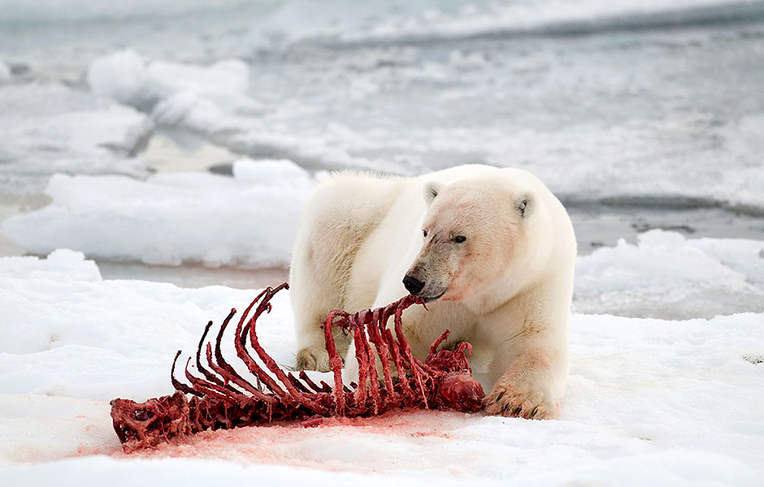
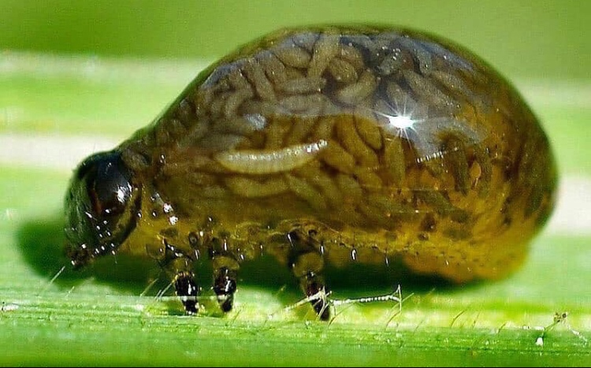
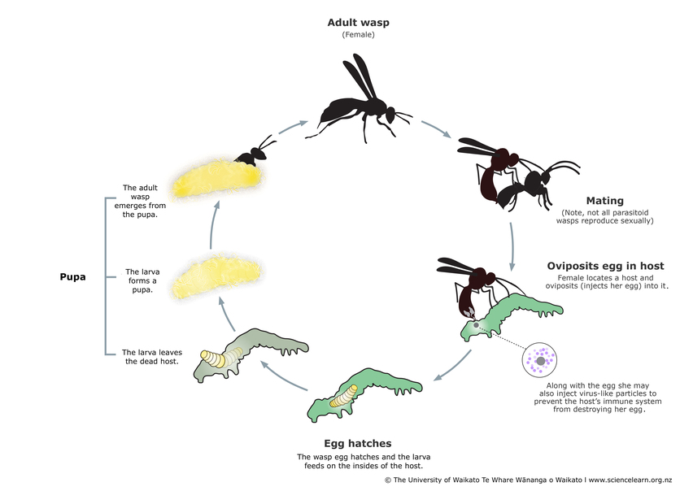

## Defining predation

 

* **an organinms that consumers all or part of another organims (prey)**
    + benefits its own fitness
    + reduces the growth, fecudity, survival of the prey population

 

* **not just lions and tigers and bears, oh my!**

 

1. True predators: attack, kill & consume
2. Grazers: attack many things, eat only a part and do not kill
3. Parasites: attack few, consume (host), keep alive in short term

## Predation may results in loss of prey abundance.....
* **less food for predator...**

* **may be subtle for grazers...**

 

## Parasitoid Bodysnatchers: complicating predator definitions...

 

## Consumption and co-existence

Predators are commonly thought to promote diversity if they preferentially consume the strongest competitor species. Such a consumptive effect relieves competitive pressure on other species, thereby enabling the coexistence of multiple species

## Predation and fear?....Refuge competition

## Consumption leads to Defenses: Animals

## predators adapt too

## Consumption is an agent of natural selection

## Can we model competition?

## Intraspecific competition (members of the same species)

* **rate of population increase that is limited by intraspecific competition **

equation:rN, the intrinsic rate of increase [r] times the population size [N]) describes a population's growth in the absence of competition. The second term ([K-N] / K) incorporates intraspecific competition, or density-dependence, into the model, and takes a value between 0 and 1. As population size (N) approaches carrying capacity (K), the numerator (K-N) becomes smaller but the denominator (K) stays the same and the second term decreases. 

rate of population growth that slows down as population size increases,

#Lotka voltera

* **Question: Under what circumstances does each species increase or decrease in abundance?

* **Take the intraspecific equationa and add a competition coefficient
alpah12: the affect that species one has on species 2
alpha21: the affect that species 2 has on 1

the effect that species 2 has on species 1 (a12) is multiplied by the population size of species 2 (N2). When a12 is < 1 the effect of species 2 on species 1 is less than the effect of species 1 on its own members. Conversely, when a12is > 1 the effect of species 2 on species 1 is greater than the effect of species 1 on its own members

# Lotka voltera: Case study

## Zero Isoclines for 2 species

Note that the zero isoclines divide each graph into two parts. Below and to the left of the isocline the population size increases because the combined abundances of both species are less than the carrying capacity of the one, while above and to the right the population size decreases because the combined abundances are greater than the carrying capacity. For the graph of the isocline of species 1, the isocline intersects the graph on the x-axis when N1 reaches its carrying capacity (K1) and no individuals of species 2 are present. The isocline intersects the graph on the y-axis at K1/a12, when the carrying capacity of species 1 is filled by the equivalent number of individuals of species 2 and no individuals of species 1 are present. The intersections of the isocline for species 2 are essentially the same, but on different axes.

