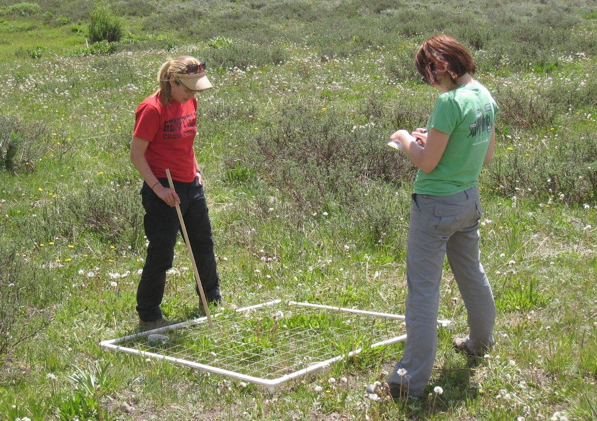
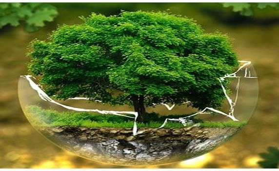
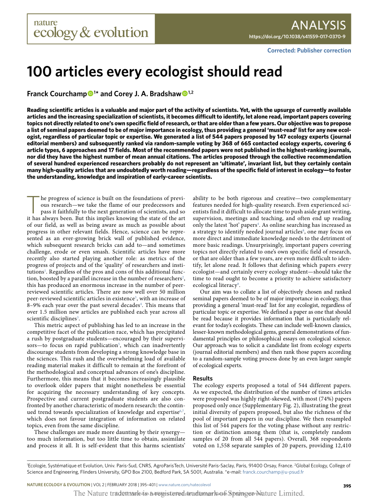

## About me

 
 
 
 
 

* Plant Ecophysologist  
* Ecosystem Ecologist

 

* www.courtneycampany.com  

## This semester we will practice being an ecologist

## This semester we will ....

* **Immerse ourselves in weekly ecological themes**
    + lecture
    + journal club
    + quantitative reasoning

 

* **Go outside!!!**

 

* **Run ecological experiments**

 

* **SOLVE a major ecological issue!**

 

* **Practice communicating science**
   + Find your voice!
   

## What is ecology (textbook)?

## What is ecology (textbook)?

 
 

* **Relations of organisms to one another and to their physical surroundings**
    + living and non-living components

 

* **(1) Distribution and abundance of organisms**

 

* **(2) Interactions among organisms**

 

* **(3) Transformation and flux of energy and matter**
    

## Ecology spans many scales

## Ecologist try to explain, understand and predict

 
 
 

##

## What is the central need for ecology?

## For Journal Club this week....

 

* **Read "100 articles every ecologist should read"**
    + article and cheat sheet on SAKAI

 

* **Take specific notes**
    + What ecological themes are common?
    + Do you feel any themes are missing?
    + Is there a take home message?
    + Is there anything you don't understand?

 

* **Pay attention to little details**
    + Are there any patterns you see?
    + Do you detect any issues?
    

