## About me: A diverse ecologist

 

* **Plant Ecologist**
    + climate change
    + physiology
    + evolution
    
 

* **Ecosystem Ecologist**
    + climate change
    + fire ecology

 

* **Shepherd Research:**
    + urban tree ecology
    + aquaponics at Tabler Farm
    
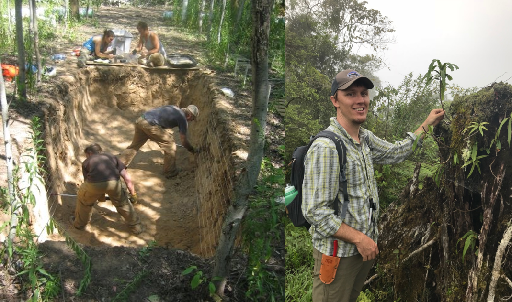

<!-- ## About me -->
<!-- 
 -->
<!--   -->

<!-- * **Plant Ecologist** -->
<!--     + climate change -->
<!--     + physiology -->
<!--     + evolution -->

<!--   -->

<!-- * **Ecosystem Ecologist** -->
<!--     + climate change -->
<!--     + fire ecology -->

<!--   -->

<!-- * **Shepherd Research:** -->
<!--     + urban tree ecology -->
<!--     + aquaponics at Tabler Farm -->

<!-- 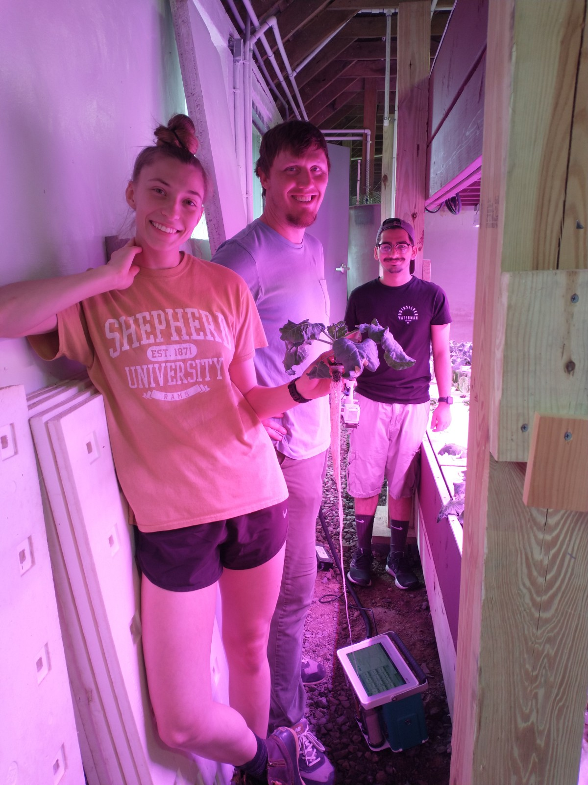 -->

<!--  -->

## This semester we will practice being a modern ecologist

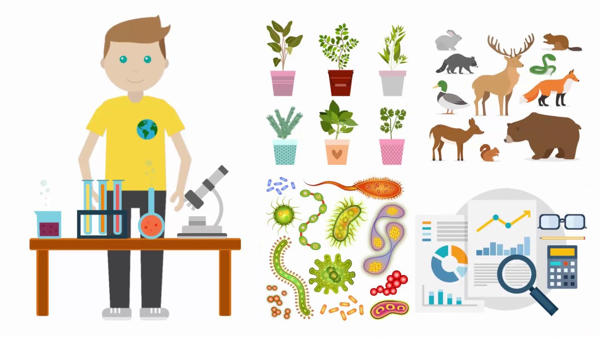

## This semester we will ....

 

* **Learn ecology**
    + Lecture
    + Journal club

 

* **Do Ecology**
    + Labs + fieldwork + data exercises
    
 

* **Contribute to ecological experiments**

 

* **Apply ecology**
    + A C.U.R.E for Invasions
   

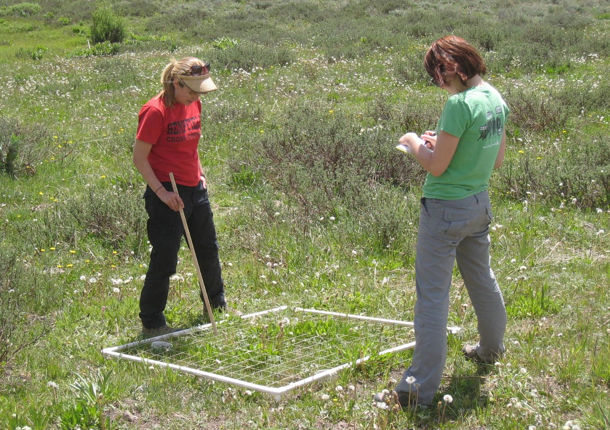

##

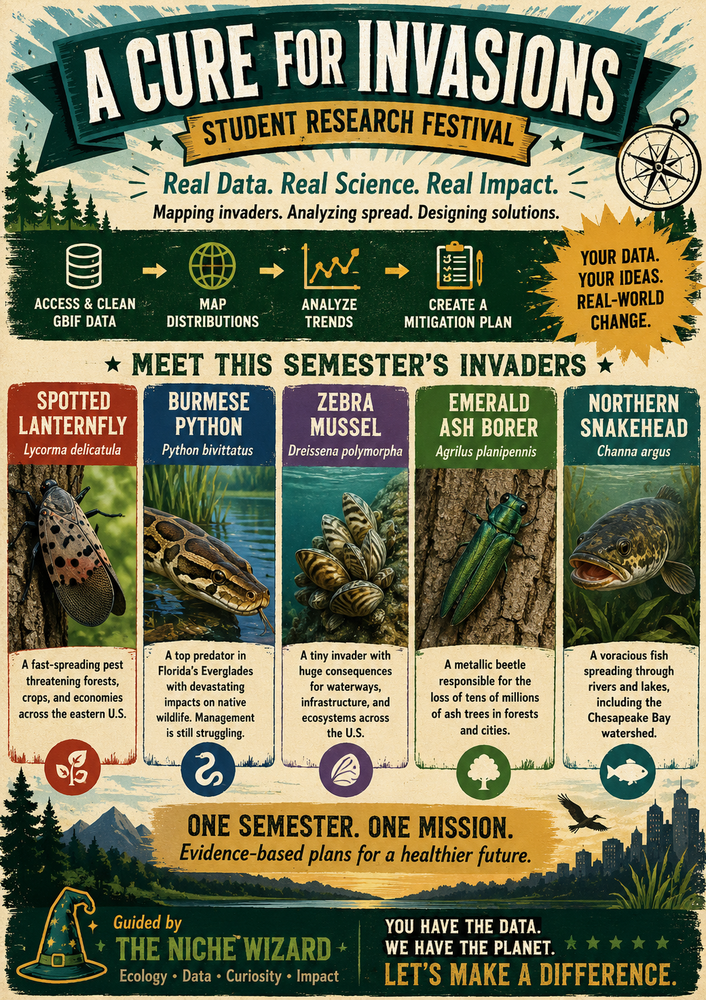

## FALL 2026: A C.U.R.E for Invasions

 

* **A C.U.R.E. (Course-based Undergraduate Research Experience) is a class where students do real, original scientific research or creative inquiry as part of the regular curriculum**

 

* **You will need to build the skills to solve/mitigate the issues of your invasive species**

 

* **Find data → Clean data → Analyze → Map → Research management → Communicate → Build an Action Plan**
    + Real tools. Real data. Real ecological problem.

 

* **Each Friday (+ a little more) you will learn new applied skills to eventually mitigate your species**
    + These skills are transferable on the job market (your resume)
    + Create a portfolio of products that you can use in an internship, job, or graduate-school interview.
    
## What is ecology (textbook definition)?

 

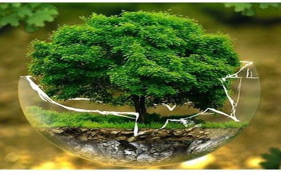

* **Ecology has a few big themes:**

 

* **study of the interactions between living organisms and their physical environment**
    + Includes living and non-living components

 

* **(1) Distribution and abundance of organisms**

 

* **(2) Interactions among organisms**

  

* **(3) Transformation and flux of energy and matter**
    

## Are humans a part of ecology? YES!

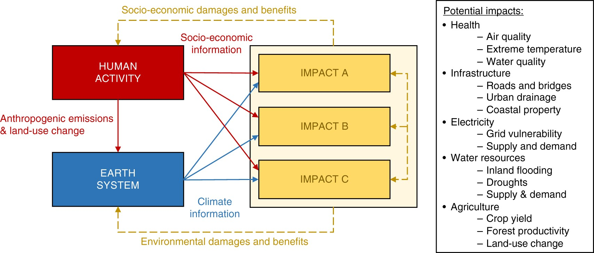

## Ecology concepts span many scales, including time

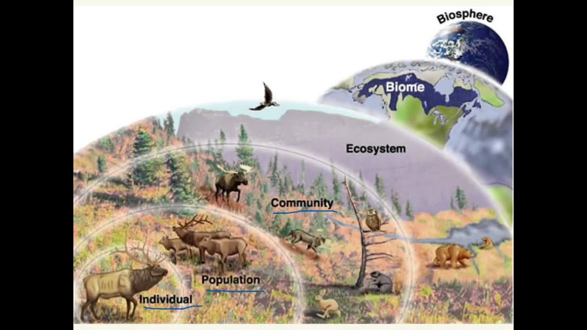

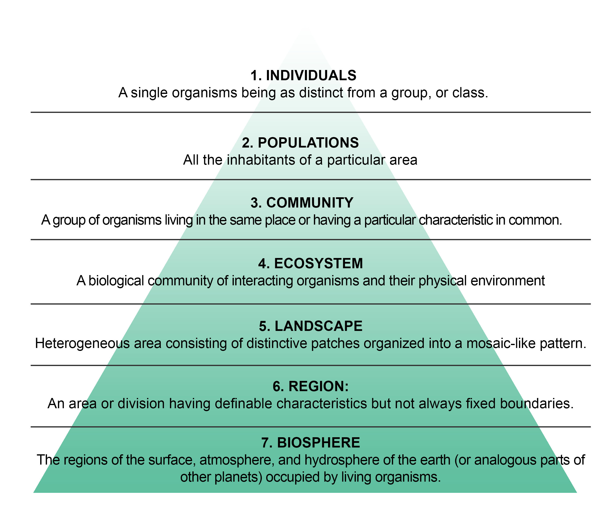

## Ecologist try to understand, explain, and predict

**Ecological questions rarely have one simple answer**

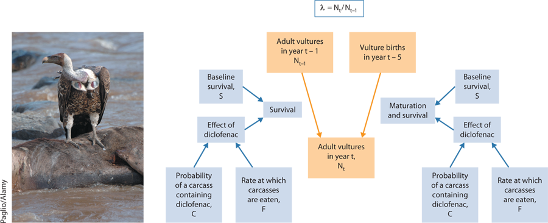

##

  
  
  
  
  
  
  
  

**Ecological processes develop over long time periods**

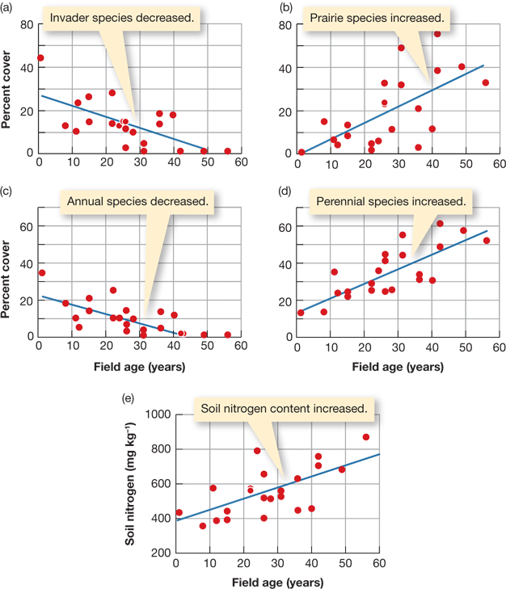

## What is the central need for ecology?

## Class Warning: We will be moving up Bloom's ladder

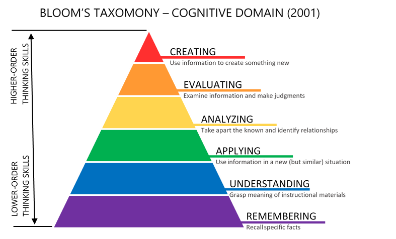

## For Journal Club this week....

 

* **Read "100 articles every ecologist should read"**
    + article and cheat sheet on Brightspace

 

* **Take specific notes**
    + What ecological themes are common?
    + Do you feel any themes are missing?
    + Is there a take home message?
    + Is there anything you don't understand?
    + *Complete and submit your reflection in person before class starts*

 

* **Pay attention to little details**
    + Are there any patterns you see?
    + Do you detect any issues?
    

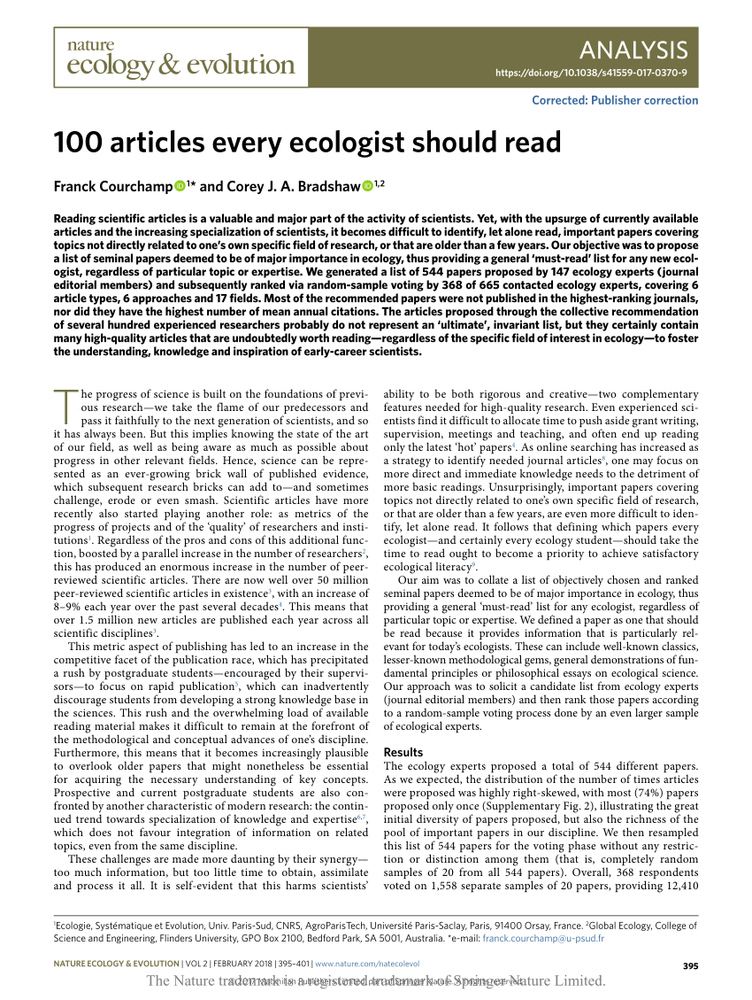

## Journal Club warning...

* **If there is one thing that I know in life it is plants !**

 

* **If there are two things that I know, the second is if you have read the paper.**
    + It is obvious to me when you are not prepared for the readings.
    + I can easily distinguish between misunderstanding and poor preparation!
    + I expect you to have a copy of the paper and notes in class (phone is not acceptable) 

 

* **I take this very seriously and you will NOT do well in this class if you do not participate**
    + The reflection is required to participate in Journal Club. No points will be rewarded for late submission
    
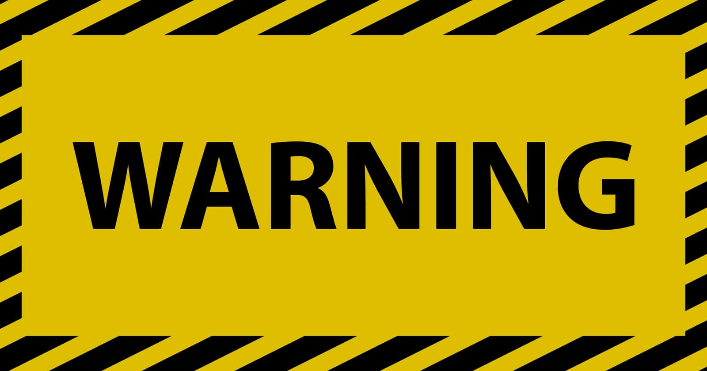

## Keep the 'Pot of Doom' locked away

 
 
 
 

* **At the start of Journal Club one name will be drawn**

 
 

* **Student will be responsible for 2 things:**
    + 1 minute brief on what the paper addresses (theme, species, issue, etc.)
    + Definition or explanation of a science word or concept from the paper you did not know (so you had to look it up)

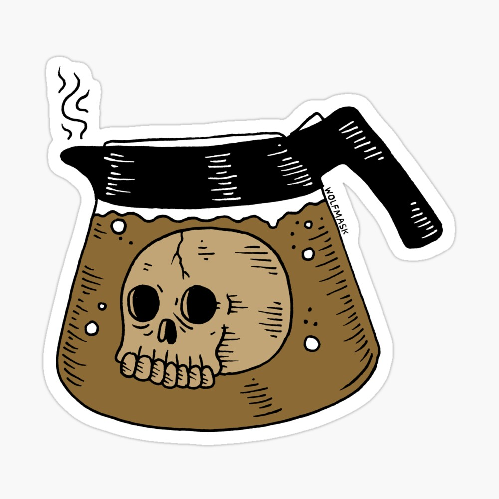

## Lab tomorrow....

 

* **Meet in lab (Byrd 210)**

 

* **C.U.R.E**
    + Get your species and first learning group
    + Practice research question and hypothesis writing
    + Discuss why invasive species matter in ecology

 

* **Walk to Carl Bell arboretum**
    + Visit the Deer exclosure experiment
    + Start a decomposition experiment
    + Wear field appropriate clothes
    