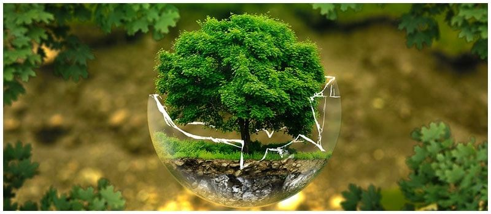
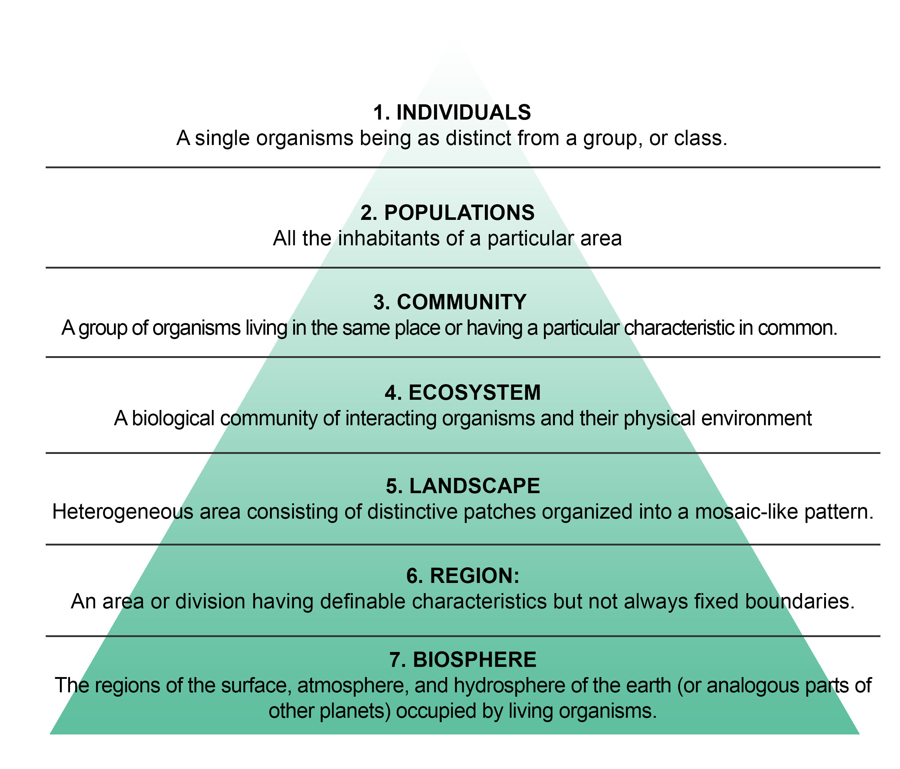

## About me

 
 

* **Plant Ecophysiologist**
    + climate change
    + physiology
    + evolution
    
 

* **Ecosystem Ecologist**
    + global change

 

* **Shepherd Research:**
    + aquaponics 
    + urban tree ecology
    + ?????
    

## About me

 
 

* **Plant Ecophysiologist**
    + climate change
    + physiology
    + evolution
    
 

* **Ecosystem Ecologist**
    + global change

 

* **Shepherd Research:**
    + aquaponics 
    + urban tree ecology
    + ?????
    

## This semester we will practice being a modern ecologist

## This semester we will ....

* **Immerse ourselves in weekly ecological themes**
    + lecture
    + journal club
    + quantitative reasoning

 

* **Go outside!!!**

 

* **Run ecological experiments**

 

* **SOLVE a major ecological issue!**

 

* **Practice communicating science**
   + Find your voice!
   

## What is ecology (textbook definition)?

## Ecology has a few big themes

 
 

* **Relations of organisms to one another and to their physical surroundings**
    + living and non-living components

 

* **(1) Distribution and abundance of organisms**

 

* **(2) Interactions among organisms**

  

* **(3) Transformation and flux of energy and matter**
    

## Are humans a part of ecology?

## Ecology concepts span many scales, including time

## Ecologist try to explain, understand and predict

 
 
 

##

## What is the central need for ecology?

## Class Warning: We will be moving up Bloom's ladder

## For Journal Club this week....

 

* **Read "100 articles every ecologist should read"**
    + article and cheat sheet on Brightspace

 

* **Take specific notes**
    + What ecological themes are common?
    + Do you feel any themes are missing?
    + Is there a take home message?
    + Is there anything you don't understand?
    + *Complete and submit your 3-2-1 on Brightspace*

 

* **Pay attention to little details**
    + Are there any patterns you see?
    + Do you detect any issues?
    

## Journal Club warning...

* **If there is one thing that I know in life it is plants !**

 

* **If there are two things that I know, the second is if you have read the paper.**
    + It is obvious to me when you are not prepared for the readings.
    + I can easily distinguish between misunderstanding and poor preparation!
    + I expect you to have a copy of the paper and notes in class

 

* **I take this very seriously and you will NOT do well in this class if you do not participate**
    + come to class prepared to speak!
    

## Keep the 'Pot of Doom' locked away

 
 
 
 

* **At the start of Journal Club one name will be drawn**

 
 

* **Student will be responsible for 2 things:**
    + 1 minute brief on what the paper addresses (theme, species, issue, etc.)
    + Definition or explanation of a science word or concept from the paper you did not know (so you had to look it up)

