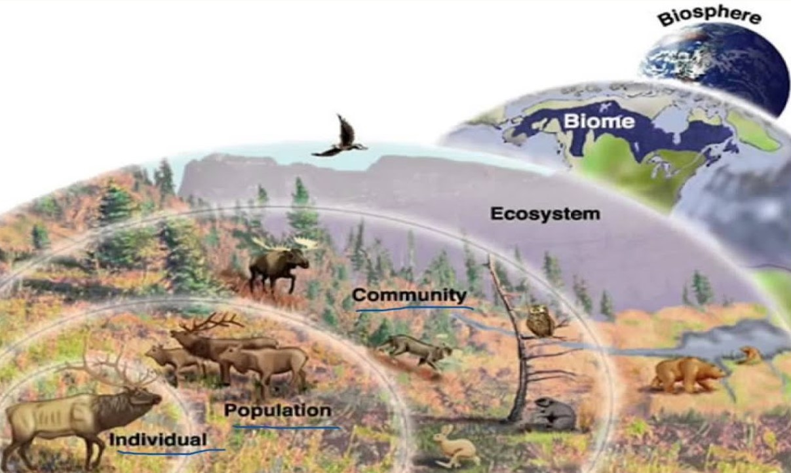

## About me

 
 
 

* Plant Ecophysologist  
* Ecosystem Ecologist

 

* www.courtneycampany.com  

 

* **Extra Credit**: .5 point final grade
  + Come see me by Friday

## Syllabus, Sakai and Textbook

 
 
 
 
 
 
 

https://courses.shepherd.edu/portal/

## This semester we will practice being an ecologist

## This semester we will ....

 
 
 

* **Immerse ourselves in weekly ecological themes**
    + lecture
    + journal club
    + quantitative reasoning

 

* **Go outside!!!**

 

* **Build your own experiment**

* **SOLVE a major ecological issue!**

 
 

* **Practice communicating science**
   + Find your voice!
   

## What is ecology (textbook)?

## Ecology spans many scales

## Ecologist try to explain, understand and predict

 
 
 

##

## What is the central need for the goals of an ecologist?

## For Wednesday (journal) and Friday (data day)

 
 
 

* **Read "100 articles every ecologist should read""**
    + article and cheat sheet on SAKAI

 

* **Take specific notes**
    + What ecological themes are common?
    + Do you feel any themes are missing?
    + Is there a take home message?
    + Is there anything you don't understand?

* **Pay attention to little details**
    + Are there any patterns you see?
    + Do you detect any issues?

## For lab this week

 
 
 
 

* **Grand Challenge Assignment**
    + meet teammates
    + brainstorm
    + divide and conquer
    
 
    
* **Basics in Excel**
    + bring laptop
    

