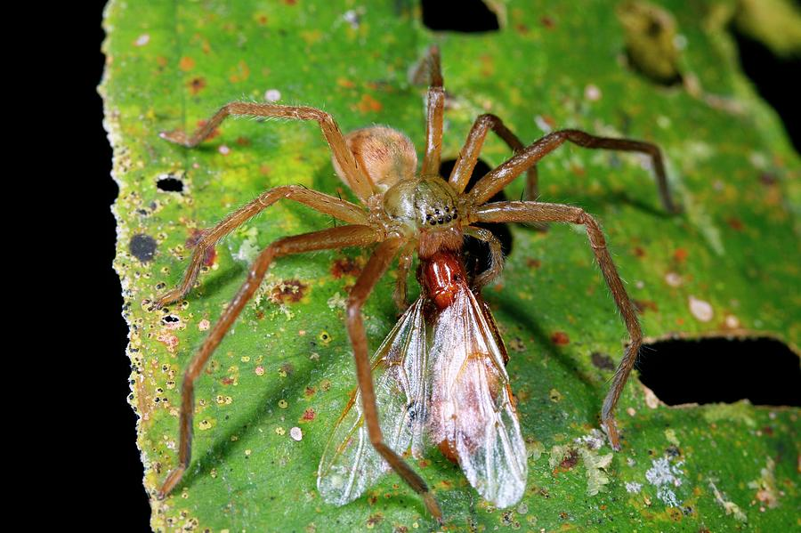

## Animal foragers

 

**Which forager type would typically get the best balance of nutrients from their food?**

## Carnivore foraging

* **Carnivore prey items contain essentially the same mix of nutrients**
 

* **Foraging success is often assumed (theory) to be limited by prey availability (quantity)**
    + Rather than nutritional balance (quality).
 

## Carnivore Foraging: Quanitity vs Quality

* **Food quantity driving consumption rates, and thus predator-prey populations, is often challenged**
    + Lotka Voltera vs Optimal Foraging
    
   
    
## Case study #1: Wolf spiders, prey quality and consumption

* **Wolf spiders feed near standing water in California (Greenstone 1979)**
    + 80% of the diet is *shore flies*, *water boatmen* and *mosquitoes*
 
  
 
* **Prey species were marked as either present or absent in each spider gut**
    + spiders classified into groups (**answer Q1**)

  

## 

##
 
 
 
 

* **Spider stomach contents (total N = 1226) from 13 different pools of water**

 
 

* **Spiders from 7 out of 13 pools were more likely than by chance to have consumed all 3 prey**
    + polyphagy (eat a variety of food)
    + **answer Q2**
    
 

* **Side note: Can you imagine making graphs without modern computers!!!**

## Leveling up with Mayntz et al. 2005

 

* **Hypothesis: IF wolf spiders optimize nutrient intake, THEN they should choose a prey type that remedies a prior nutritional deficiency**
    + experiment manipulating findings from Greenwood (1979)

 

* **Nutritional state of the Wolf spiders manipulated by feeding them a pre-treatment diet**
    + fruit flies with high or low ratio of protein to lipid for 1-2 days. 

 

* **Then tested feeding responses to the pre-treatment food and/or a complementary alternative**
    + offered only 1 choice (same or different prey)
    + recorded how much of each was eaten
    + **answer Q3**

## Leveling up with Mayntz et al. 2005 (answer Q4)

## Today: Quantitative reasoning practice

 
 

* **In your groups, work through interpretation of the results from these papers**

 

* **Use your knowledge of species interactions and evolution to theorize about more complex predator-prey relationships**

 

* **These are great practice exam questions!!!**